**Integer Arithmetic**
---
<!-- TOC -->

- [1. ALU是什么](#1-alu是什么)
- [2. 加法(全加器)](#2-加法全加器)
    - [2.1. 如何产生一位相应的数据](#21-如何产生一位相应的数据)
    - [2.2. 如何生成全部的数据](#22-如何生成全部的数据)
    - [2.3. 问题](#23-问题)
    - [2.4. 解决问题:先行记录加法器(CLA)](#24-解决问题先行记录加法器cla)
    - [2.5. 进一步的解决方法:部分先行加法器](#25-进一步的解决方法部分先行加法器)
    - [2.6. 加法溢出](#26-加法溢出)
        - [2.6.1. 判定溢出](#261-判定溢出)
- [3. 减法计算](#3-减法计算)
- [4. 乘法操作](#4-乘法操作)
    - [4.1. 乘法操作的实现](#41-乘法操作的实现)
    - [4.2. 问题:积的补码不等于补码的积](#42-问题积的补码不等于补码的积)
    - [4.3. Booth’s算法](#43-booths算法)
- [5. 除法操作](#5-除法操作)
    - [5.1. 除法的情况分类](#51-除法的情况分类)
    - [5.2. 除法的实现](#52-除法的实现)
        - [5.2.1. 除法的机器级实现](#521-除法的机器级实现)
        - [5.2.2. 除法的规则](#522-除法的规则)
    - [5.3. 第一种除法的过程](#53-第一种除法的过程)
        - [5.3.1. 机器如何确定是否够减并且可以保证不够减的时候可以回溯呢？](#531-机器如何确定是否够减并且可以保证不够减的时候可以回溯呢)
        - [5.3.2. 实例](#532-实例)
    - [5.4. 第二种除法的算法](#54-第二种除法的算法)
        - [5.4.1. 除法计算结束后的修正](#541-除法计算结束后的修正)
    - [5.5. 除法器](#55-除法器)

<!-- /TOC -->

# 1. ALU是什么

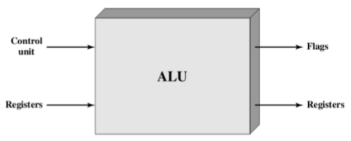

1. ALU is that part of the computer that actually performs arithmetic and logical operations on data(ALU是计算机使用数学或者逻辑处理数据的部分)
    1. Data are presented to the ALU in registers, and the results of an operation are stored in registers(数据被存储在ALU的寄存器中，运算的结果也被存储到寄存器中)
    2. The flag values, also stored in registers, are set as the operation result(标记值也存储在寄存器中并且被标记为运算结果)
    3. The control unit provides signals that control the operation of the ALU and the movement of the data into and out of the ALU(控制单元提供控制ALU运算以及需要移入或者移出ALU的数据的信号)

# 2. 加法(全加器)

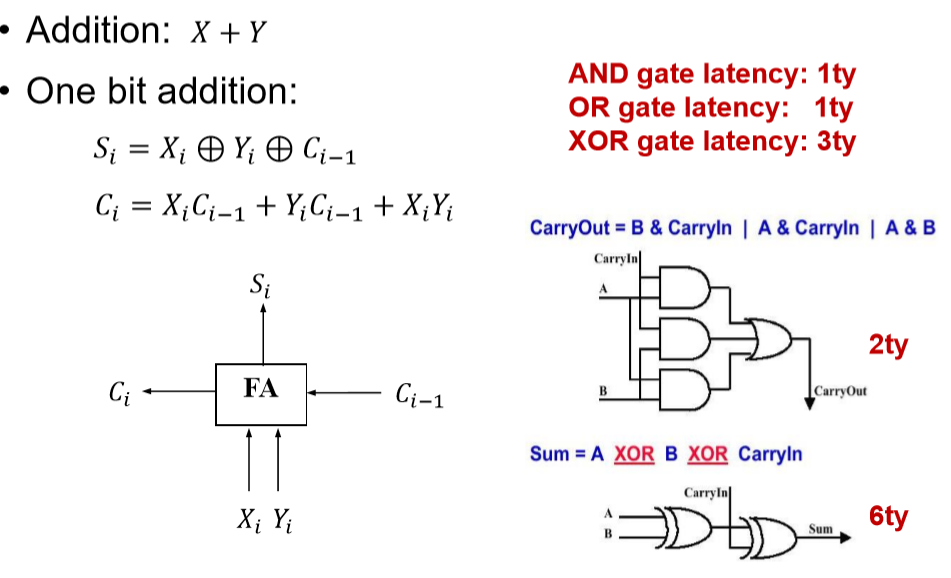

1. 输入x，y，ci-1

## 2.1. 如何产生一位相应的数据
1. Si = Xi ⊕ Yi ⊕ Ci-1
2. Ci = XiYi + Ci-1Xi + Ci-1Yi(乘法是and，加法是or)
3. 每一个carryout:2ty的延时
4. 每一个sum:6ty的延时

## 2.2. 如何生成全部的数据
1. 将全加器串联起来即可。

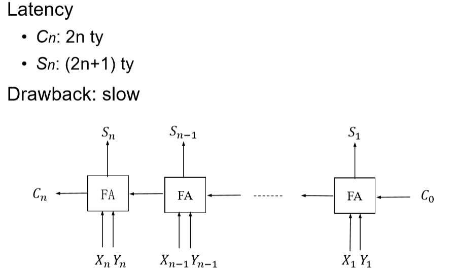

2. Sn = 2(n-1)+3 = 2n+1
    + 在等待C来的时候，已经提前把Xi和Yi进行计算。
    + 那么n=1的时候，为什么计算出来是3，而实际是6?因为需要n>=3的时候才能满足这个事情。2(n-1)>=3才行。
    + S1 = 6,S2 = 6,S3 = 7;S1和S2是同时出来的，只要C过去了就行。

## 2.3. 问题
1. 速度比较慢。
2. 和数据量成线性相关。

## 2.4. 解决问题:先行记录加法器(CLA)

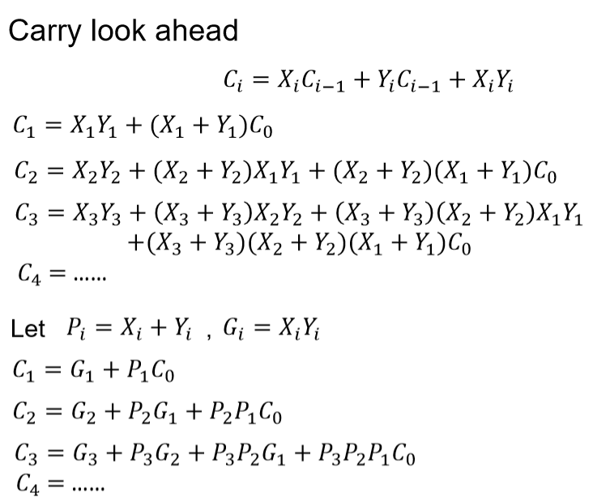

1. 定义
    + Pi = Xi + (或)Yi
    + Gi = Xi & Yi
2. 新的计算方法:(并行运算)
    + 所有的Pi、Gi都是可以同时计算的，代价是:1ty
    + 求出所有的Ci，代价:2ty
        + 先计算所有的与，多个与也可以一次计算
        + 再计算所有的或，一次计算。
    + 求出所有的Si，代价:3ty
        + 就是原来的异或。只需要再做一次就可以
3. P是传播，G是生成。

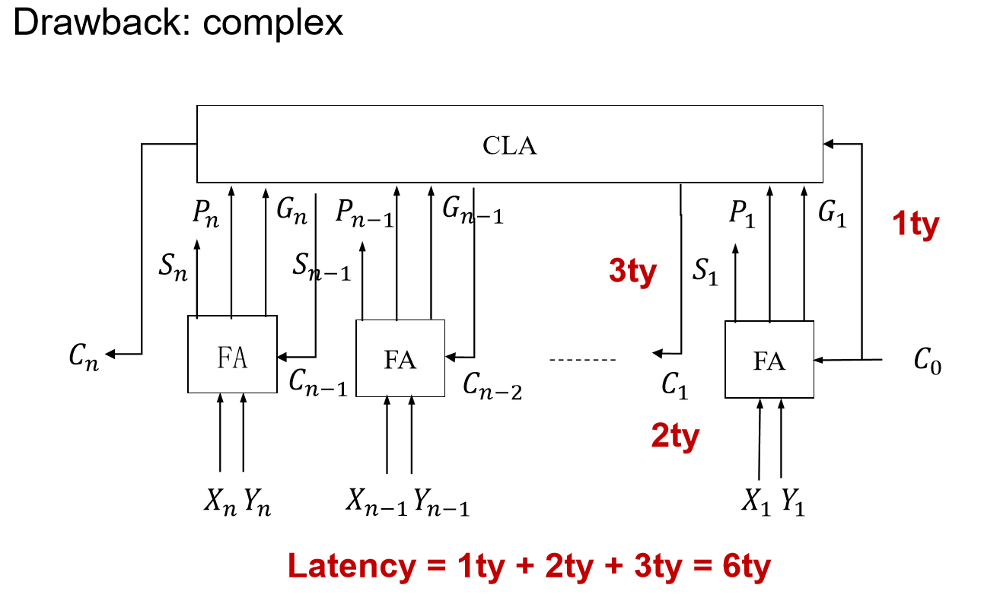

## 2.5. 进一步的解决方法:部分先行加法器

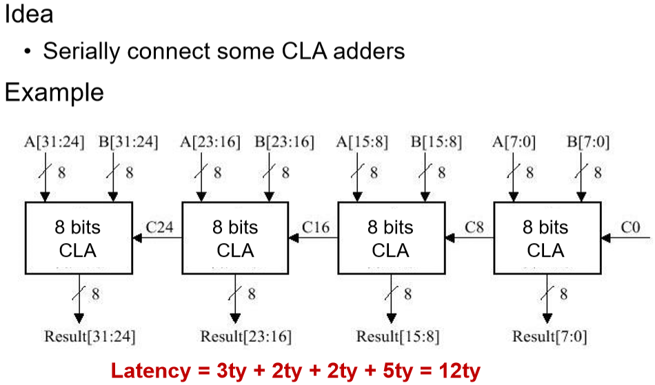

1. 最后算出的是最前面的加法部分
2. 最左边是3 = 1 + 2
3. 然后中间两个+2:之前P和G都算好了。
4. 最后一步5 = 2 + 3
    + P和G已经算好了
5. 多一个加2

## 2.6. 加法溢出
1. 按照钟表来想，拨过了头。
2. 两个正数相加不可能暨溢出，并且结果是个正数（如下图：只要溢出，包含溢出位的结果仍然是负数）。

### 2.6.1. 判定溢出

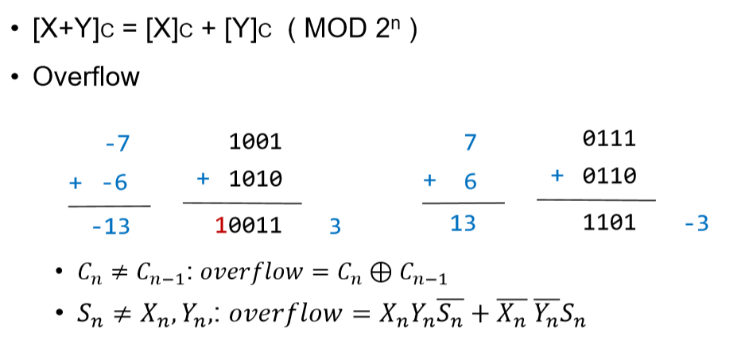

第一种情况
---
Cn|Cn-1|Xn|Yn|Sn
--|--|--|--|--
1|0|1|1|0
0|1|0|0|1

第二种情况
---
Xn|Yn|Sn
--|--|--
0|0|1
1|1|0

1. 只要有两位及以上位均为1则产生了进位。

# 3. 减法计算
1. X - Y = X + (-Y)

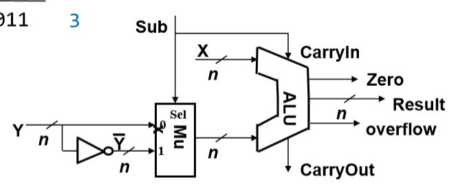

1. Sub是控制线，是1则为减法，是0则为加法。
2. Sub为1时，会走下面的路，也就是取反。
3. Sub的另一端连接到C0的位置上。

# 4. 乘法操作

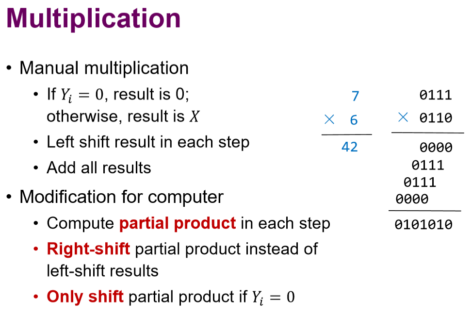

1. 这时候出现问题:纵向相加，加法的时候会移位。
2. 部分积(partial product)
3. 将加法器左移，可以变成部分积右移，只留下来最高部分来进行加。

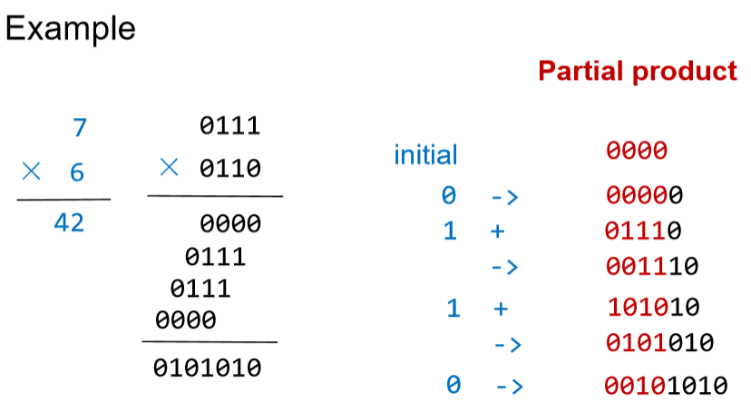

1. 高位补充0，小数点在最右边
2. 小数相除小数点在左边？

## 4.1. 乘法操作的实现

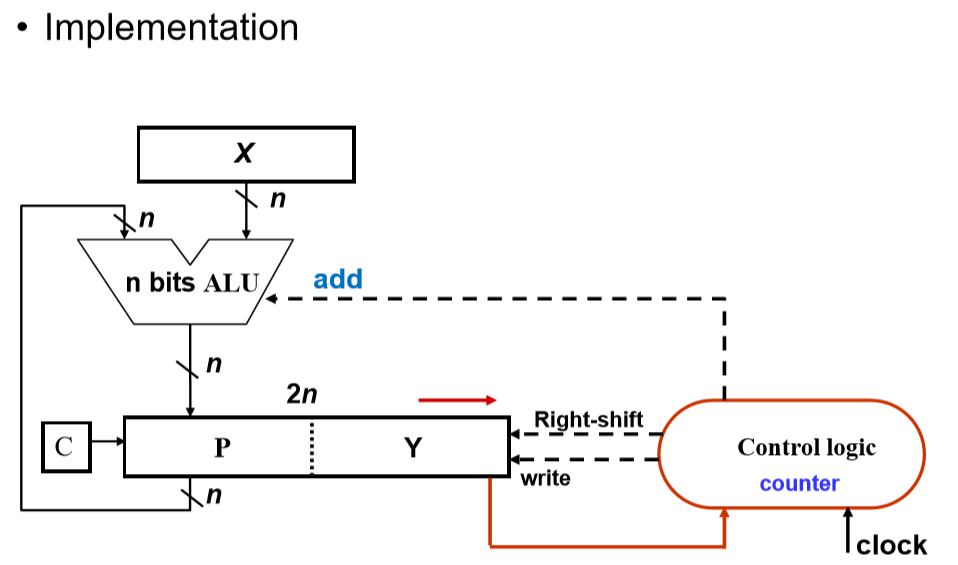

1. Y在有意义的变短，有一部分就已经不需要使用了。
2. 所有Y和product是此消彼长的。
3. 长的整体无论红黑都是部分积。

## 4.2. 问题:积的补码不等于补码的积
1. 在加法中很顺利的原码在这里是不顺的。
2. 问题解决:如何用补码来计算

## 4.3. Booth’s算法
1. Xc * Yc = X * (-Yn * 2n-1 + Yn-1 * 2n-2 + ... + Y1*20)
2. 算法核心:2k = 2k+1 - 2k
3. 将算法核心带入1中的式子:= X * ((Yn-1 - Yn)*2n-1 + (Yn-2 - Yn-1)*2n-2 + ... + (Y1 - Y2)*21 + (Y0 - Y1)*20)
    + Y0 = 0
    + 这样子也就会满足原来的阶乘的形式。

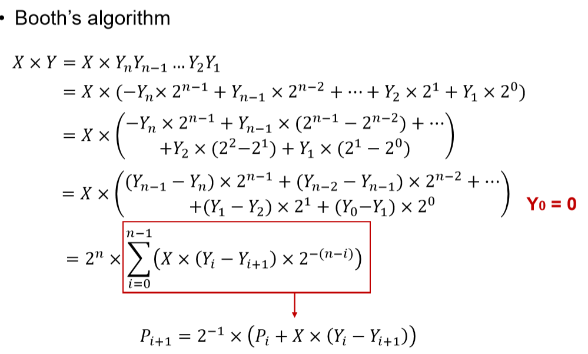

算法内容
---

算法问题
---

1. 在高位补充的时候应该是符号扩展。
2. -7:1001;-6:1010

# 5. 除法操作

## 5.1. 除法的情况分类

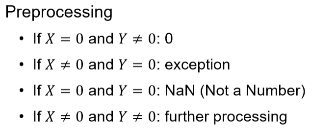

1. -7/3 = -2...-1
2. 被除数需要进行符号扩展，被除数减去除数。
3. 商先产生高位，这样子的资源和性能依然不够经济。
4. 余数是n位，被除数是n位和被除数的2n位是一致的。

## 5.2. 除法的实现
1. 最开始，除数放到商的位置上，而余数的位置上全是**符号扩展位**。

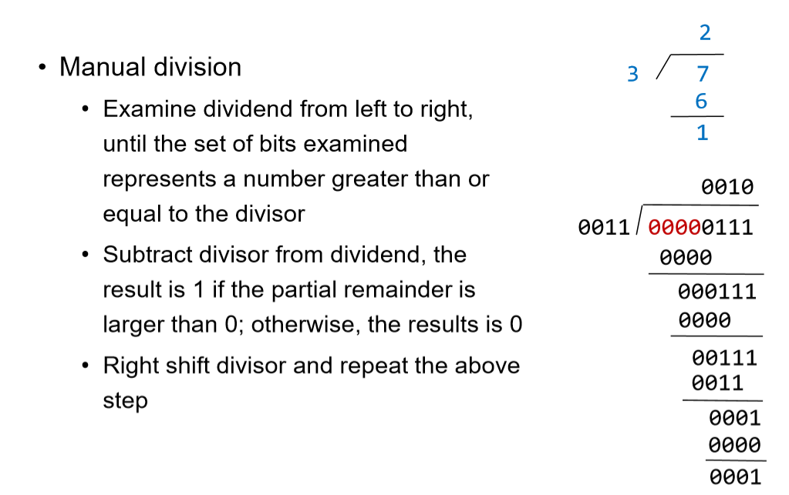

2. 每一次左移。
    + 如果够减的话，就减去除数写入1
    + 如果不够减的话，就直接写入0

### 5.2.1. 除法的机器级实现

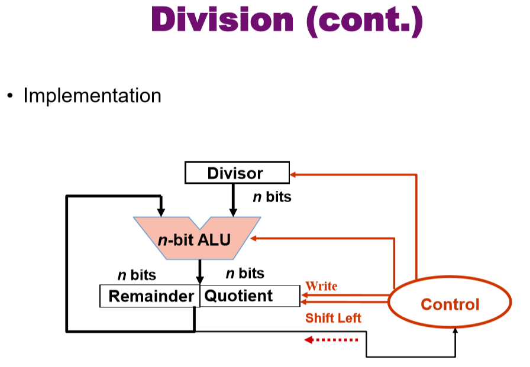

### 5.2.2. 除法的规则

1. 如何判断够还是不够？余数的绝对值靠近0而不越过0。
    + 负数除以正数的余数是负数
    + 正数除以负数的余数是正数
    + 负数除以负数的余数是负数

## 5.3. 第一种除法的过程

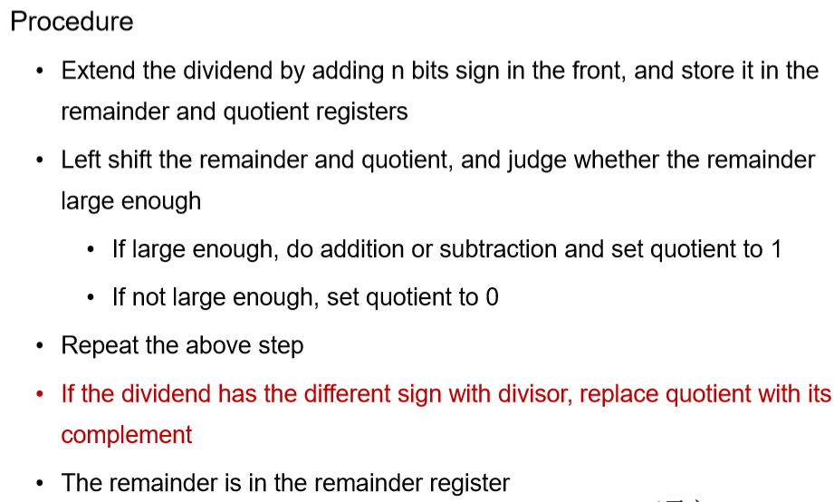

1. 首先对于符号位进行扩展，并且存储到分别的余数部分和商部分。
2. 左移余数和商，判断余数存储器是否足够大。
    + 如果足够大，那么就做加法或者减法并且在商的右侧添加一个1
    + 如果不足够大，那么直接在商的右侧直接加上一个0
3. 重复以上的两个步骤。
4. 最后全部计算结束后的注意点:
    1. 如果除数和被除数的符号相反，那么商需要取其补码。
    2. 余数被存储在余数寄存器中。

### 5.3.1. 机器如何确定是否够减并且可以保证不够减的时候可以回溯呢？

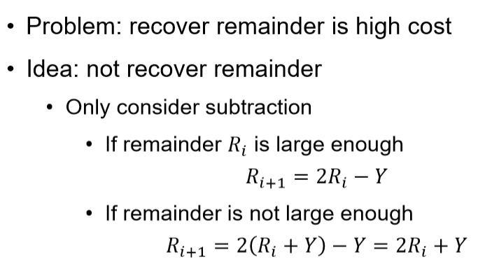

1. 先减去再加上
2. 本来应该先减去再加变成

### 5.3.2. 实例
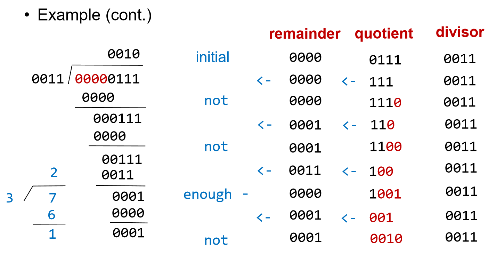
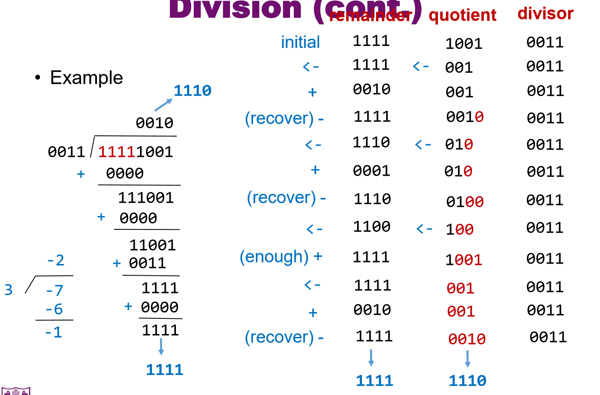
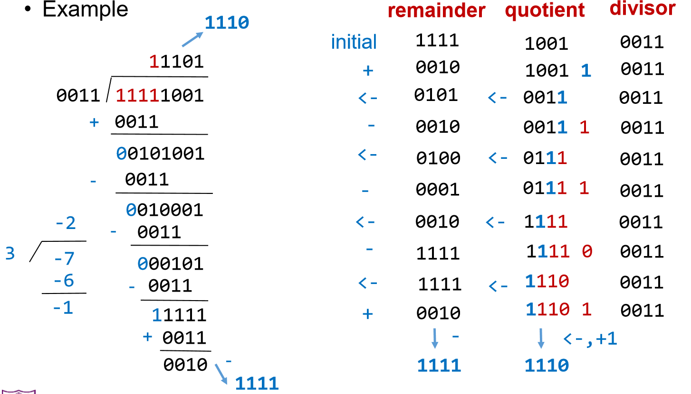

1. 最后是减去divisor
2. 商是左移加一

## 5.4. 第二种除法的算法

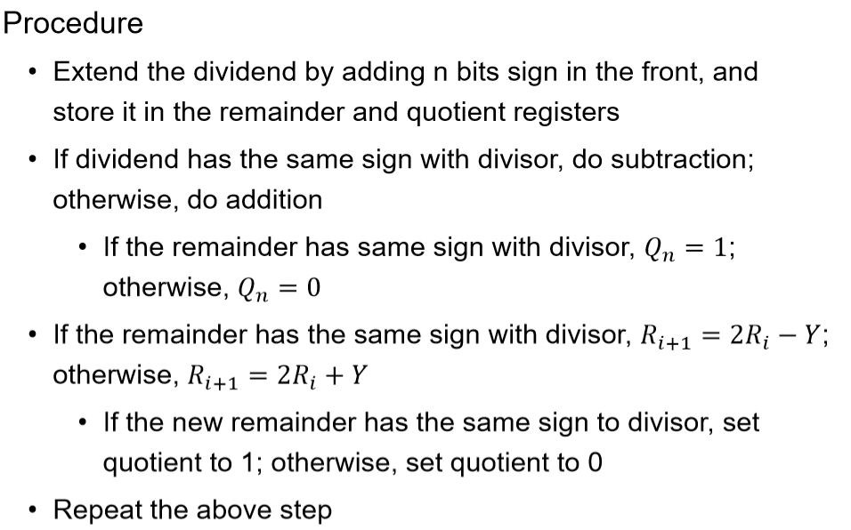

1. 首先将被除数进行符号扩展，并且分别将其存到余数和商的寄存器中。
2. 如果被除数和除数的符号相同，那么进行减法。如若不然进行加法。
    + 如果余数和除数的符号相同，则Qn=1,不然Qn=0
3. 根据余数和除数的符号关系来决定如何进行计算。
    + 如果新得到的余数和除数符号相同，那么我们给商加上一个1，不然加上一个0。
4. 重复上述操作

### 5.4.1. 除法计算结束后的修正

1. 对商的修正，如果商是负的就加上1
2. 对除数的修正，如果符号不同的，如果除数和被除数符号是否相同，如果相同，我们需要减去除数。
3. 还要看余数是否和除数相同，如果相同要进行处理

## 5.5. 除法器

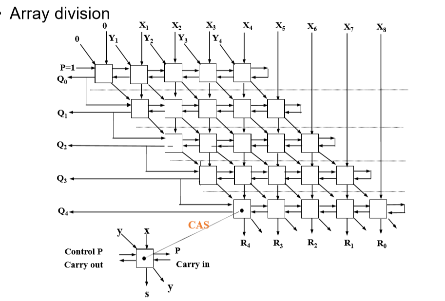
