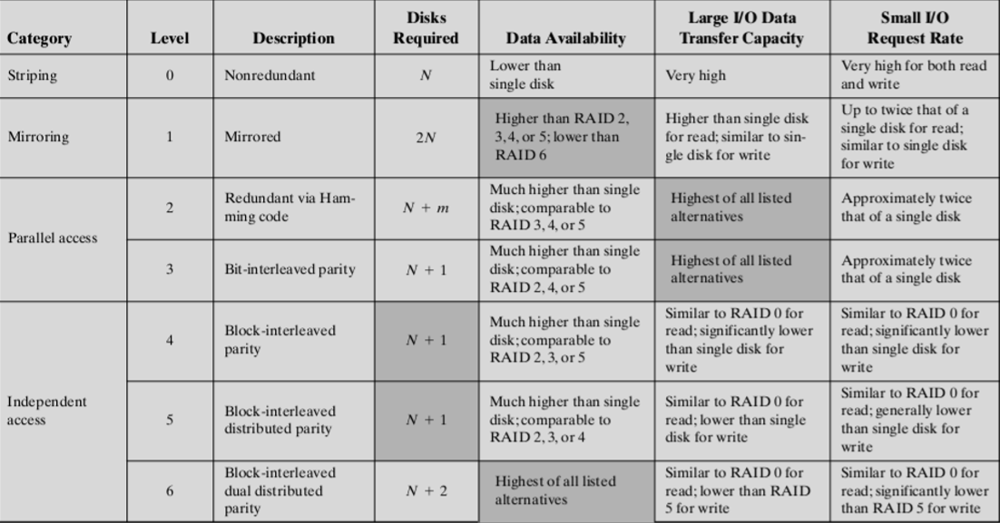
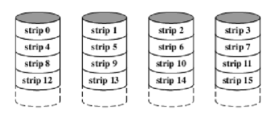
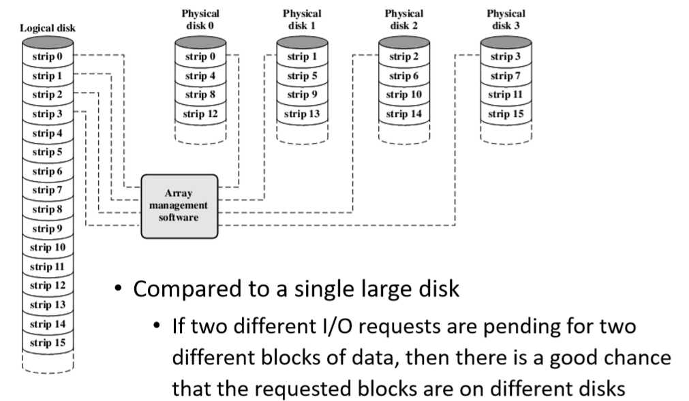
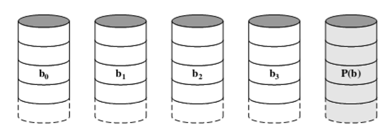
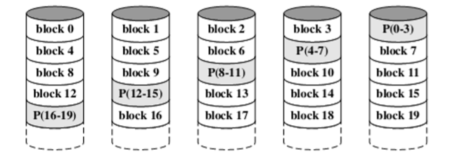
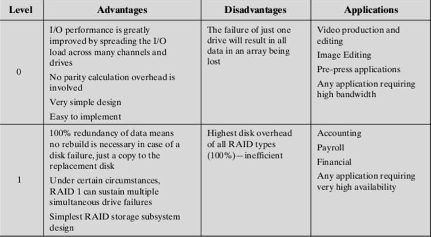
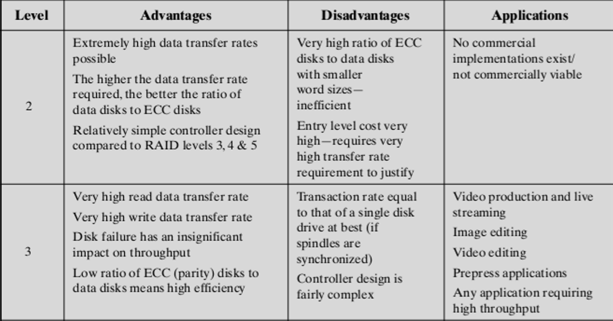
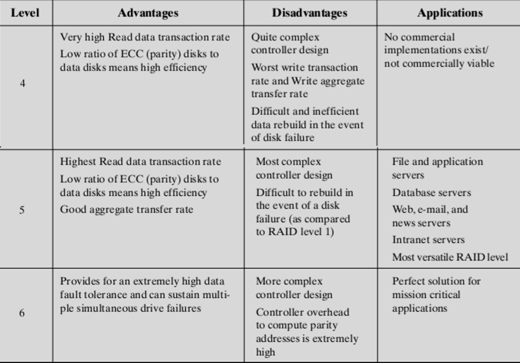

RAID(磁盘冗余阵列)
---
<!-- TOC -->

- [1. RAID](#1-raid)
- [2. 不同的RAID](#2-不同的raid)
    - [2.1. RAID Level 0](#21-raid-level-0)
        - [2.1.1. 优点(Usage)](#211-优点usage)
        - [2.1.2. 缺点](#212-缺点)
        - [2.1.3. 和单一的大磁盘的对比](#213-和单一的大磁盘的对比)
    - [2.2. RAID Level 1](#22-raid-level-1)
        - [2.2.1. 优点](#221-优点)
        - [2.2.2. 缺点](#222-缺点)
        - [2.2.3. 应用](#223-应用)
        - [2.2.4. 和RAID Level 0相比](#224-和raid-level-0相比)
    - [2.3. RAID Level 2](#23-raid-level-2)
        - [2.3.1. 校验方法](#231-校验方法)
        - [2.3.2. 应用](#232-应用)
        - [2.3.3. 读出数据(read)](#233-读出数据read)
        - [2.3.4. 读入数据(write)](#234-读入数据write)
        - [2.3.5. 优点](#235-优点)
        - [2.3.6. 缺点](#236-缺点)
    - [2.4. RAID Level 3](#24-raid-level-3)
        - [2.4.1. RAID 3为什么可以修复损坏](#241-raid-3为什么可以修复损坏)
        - [2.4.2. 性能](#242-性能)
    - [2.5. RAID Level 4](#25-raid-level-4)
        - [2.5.1. 性能](#251-性能)
        - [2.5.2. 如果减少文件的读写计算](#252-如果减少文件的读写计算)
    - [2.6. RAID Level 5](#26-raid-level-5)
    - [2.7. RAID Level 6](#27-raid-level-6)
        - [2.7.1. 优点](#271-优点)
        - [2.7.2. 缺点](#272-缺点)
- [3. RAID不同级别的优缺点](#3-raid不同级别的优缺点)

<!-- /TOC -->

# 1. RAID
1. Redundant Array of Independent Disks(独立磁盘循环冗余阵列)
2. Basic idea 基本观点
    + With multiple disks, separate I/O requests, even a single I/O request, can be handled in parallel, as long as the data required reside on separate disks(对于多个磁盘，只要所需的数据位于不同的磁盘上，就可以并行处理单独的I/O请求)
3. Characteristic(特点)
    + RAID is a set of physical disk drives viewed as a single logical drive(RAID是一组被视为单个逻辑驱动器的物理磁盘驱动器)
    + Data are distributed across the physical drives(数据分布在物理驱动器上)
    + Redundant disk capacity is used to store parity information, which guarantees data recoverability in case of a disk failure(冗余磁盘容量用于存储奇偶校验信息，这保证了在磁盘出现故障时数据的可恢复性)
4. 磁盘性能的变快:读写速度快和I/O的响应速度变快


# 2. 不同的RAID


## 2.1. RAID Level 0



1. The data are striped across the available disks(数据是被条带化存储在可用的磁盘中)
    + Eg.是按照01234(数值序)的顺序进行同行条带之间的访问
2. Not include redundancy to improve performance (not a true member of the RAID family)(不包含用来增加性能的冗余(并不是一个RAID家族的一个真正成员))



### 2.1.1. 优点(Usage)
1. High rate data transfer(很快的数据传输速度)因为可以同时在很多块盘(多通道)上写入，所以速度会变快
2. High I/O request rate(高I/O响应速率)
    + 可以同时响应多个IO请求，如果在不同的磁盘上
3. 不需要奇偶校验位。
4. 设计简单，易于实现。

### 2.1.2. 缺点
如果一个文件横跨四个盘，如果一个盘损坏，就会导致所有文件都不可用。

### 2.1.3. 和单一的大磁盘的对比
If two different I/O requests are pending for two different blocks of data, then there is a good chance that the requested blocks are on different disks(如果两个不同的I/O请求对于两个不同的数据块处于挂起状态，那么请求的数据块很可能位于不同的磁盘上)

## 2.2. RAID Level 1


1. Redundancy is achieved by the simple expedient of duplicating all the data(磁盘冗余是通过复制所有数据的简单方法实现的)
2. Data striping is used(数据被条带化存储)

### 2.2.1. 优点
1. A read request can be serviced by either of the two disks that contains the requested data, whichever one involves the minimum seek time plus rotational latency(读取请求可以由包含请求数据的两个磁盘中的任何一个提供服务，无论哪一个磁盘包含最小的寻道时间加上旋转延迟，比如同时写入block0和block4，就可以并行读出)
2. A write request requires that both corresponding strips be updated, but this can be done in parallel(写请求要求更新两个对应的条带，但这可以并行完成，以慢的哪个盘作为基数)
3. Recovery from a failure is simple(可以很快的从损坏中恢复)

### 2.2.2. 缺点
High cost(高存储代价)

### 2.2.3. 应用
Limited to drives that store system software and data and other highly critical files(仅限于存储系统软件、数据和其他高度关键文件的驱动器)

### 2.2.4. 和RAID Level 0相比
1. RAID 1 can achieve high I/O request rates if the bulk of the requests are reads, in which the performance of RAID 1 can approach double of that of RAID 0(如果大量的请求是读的，RAID 1可以获得很高的I/O请求率，其中RAID 1的性能可以接近RAID 0的两倍)
2. If a substantial fraction of the I/O requests are write requests, then there may be no significant performance gain over RAID 0(如果I/O请求的很大一部分是写请求，那么与RAID 0相比可能没有显著的性能提升)


## 2.3. RAID Level 2
1. Use of a parallel access technique(使用并行访问机器)
    + All member disks participate in the execution of every I/O request(所有的成员磁盘都会参与到每一个I/O请求的操作中去)
    + the spindles of the individual drives are synchronized so that each disk head is in the same position on each disk at any given time(各个驱动器的主轴是同步的，因此每个磁盘头在任何给定的时间都在每个磁盘上的相同位置)
2. Data striping is used(使用的数据的条带存储)
    + The strips are very small, often a single byte or word(每一个数据条带都很短，常常是只有一位或者一个字节，所以RAID 2追求读写速度)
3. RAID 2可以解决磁盘损坏。

### 2.3.1. 校验方法
1. 存储的是校验码(右面三个)，这里用的是汉明码


2. An error-correcting code is calculated across corresponding bits on each data disk, and the bits of the code are stored in the corresponding bit positions on multiple parity disks(在每个数据盘的相应位上计算纠错码，并将纠错码的位存储在多个奇偶校验盘的相应位位置)
    + Hamming code is typically used(通常使用汉明码)
3. 纠错能力上强于Level 3

### 2.3.2. 应用
RAID 2不再被使用，因为其被使用的前提是磁盘容易出错，而这不符合现在的情况。

### 2.3.3. 读出数据(read)
The requested data and the error-correcting code are fetched(需要的数据和校验码被读取出来)

### 2.3.4. 读入数据(write)
All data disks and parity disks must be accessed(必须访问所有数据磁盘和奇偶校验磁盘)

### 2.3.5. 优点
1. 很高的数据读写速度
2. 磁盘损坏的影响比较小
3. ECC校验码的比率低。

### 2.3.6. 缺点
1. Still rather costly(还是比较贵)
2. Only be an effective choice in an environment in which many disk errors occur, which is overkill and is not implemented to individual disks and disk drives with the high reliability(只有在出现许多磁盘错误的环境中才是一个有效的选择，这些错误是过度的，并且没有实现到具有高可靠性的单个磁盘和磁盘驱动器上)

## 2.4. RAID Level 3


1. Use of a parallel access technique(使用并行访问数据)
2. Use very small data striping(使用很小的数据条带)
    + 让每一个磁盘都参与到数据读写中去，保证每一个处理的速度比较快
3. A simple parity bit is computed for the set of individual bits in the same position on all of the data disks(为所有数据磁盘上相同位置的单个位集计算一个简单奇偶校验位)
    + Can be used to reconstruct data when a drive fails(可以被用来在一个磁盘损坏的时候修复数据)
    + 𝑏0 = 𝑃(𝑏) ⨁ 𝑏1 ⨁ 𝑏2 ⨁ 𝑏3
4. RAID 3只能解决损坏的问题，但是不能解决出错的问题，换句话说也就是我们不能确定出错的是哪一位。(因为是奇偶校验法，是前面所有的运算后，存储到后面去)

### 2.4.1. RAID 3为什么可以修复损坏
```
p = b0 ⨁ 𝑏1 ⨁ 𝑏2 ⨁ 𝑏3
𝑏2 ⨁ p = 𝑏2 ⨁ b0 ⨁ 𝑏1 ⨁ 𝑏2 ⨁ 𝑏3
𝑏2 ⨁ p = b0 ⨁ 𝑏1 ⨁ 𝑏3
𝑏2 ⨁ p ⨁ p= b0 ⨁ 𝑏1 ⨁ 𝑏3 ⨁ p
𝑏2 = p ⨁ 𝑏0 ⨁ 𝑏1 ⨁ 𝑏3
```

### 2.4.2. 性能
1. Achieve very high data transfer rates(达到了更高的数据传输速率)
    + For large transfers, the performance improvement is especially noticeable(因为传输速度的增加，其性能显著增加)
2. Only one I/O request can be executed at a time(每次只能处理一个I/O操作)
    + In a transaction-oriented environment, performance suffers(在面向事务的环境中，性能会受到影响)

## 2.5. RAID Level 4


1. Use of an independent access technique(使用独立访问技术)
    + Each member disk operates independently, so that separate I/O requests can be satisfied in parallel(每个成员磁盘独立运行，因此可以并行地满足单独的I/O请求)
2. Data striping is used(数据条带化存储,**条带变大**)
3. A bit-by-bit parity strip is calculated across corresponding strips on each data disk, and the parity bits are stored in the corresponding strip on the parity disk(在每个数据盘上的对应条带上计算逐位奇偶校验条，奇偶校验位存储在奇偶校验盘上的对应条带上)
4. 网络服务器需要**独立**响应每一个请求，所以4也就是3中的数据条带变大的结果。
5. 问题所在:因为冗余盘不能同时写入，所有的盘都不能同时写入
    + 因为每次修改的话会影响到校验盘。无法同时进行两个操作。

### 2.5.1. 性能
1. RAID 4 involves a write penalty when an I/O write request of small size is performed(当执行小规模的I/O写请求时，RAID 4会等待)
    + Each time that a write occurs, the array management software must update not only the user data but also the corresponding parity bits(每次发生写入时，阵列管理软件不仅要更新用户数据，还要更新相应的奇偶校验位)
    + 𝑃′ = 𝑃 ⊕ 𝑏0 ⊕ 𝑏0′(解决的方法)
2. In the case of a larger size I/O write that involves strips on all disk drives, parity is easily computed by calculation using only the new data bits(如果较大的I/O写操作涉及到所有磁盘驱动器上的条带，则只使用新的数据位通过计算很容易计算奇偶校验位的值)
3. Every write operation must involve the parity disk, which therefore can become a bottleneck(每个写操作都必须涉及奇偶校验磁盘，因此奇偶校验磁盘可能成为瓶颈)

### 2.5.2. 如果减少文件的读写计算
1. P(0,3) = B0 ⊕ B1 ⊕ B2
2. P(0,3)' = B0 ⊕ B1' ⊕ B2
3. 将上面两个式子异或:P(0,3)' = B1 ⊕ B1' ⊕ P(0,3)
4. 更新一次Block涉及两次读(B1'不用读入)两次写
    + 最长时间就是两次读和两次写全部加起来。

## 2.6. RAID Level 5


1. Similar to RAID level 4
2. Distributes the parity strips across all disks(将奇偶校验位条分布到所有磁盘上)
    + Avoid the potential I/O bottleneck(避免可能的I/O瓶颈)
3. 目前使用的比较多的是RAID 5和RAID 1
4. 假设在Block0写入，会影响到4行/列(第一行、最后一行、第一列、最后一列)
5. 将校验盘这个物理盘放到所有盘中(虚拟盘)

## 2.7. RAID Level 6


1. Two different parity calculations are carried out and stored in separate blocks on different disks(执行两种不同的奇偶校验计算并存储在不同磁盘上的不同块中)
2. 为了防止两个磁盘出现问题。

### 2.7.1. 优点
Provide extremely high data availability: three disks would have to fail within the MTTR interval to cause data to be lost(提供了很高的数据读写能力:单个盘都损坏才能导致数据的丢失)

### 2.7.2. 缺点
Write penalty: each write affects two parity blocks(写入延迟:每一个写入都有可能影响两个奇偶校验块)


# 3. RAID不同级别的优缺点





