03-局域网数据链路层原理与技术
---
 
# 1. 数据链路层概述
1. 本章主要是局域网的数据链路层的技术标准
2. 主要是以太网的介质和无线网的介质两大类。
3. 是一个直连线路上的介质控制，在无线路由器上，会有不同的第二层(手机到路由器，路由器到远端)，数据链路层只能在一个网段，不能跨链路

## 1.1. 物理层和数据链路层的区别
| 第一层                                   | 第二层                   |
| ---------------------------------------- | ------------------------ |
| 无法与上层通信                           | 通过LLC与上层通信        |
| 无法确定哪台主机将会传输或接受二进制数据 | 通过MAC确定              |
| 无法命名或标识主机                       | 通过寻址或命名过程来实现 |
| 仅仅能描述比特流                         | 通过帧来组织/分组比特    |

## 1.2. 数据链路层 Data Link Layer

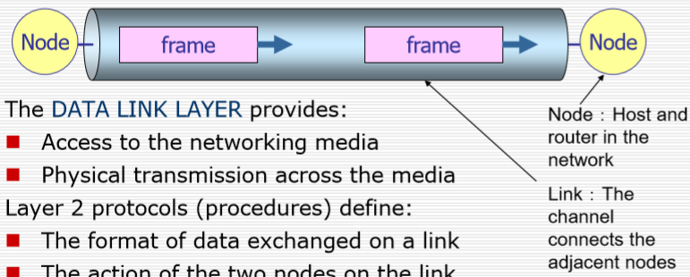

1. 问题：如何在不稳定(instable)的链路上正确传输数据？
2. 数据链路层提供
    + 网络介质访问:
    + 跨媒体物理传输(transmission):
3. 第二层协议明确了
    + 在链路上交换的数据格式
    + 链路上的两个节点的行为
4. 在数据链路层，过程就是协议。
5. 在两端校验，帧是否是正确的，或者是不正确的，如果正确交付第三层，否则进行相应的处理

## 1.3. 局域网和数据链路
1. 主要工作
    + 错误识别(notification)
    + 网络拓扑(Network topology)
    + 流控制(Flow control)
2. 第一层和第二层的不同:
    + 第一层不可以访问更高层(upper-level layers)，而第二层是通过逻辑链路(Logical Link Control)控制进行
    + 第1层无法决定哪个主机将发送(transmit)或接收(receive)来自组的二进制数据；第2层使用媒体访问控制（MAC）做到这一点，共用总线链路
    + 第1层无法命名或识别计算机；第2层使用寻址（或命名）过程，以太网场景下
    + 第1层只能描述比特流；第2层使用成帧对比特进行组织或分组。

## 1.4. 第二层提供的服务
1. 提供给网络层的三层服务
    1. (最弱，最不靠谱的)没有确认(acknowledgement)的无连接(Connectionless)服务
        + 发送取出就行，不用等收到确认
        + 可靠(Reliable)的链接（上层以确保数据正确性）
        + 实时任务，比较高效
        + 适用于大多数局域网
    2. 带有确认的无连接服务：不可靠的链接，例如无线网络：需要保证一定的通信质量(比如无线网络的传输)，同时会损失一定的性能。
    3. 带有确认的连接服务
        + 比如蓝牙:需要先确定绑定关系才能进行通信
        + 手机和手机之间的蓝牙连接需要确定一些信息
2. 三种服务的连接的不同和区别:
    1. 无线连接和有线连接相比多了**确认**的过程
    2. 网线连接:我们通信的对象是路由器，由路由器进行转发
    3. PPPoP是**路由器和远端**的服务器的连接
    4. 有线无线都接给路由器，都需要连接，但是无线网相对有线网需要确认(包确认)

## 1.5. 常见的局域网的介质访问控制(Media Access Control)
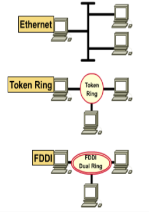

1. 以太网(Ethernet):逻辑总线拓扑（信息流在线性总线上）和物理星形或扩展星形（连线为星形）
2. 令牌环(Token Ring):逻辑环拓扑（信息流在一个环中）和物理星形拓扑（以星形连接）
3. FDDI(光纤分布式数据接口):逻辑环拓扑（信息流在一个环中）和物理双环拓扑（作为双环连接）,光纤作为传输介质，曾经很常用，后来被以太网有线接入逐渐替代

## 1.6. 介质访问控制方法(Access Methods)

### 1.6.1. 两大类介质访问控制方法
1. 确定性轮流(Deterministic—taking turns):Token Ring and FDDI(Fiber Distributed Data Interface，光纤分布式数据接口)
2. 争用式(Non-deterministic (probabilistic))
    1. 非确定性（概率性）-先到先得 first come, first sesrved 
    2. Ethernet/802.3
    3. 70年代，Norman Abramson设计
    4. Pure ALOHA: 纯ALOHA协议
        + 主机任何时候都可以发送数据
        + 如果发生冲突，延迟一段时间再发送
    5. Slotted ALOHA: 分段ALOHA协议
        + 把信道在时间上分段。主机任何时候都发送数据，但是必须等待下一个时间分段的开始才开始发送
        + 如果发生冲突，延迟一段时间再发送

### 1.6.2. 确定性轮流 Deterministic MAC Protocols
1. 特殊数据令牌在环中循环(circulates)。
2. 当主机收到令牌时，它可以传输数据而不是令牌。这称为夺取(seizing)令牌。
3. 当发送(transmitted)的帧返回到发送器时，站点将发送新令牌； 框架已从环上卸下或脱落(stripped)。

### 1.6.3. 非确定性MAC协议 Non-Deterministic MAC Protocols
1. 此MAC协议称为带冲突检测的载波侦听多路访问（CSMA/CD，Carrier Sense Multiple Access with Collision Detection）(**重要考点**)
2. 为了使用这种共享介质(shared-medium)技术，以太网允许网络设备为传输权进行仲裁(arbitrate)。
3. 适用于总线结构的以太网。

## 1.7. 局域网数据传输(Transmitison)方式:三种
1. 单播(unicast)-将单个数据包从源发送到网络上的单个目标
2. 多播(multicast)-由发送到网络上特定节点子集的单个数据包组成，这些节点都有同样的进程进行响应
3. 广播(broadcast)-由单个数据包组成，该数据包传输到网络上的所有节点。（广播的目的地址是0x11111111）

# 2. 以太网 和 带冲突检测的载波侦听多路访问 Ethernet and CSMA/CD 

## 2.1. 逻辑链路(Logical Link Control)和介质访问控制(Media Access Control)子层
1. 无缘电缆的方式传播电波:以太网
2. 帧传播速度提高了
3. 帧的标准没有改变

### 2.1.1. 局域网标准
1. 定义物理媒体和用于将设备连接到媒体的连接器
2. 在数据链路层定义设备的通信方式
3. 数据链路层定义了如何在物理介质上传输数据。
4. 数据链路层还定义了如何封装(encapsulate)特定于协议的流量(traffic)，以使去往不同上层协议的流量在到达堆栈时可以使用相同的通道。

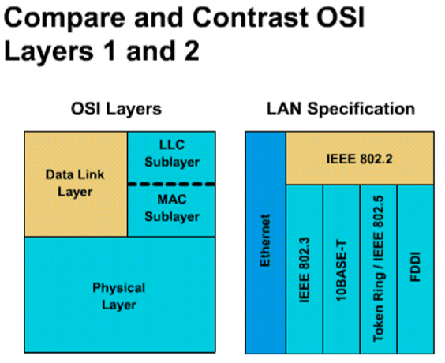

>IEEE 802.2对应LLC，以太网则覆盖物理层和链路层

1. IEEE将数据链路层分为两部分：
    1. 媒体访问控制（MAC）（转换为媒体）
    2. 逻辑链路控制（LLC）（过渡到网络层）
2. 乍一看，IEEE标准似乎以两种方式违反了OSI模型。
    1. 首先，它定义自己的层（LLC），包括其接口等。
    2. 其次，看来MAC层标准802.3和802.5跨越了第2层/第1层接口。
        + 802.5 令牌环网
        + 802.3 覆盖了物理层和第二层下半层
3. 但是，802.3和802.5定义了用于构建特定技术的命名，框架和媒体访问控制规则，都规范了对应的方案，不同方案不同解决标准

### 2.1.2. MAC & LLC
1. MAC子层(802.3)
    + 定义如何在物理线路上传输帧(frames)
    + 处理物理寻址
    + 定义网络拓扑
    + 定义线路规则(discipline)
2. LLC 子层(802.2)
    + 逻辑上标识不同的协议类型，然后将其封装，兼容不同介质的访问
    + 使用SAP标识符执行逻辑标识，用来做发送的位置的标识
    + LLC帧的类型取决于上层协议期望的标识符，对于上层服务进行支持
    + LLC已经比较规范了，后来有的厂商已经放弃继续做

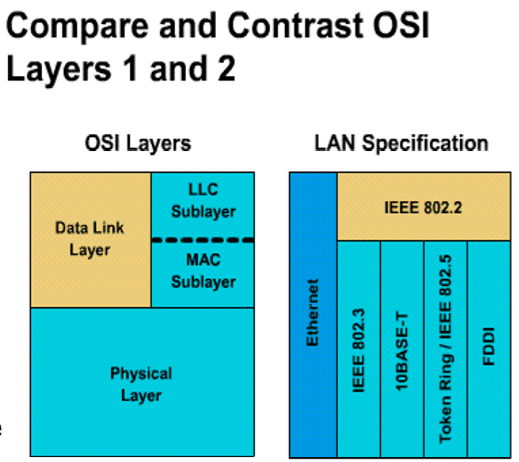

## 2.2. Media Access Control Sublayer 介质访问控制子层

1. 以字节为单位进行帧结构描述
2. 有802.3的规范和以太网的规范
3. MAC 介质访问控制子层的帧结构

### 2.2.1. 前同步码
1. 从1和0的交替(alternating)模式开始，称为前同步码(preamble)。前同步码是(0x10101011)，前导码是(0x10101010)
    + 告诉接收方，要来数据了，因为不是预约发数据的模式，这个码就是为了保证对方有相应准备时间，前面7个自己是0x10101010，最后一个是0x10101011(用于进行时钟同步)
    + 使用曼彻斯特编码的方案，无传输的时候是0电平的
2. 前同步码告诉接收站一帧即将到来。

### 2.2.2. 目标和源物理地址字段
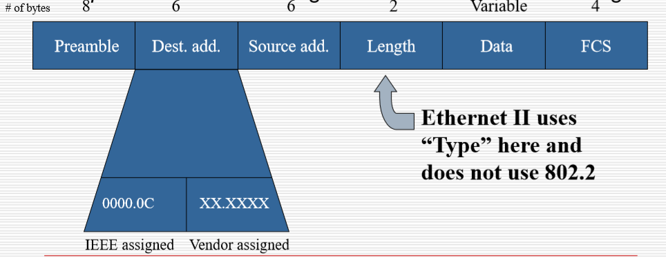

1. 源地址：始终是单播地址
2. 目的地址：单播地址，组播地址或广播地址
3. MAC地址：6个字节目的地址(Dest.add) 6个字节源地址(Source.add.)，和第三层第四层报文有差别
4. 先看目的地址的好处:交换机等看到目的地址就可以进行判断，提高效率

### 2.2.3. 长度字段
>长度字段指示在该字段之后且在帧检查序列字段之前(precede)的数据字节数。
1. 2个字节长，早期规范放的是长度,指定**数据长度**，以太网2标准下则是使用type来完成这部分内容，指定后面的DATA是IP还是IPX的报文数据。
2. 没有长度也可以计算出来长度，通过有电平长度就可以计算出数据的长度
3. 数据长度的限制(46-1500字节)，以太网的帧长度不能长于1518字节
4. 为了避免歧义，只要保证Length的数据大于数据报的最大长度即可保证是表示type，保证和之前兼容

### 2.2.4. 数据字段
>数据字段包含您要发送的信息。
1. 数据的长度为46(18 + 46 = 64字节)-1500字节，帧的大小至少是64个字节，如果数据太短需要补充0才能生成data，前引导码不算帧长度
2. 最前面8个字段不算帧的内容
3. **4个64字节大小帧同时发送才能保证占据全部的链路**，100m链路，用512us，就是512bit

### 2.2.5. FCS字段
>FCS字段（四个字节）包含循环冗余校验(cyclic redundancy check)值
1. 固定4字节
2. 发送设备创建CRC
3. 接收设备重新计算CRC，以检查在传输(transit)过程中可能对帧造成的损坏(damage)。
4. 发送方用有效帧的内容除以一个数字，取得的余数放到这个位置，进行发送，接收方。也会将这个帧的内容除以那个数，然后将得到的进行比较，判断是否出现错误。
5. FCS正确不一定能保证数据是正确的，几次错误后导致FCS还是正确的，但是这种出错率比较低
6. CRC错误在不同情况下不同处理:有时候是直接抛弃，有时候还要再校验一下。

## 2.3. LLC 逻辑链路控制子层
1. 逻辑链路控制（LLC）子层通过单个链路管理设备之间的通信
2. LLC在IEEE 802.2规范中定义，并且支持无连接和面向连接(connect-oriented)的服务。
3. LLC子层允许部分数据链接层独立于现有技术运行,单个LLC子层可以与不同的MAC子层兼容(compatible)。
4. LLC子层基有面向连接的，也有不面向连接的，也就是既可以是进行总线服务，也可以实现令牌环路
5. LLC为什么被弃用了?因为局域网的正确率比较高，不需要LLC来进行守护，避免拖累速度和效率，而这部分也已经被第四层完成了
6. 蓝牙等特殊连接，直到第二层就已经结束，所以就需要使用LLC来完成
7. 有无连接是在LLC部分执行的，无法在MAC上进行处理的

### 2.3.1. LLC子层：封装
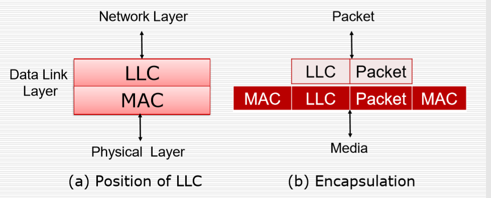

1. LLC子层服务上层，LLC会放在packet前面，然后再做一次封装。
2. 第二次封装则为LLC子层向MAC子层请求封装操作。
3. 如上的过程如下：
    1. LLC获取网络协议数据（数据包，packet），并添加更多控制信息以帮助将数据包传递到其目的地。
    2. 它添加了802.2规范的两个寻址组件，以在每一端标识上层协议：
         + 目标服务访问点（DSAP）
         + 源服务访问点（SSAP）
    3. 然后，此重新打包的数据将传输到MAC以进一步封装数据。
    4. 基于SAP规范进行地址和分配。
4. 提供了
   1. 无确认的无连接服务，被使用在
      1. 可靠链路(上层来保证数据正确性)
      2. 实时任务
      3. 大多数的局域网内
   2. 有确认的无连接服务，被使用在，不可靠链路，比如无线网
   3. 确认的有连接服务

## 2.4. MAC子层上的介质访问控制

### 2.4.1. 十六进制数(Hexadecimal)作为MAC地址
1. MAC地址为48位，始终表示为**12个十六进制数字**。
2. IEEE管理的前6个十六进制数字（从左到右）标识制造商(manufacturer)或销售商(供应商)，并包括组织唯一标识符（OUI）。
    + OUI是生产的厂商，比如0060CF就是Cisco的，然后可以使用后面24个bit进行自己的编码
    + 一个厂商是可以买多个OUI的，也可以几个单位买一个OUI
    + 第一个bit取0表示这个地址是一个单播地址，取1则是表示是一个多播地址。
    + 第二个bit取0表示这个地址是全球唯一地址，取1则表示是一个地址唯一地址
3. 其余的6位十六进制数字包括接口序列号，由特定供应商管理。

### 2.4.2. 以太网802.3广播
1. 广播
    + 目标MAC：全1（FFFF.FFFF.FFFF）
    + 保证所有的设备都能收到这个地址
    + 会导致非目的主机进行地址解析
2. 广播会不必要地打断电台(stations)，从而严重影响电台的性能
3. 因此，仅在以下情况下才应使用广播：
    + 目的地的MAC地址未知
    + T目的地是所有主机
4. 非必要情况下我们不希望有很多广播，有可能会导致广播风暴

### 2.4.3. 以太网操作
1. 以太网是广播网络，也就是说，每个站都可以看到所有帧，而不管它们是否是目的地
2. 通过MAC地址判断站点是否为目的地
3. 目标站在OSI层上发送数据。其他节点丢弃(discard)帧

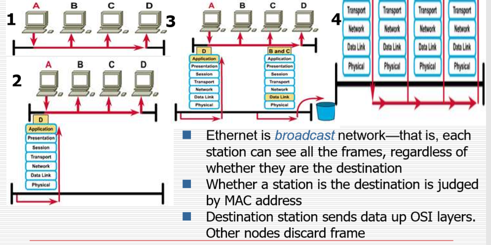

>上图中1是总线拓扑，1发送的数据帧会传达给所有在这个总线上的设备，非目的主机检查目的地址和本机MAC地址不同，则会将该帧丢弃。

### 2.4.4. 广播操作步骤
1. 听然后传送
2. 广播 jam 信号
    + 是一个32bit的全1的数据帧表示出现了冲突
    + 标准思科认为是所有侦听的设备都会发送
3. 发生碰撞(Collision)
    + 两个设备同时使用链路发送电信号，则会出错。
    + 如果有冲突，则会一直侦听总线，等到空闲则可以组织数据帧发送
    + 还有问题就是多台主机同时进行组织数据帧进行发送
    + 因为同时还在侦听总线，如果出现冲突，则会发出jam信号，只要有0或者1传输，有电平则会表示使用
4. 设备退回(back off)适当的时间，然后重新传输(retransmit),发生冲突的设备，根据特定的回退算法

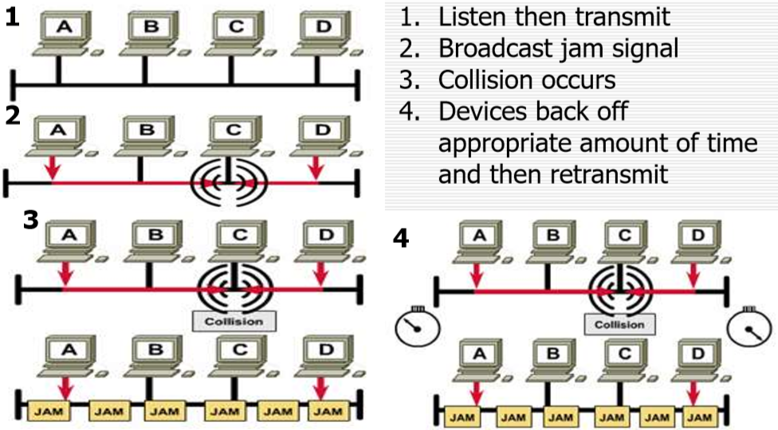

5. 为什么64个字节才能抢线路？
    + 10M以太网，64个字节才能在512us中传输满整个100m的线路

### 2.4.5. 以太网的CSMA/CD 
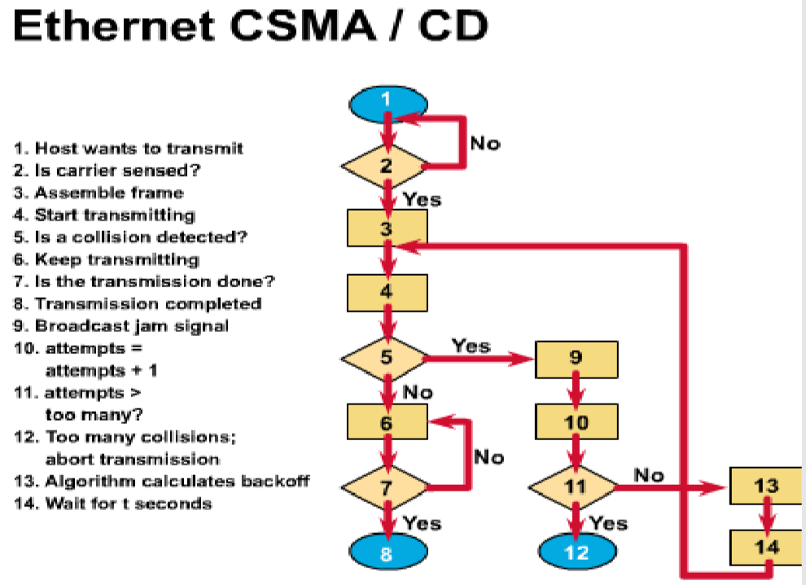

1. 首先设备要发送数据
2. 开始侦听链路是非忙，如果忙，则过一阵来再看看
3. 如果不忙，则开始准备发送
    + 如果有错误，则到9，表示有冲突发送，广播一个jam sighnal，把自己尝试的次数 + 1(重发有一定限度)
    + 尝试次数过多，会像上层协议传输网络不可用
    + 尝试次数还可，则到13计算一个回退时间，来再次尝试，回退时间单位，会保证A和D的时间差能保证第一个人已经用完电路来避免冲突。
4. 如果没有错误，则一直传输到结束为止

# 3. 无线局域网和CSMA/CA

## 3.1. 无线(Wireless)局域网
1. 无线局域网
    + 基于单元的通信
    + 电台发送的信号只能被附近的电台接收
    + 短距离传输
2. 无线局域网标准
    + IEEE 802.11
    + IEEE 802.11b
    + IEEE 802.11a
    + IEEE 802.11g
    + IEEE 802.11n
3. 无线局域网分为两类
   1. 有基础设施拓扑网络(Infrastructure mode)
   2. 无基础设施拓扑网络(ad-hoc mode)
4. 基础设施是提前建设好的基站，可以覆盖一定的区域
   1. 无线网卡和基础设施通信

### 3.1.1. 虚拟载波监听
1. 源站把它要占用信道的时间(包括目的站发回确认帧所需的时间)写入到所发送的数据帧中(即在首部中的`持续时间`中写入需要占用信道的时间，以微秒为单位，一直到目的站把确认帧发送完为止)，以便使其他所有站在这一段时间都不要发送数据。
2. 当站点检测到正在信道中传送的帧中的`持续时间`时，就调整自己的(Network Allocation Vector，NAV网络分配向量)。NAV指出了信道处于忙状态的持续时间。
3. 为什么信道空闲还要再等待呢?就是考虑可能有其他站点有**高优先级**的帧要发送。如有，就让高优先级帧先发迭。等待的时间就是IFS(Inter-Frame Space，帧间间隔)。
   1. SIFS(Short Inter-Frame Space，短帧间间隔)最短
   2. PIFS(Point Inter-Frame Space，点协调功能帧间间隔)其次
   3. DIFS(Distributed Inter-Frame Space，分布协调功能帧间间隔)最长。

5. 实际吞吐量
   1. 因为源站点发出帧后，接收节点需要返回确认帧(ACK)。这将导致吞吐量降到带宽的一半
   2. 还受到信号强度的影响，当信号变弱之后，将会发起ARS(Adaptive Rate Selection，自适应速率选择)，传输单元会将传输速率从11 Mbps降到5.5 Mbps，或5.5到2，或2到1

### 3.1.2. 无线局域网标准
1. IEEE 802.11
    + 一项关键技术：**直接序列扩频（DSSS，Direct Sequence Spread Spectrum）**
    + DSSS适用于在 1 到 2 Mbps范围内运行的无线设备，上面的这个速率在实际生活场景中要除以2，因为无线通信都是有确认的，所以一般我们认为信道一来一回才有一次通信。
    + DSSS可以高达11 Mbps的速度运行，但在2 Mbps以上时将不被视为兼容
    + 也称为 Wi-Fi™，无线保证度，是星型拓扑，基站作为中心
2. IEEE 802.11b(Wi-Fi)
    + 传输能力提高到11 Mbps
    + 所有802.11b系统都向后兼容(backward compliant)，因为它们还仅针对DSSS支持1和2 Mbps数据速率的802.11。
    + 通过使用与802.11不同的编码技术来实现(Achieves)更高的数据吞吐率
    + 在2.4 GHz内运行，解决了802.11中出现的部分问题
    + 使用的是高速直连方案
3. IEEE 802.11a
    + 涵盖在5 GHz传输频带中运行的WLAN设备，运行在5Hz上
    + 802.11a能够提供54 Mbps的数据吞吐量，并且采用称为“速率加倍”的专有技术已达到108 Mbps。
    + 实际上，更标准的等级是20-26 Mbps。
    + 传播距离相比802.11和802.11b短(衰减强)，但是对于多用户上网的支持更好了。
    + 使用**正交频分复用**技术。
4. IEEE 802.11g
    + 可以提供与802.11a(54Mbps)相同的功能，但具有802.11b的向后兼容性
    + 使用**正交频分复用(OFDM，Orthogonal Frequency Division Multiplexing)**技术。
5. IEEE 802.11n: 下一代的WLAN
    + 提供的带宽是802.11g的两倍，即108Mbps，理论上可达500-600Mbps。实际上是100M左右
    + 目前使用比较多的方案。

### 3.1.3. 无线网络拓扑
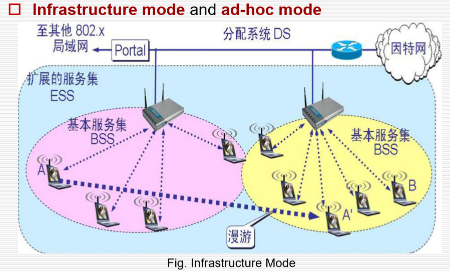

1. 这里讲的是有基础设施的无线网络拓扑结构
2. DS:分配系统，线
3. 上网还要通过网关

### 3.1.4. 无线网络的基础设施
1. 基本服务集（BSS）包括一个基站（BS）和几个无线主机
    + 所有主机都可以在本地BSS中直接相互通信
    + 基站中两个主机之间是不直接互相通信的。
    + 同一个BSS中的主机间直接通信
2. 接入点（AP）充当基础架构模式的基站（BS）
    + AP硬连线到有线(cabled)局域网，以提供Internet访问和与有线网络的连接
    + 安装AP后，将分配服务集标识符（SSID）和通道
    + 单元格的范围是91.44至152.4米（300至500英尺）
    + 覆盖大概100m左右
3. 一个BSS可以通过分发系统（DS）连接到另一个BSS，并构造一个扩展服务集（ESS）。
4. 家里的路由器既有AP的功能又有路由器功能，但是理论上只应该是AP的功能，一般我们认为家用路由器是一个AP

## 3.2. 访问过程(Accessing Procedure)
1. 在WLAN中激活客户端时，它将开始“侦听”与之“关联”的兼容设备
2. 这被称为“扫描”
    + 主动扫描
    + 被动扫描
3. 需要和AP连接，才能向AP发送数据帧。

### 3.2.1. 主动扫描
1. 导致从寻求加入网络的无线节点发送探测(probe)请求。
2. 探测请求将包含它希望加入的网络的服务集标识符（SSID）
3. 当找到具有相同SSID的AP时，该AP将发出探测响应
4. 身份验证和关联步骤已完成
5. 移动端发出请求帧，但是AP不发送自己的信息
6. AP比较安全。不用发送出自己的SSID

### 3.2.2. 被动扫描
1. (ad hoc) 侦听由AP（基础结构模式）或对等节点（ad hoc）传输的信标管理帧（beacon management frames），包含自己的SSID信息
2. 当节点接收到包含要尝试加入的网络的SSID的信标时，将尝试加入该网络。
3. 被动扫描是一个连续的过程，并且随着信号强度的变化，节点可能会与AP关联或分离，也是因为强度变化，所以连接状态需要维持。

## 3.3. 无线局域网的帧结构
1. WLAN不使用标准的802.3帧。 
2. 框架有三种类型
    + 控制帧(Control Frames)
    + 管理帧(Management frames)
    + 数据帧（仅数据帧类似于802.3帧）
3. 无线数据帧和802.3帧的有效载荷(payload)为1500字节
    + 但是，以太帧不能超过1518字节，而无线帧则可能高达**2346字节**。(是因为在无线情况下使用的是有确认的信息，增加无线帧有效数据大小，来对冲，确认的信息的损耗)。
    + 无线网络帧的大小也不会太大，尽量避免转换成有线帧的时候出现帧的拆分，也就是说大小一般在1500字节以下，通常，WLAN帧大小将被限制为1518字节，因为它最常连接到有线以太网。

## 3.4. 数据帧结构（802.11 无线网）

1. 帧控制信息包含 16 bit
2. 去往AP和来自AP是我们需要重点确认
3. WEP规格，Wired Equivalent Privacy（有线等效保密）
4. 持续期:参数，**很重要**，CSMA/CA需要，这个信息
5. 有时间窗口，如果超时没收到信号，则进行重传

### 3.4.1. 数据帧的的地址分类
1. ad hoc(无线网地址)用地址4
2. 有基础设施用的是地址1、2、3

### 3.4.2. 数据帧中的地址详解

1. 扩展星型拓扑
2. 去往AP和来自AP显然是不能全为1的
   1. 去往AP是指向AP发送，参考第二行
   2. 为什么不能全为1?因为两个AP之间通过有线进行通信，所以不是无线通信的过程。

## 3.5. 为什么我们需要CSMA/CA？
1. 冲突(Collisions)可能发生在WLAN中，但是站点只能知道附近的传输，因此CSMA/CD不是一个好的选择。
    + 隐藏站问题:当A将数据传输到B时，C无法检测到A和B之间的传输，因此C可能会决定将数据传输到B并导致B发生冲突。
    + 暴露站问题:当B将数据传输到A时，C可以检测到传输，因此C不会将数据传输到D。但这是一个错误。(听到不应该听到的信号)

1. 应用在无线网络ad hoc连接的时候，直接相连转发
2. 对应:总线拓扑
3. 这种情况下做不到全体的侦听
4. 什么我们不使用CSMA/CD？
   1. 碰撞检测”要求一个站点在发送本站数据的同时，还必须不间断地检测信道。一旦检测到碰撞，就立即停止发送。但由于无线信道的传输条件特殊，其信号强度的动态范围非常大，因此在802.11适配器上接收到的信号强度往往会远远小于发送信号的强度(信号强度可能相差百万倍)。如要在无线局域网的适配器上实现检测到碰撞，在硬件上需要的花费就会过大。
   2. 更重要的是，即使我们能够在硬件上实现无线局域网的碰撞检测功能，我们仍然无法避免碰撞的发生。这就表明，无线局域网不需要进行碰撞检测。

## 3.6. 多路复用机制(Mechanism)
1. 以太网
    + 信号被传输到电缆上的**所有**站。
    + 发送站检测到冲突。
    + 一次只能在信道上发送一个有效帧。
2. WLAN 无线网络
    + 信号通过电缆传输到发送站附近的站(相邻,不可以跨越有效距离发送)
    + MAC协议必须尽最大努力确保仅发送站靠近接收站，发送方只能发送一路信号给接受方，不能有多个发送方发送信号给一个接受点
    + 接收方检测确定冲突。
    + 一次可以在通道上传输**多**个有效(effective)帧,不可以产生冲突。

## 3.7. CSMA/CA 避免冲突的载波侦听多路访问
1. CSMA/CA（Carrier Sense Multiple Access with Collision Avoidance）
    + 发送站点在发送数据前，以**控制短帧**刺激接收站点发送应答短帧，使接收站点周围的站点监听到该帧，从而在一定时间内避免数据发送
    + 基本过程
        1. A向B发送RTS（Request To Send，请求发送）帧，A周围的站点在一定时间内不发送数据，以保证CTS帧返回给A；
        2. B向A回答CTS（Clear To Send，清除发送）帧，B周围的站点在一定时间内不发送数据，以保证A发送完数据；
        3. A开始发送
        4. 若控制帧RTS或CTS发生冲突，采用二进制指数后退算法等待随机时间，再重新开始。(A和C同时发送RTS)
2. 退避时间短的设备先传输
3. 发现冲突所有设备同时退避
4. 在ad hoc网络中比较无序，存在大量延时，比如CTS和RTS相碰撞，这种情况是比较少的，异常情况，不在本课程考虑范围内。

### 3.7.1. CSMA/CA过程
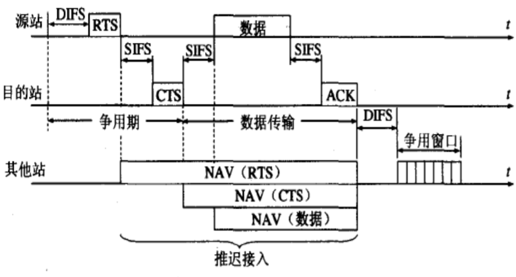

1. 为避免冲突，802.11所有站点在完成一个事务后必须等待一段时间才能进行下一个动作，这个时间被称为IFS，具体取决于帧的类型。
2. SIFS(Short interframe space):短帧间间隔 28us，用于本设备接受发送状态转换，不足够源站接受CTS
3. DIFS(Distributed Inter-frame Spacing):分布协调功能帧间间隔 128us(多个节点进行协调)
4. 应答CTS(Clear to Send)，等待SIFS(Short interframe space)后发送数据
5. 过程中的时间写入时间数据标记位
6. NAV(网络分配向量)：网络协调时间,时间长度:NAV计算方式在后面，NAV是一开始就进行预估了，别的节点抢到了节点时，我们会减掉别人正常通信的时间，不是一直累积下去的情况。
7. 下一次经过争用窗口来抢
8. 源站需要收到确认信息CTS才能接着发送信息
9. 多个源站向目的站发RTS给目的站，目的站发现冲突，告诉各自站点，PPT处理的是RTS

### 3.7.2. CSMA/MA实例

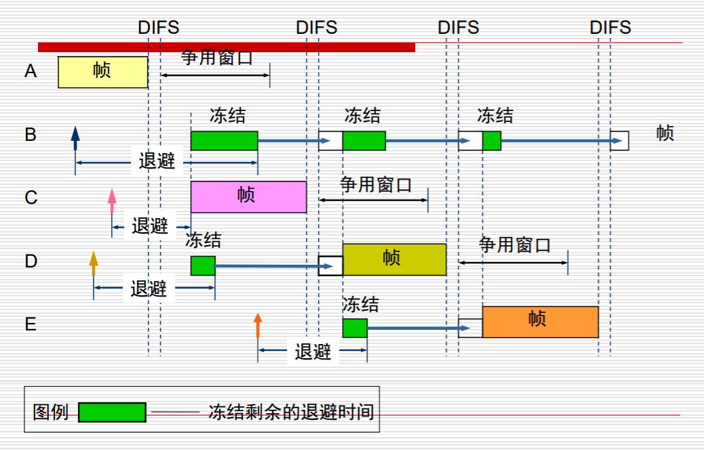

1. A的反应时间少，抢到使用权
2. E加入进来的话也会计算出一个退避时间

## 3.8. 实际数据传输率
1. 当源节点发送帧时，接收节点将返回肯定确认（ACK）。
    + 这可能导致消耗50％的可用带宽(bandwidth)。
    + 在额定为11 Mbps的802.11b无线局域网上，这会将实际数据吞吐量降低到最大5.0到5.5Mbps。
2. 网络性能也会受到信号强度的影响
    + 随着信号变弱，可以调用自适应速率选择（ARS）
    + 信号会受到距离影响，越远信号越弱，功率越低，带宽不能稳定到初始带宽
    + 传输单元会将数据速率从11 Mbps降低到5.5Mbps，从5.5 Mbps降低到2 Mbps或2 Mbps到1 Mbps。

## 3.9. WLAN和Ethernet区别
| Ethernet                             | WLAN                                          |
| ------------------------------------ | --------------------------------------------- |
| 信号被传输到连接在线缆上的所有站点上 | 信号只被传输到接近发送站点的站点              |
|                                      | 接受站点检测冲突                              |
| 只会有一个有效帧在信道上传播         | 会有多个有效帧同时在信道上传播                |
|                                      | MAC协议必须尽可能保证只有发送站点接近接收站点 |

# 4. Layer 2 Devices 第二层设备

## 4.1. NICs 网卡
1. NIC执行重要的第2层数据链路层功能：
   1. 逻辑链接控制-与计算机上层通信
   2. 媒体访问控制-提供对共享访问媒体的结构化访问
   3. 命名-提供唯一的MAC地址标识符
   4. 成帧-封装过程的一部分，打包比特以进行传输。
   5. 信号-使用内置收发器创建信号并与媒体接口(也有第一层功能，变为01信号)

## 4.2. 网桥(Bridges)
1. 网桥将流量划分为多个部分，并根据MAC地址而不是协议对流量进行过滤。
2. 网桥可以通过减少较大的冲突域来提高网络性能。
   1. 大的冲突域变少，碰撞和冲突会变少，但是网桥会成为一个瓶颈。(网桥将数据帧检验存储再转发)
   2. 导致延迟提高10-30%
3. 在从网络的一个网段到其他网段的流量较低的情况下，网桥最有效,当网段之间的流量变大时，网桥会成为瓶颈(bottleneck)，并减慢通信速度。
4. 一般是处理两个不同的分段，相对比较简单。
5. 是一种储存转发(store-and-forward)设备，因为它必须接受整个帧并在转发前校验CRC(事实上这必要性不大)
   
### 4.2.1. 透明网桥原理

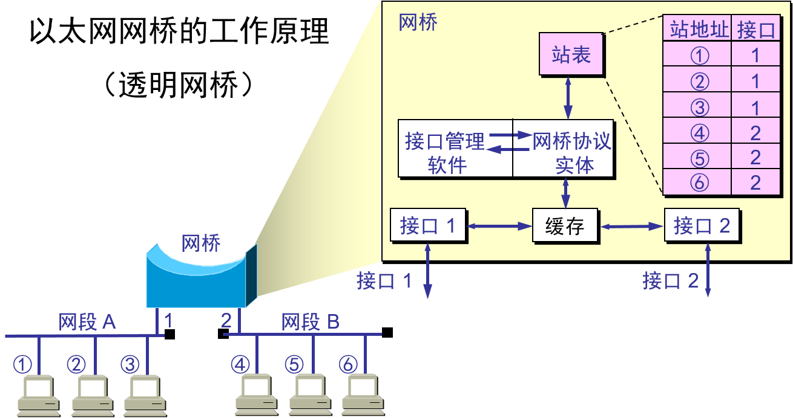

1. Mac表放到缓存的位置，刚启动时是空表，之后逐渐学习。
    + Mac地址表是有生命周期的，如果计时超过一个阈值没有刺激刷新Mac表，则会刷新表
    + 比如笔记本更换接入地址。
2. “透明”指局域网中的站点并不知道所发送的帧将经过哪几个网桥，因为网桥对各站来说是看不见的
3. 即插即用
4. 原理
    1. 从A发出的帧从接口x进入了网桥，则从这个接口发出帧就一定能达到A。网桥每收到一个帧，就记下其源地址和进入网桥的接口，写入转发表。
    2. 在收到一个新的帧时，在转发表中匹配此帧的目的地址，找到对应的接口并转发。
    3. 在网桥的转发表中写入的信息除了地址和接口外，还有帧进入网桥的时间，因为
       + 拓扑可能经常变化
       + 站点也可能会更换适配器（这就改变了站点的地址）
       + 站点并非总是处于工作状态
       + 把每个帧到达网桥的时间登记下来，就可以在转发表中只保留网络拓扑的最新状态信息，使得网桥中的转发表能反映当前网络的最新拓扑
5. 问题：网络上的设备要发送数据但不知道目标地址时。
    + 向网络上的所有设备发送广播。因为希望数据帧能够发送到全网，尽可能到达目的地
    + 由于网络上的每个设备都必须注意此类广播，因此网桥始终会转发这些广播。
6. 广播过多会导致广播风暴，并且可能导致：
    + 网络延时(network time-outs)
    + 交通减速(traffic slowdowns)
    + 低于可接受的性能

### 4.2.2. 源路由网桥
1. 发送帧时将详细的路由信息放在帧的首部中,从而使每个经过的网桥都了解帧的路径
2. 在令牌环网络中被广泛使用
3. 原理:源站以广播方式向目的站发送一个发现帧，每个发现帧都记录所经过的路由。发现帧到达目的站时就沿各自的路由返回源站。源站在得知这些路由后，从所有可能的路由中选择出一个最佳路由。凡从该源站向该目的站发送的帧的首部，都必须携带源站所确定的这一路由信息。

## 4.3. 交换机(Switches)
1. 执行两个基本操作：
   1. 切换数据帧：在输入介质(medium)上接收帧，然后将其传输到输出介质
   2. 维护交换操作：交换器建立和维护交换表并搜索循环。 路由器构建并维护路由表和交换表。(STB协议避免回路)
2. 交换是一项通过**减少流量**和alleviates congestion来缓解以太网LAN拥塞(alleviates congestion)的技术.
   1. 交换机创建专用(dedicated)的网段或点对点连接，并将这些网段连接到交换机内的虚拟网络中。
   2. 之所以称为**虚拟电路**，是因为它仅在两个节点需要通信时才存在，并且在交换机内建立。网桥内部有一个高带宽的总线(一般内部带宽是接口带宽的10倍)
   3. 您可以将每个交换机端口视为一个微桥(micro-bridge)。该过程称为微分段(microsegmentation)。
   4. 每个交换机端口将介质的全部带宽提供给每个主机
3. 局域网交换机可减少冲突域的大小(通过，VLAN划分)
4. 但是，连接到交换机的所有主机仍位于同一广播域中。
    1. 也就是说，通过LAN交换机连接的所有其他节点仍将看到来自一个节点的广播。
    2. 交换机不能划分广播域(端口->所有端口转发)
5. 带宽利用率可以接近100%
6. 交换机连接的是一个局域网，而路由器连接的是不同局域网。

### 4.3.1. 交换机划分了冲突域
1. 转发的速度明显加快，因为它们在**硬件**中进行切换，而网桥在**软件**中进行切换。
2. 可以使用交换机连接10 Mbps以太网LAN 和 100 Mbps以太网LAN。
3. 在交换式以太网实现中可用带宽可以接近100％。
4. 共享以太网网络的容量不足其全部容量的30％至40％时，其性能最佳。
5. 一些交换机**支持直通交换**，这减少了延迟和延迟，而网桥仅支持**存储转发交换(存储转发，存下来检验转发)**。
   1. 直通交换:快速转发，不做校验，只看前6字节的MAC地址。
   2. 局域网:网速比较快，传输速率高，网线比较短，可以认为是基本没有错误的，所以可以进行直通转发

### 4.3.2. 路由器划分了冲突域
1. 路由器可以创建最高级别的细分：
   1. 创建较小的**碰撞域**
   2. 创建较小的**广播域**：除非经过编程，否则路由器不会转发广播。
2. 路由器通过检查数据包上的**目标逻辑地址**，然后在其路由表中查找转发指令来完成数据包的转发
3. 由于路由器比网桥执行更多的功能，因此它们以更高的延迟率运行。
4. 路由器可以用作**网关**，用于连接不同的网络媒体和不同的LAN技术
5. 是根据逻辑地址(IP地址)进行转发，不再是MAC
6.  function比较多，所以延时会比较多。