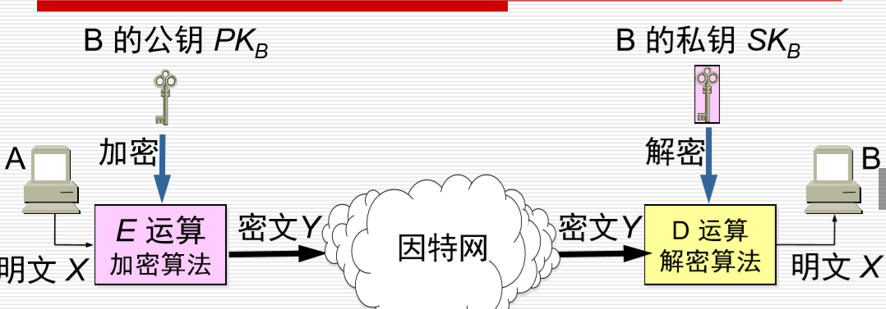
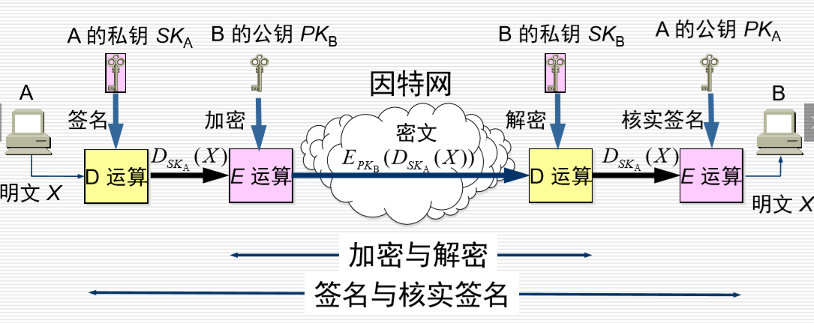
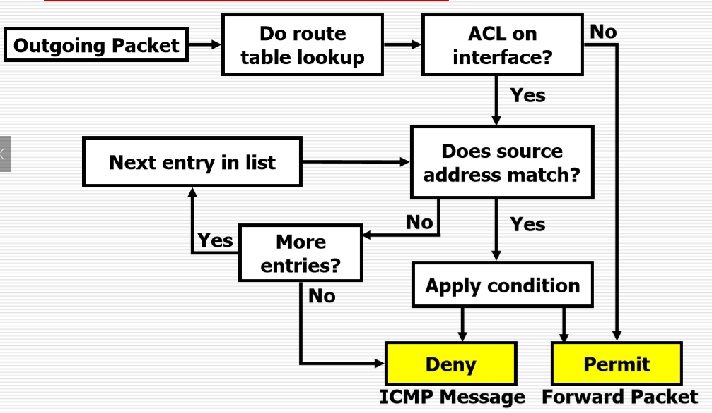
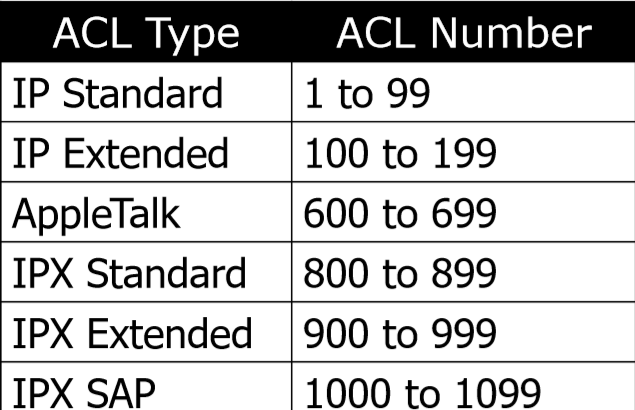
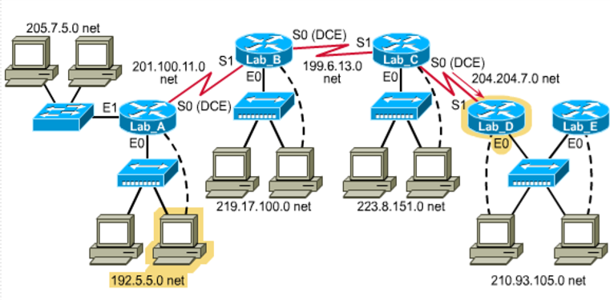
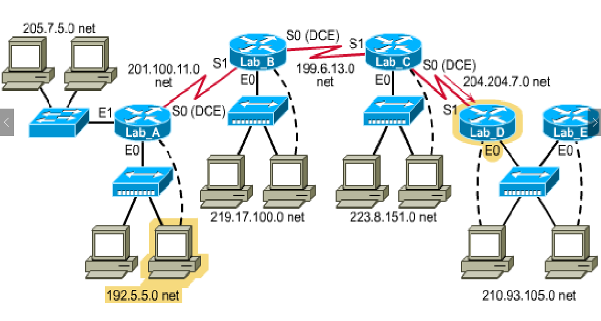
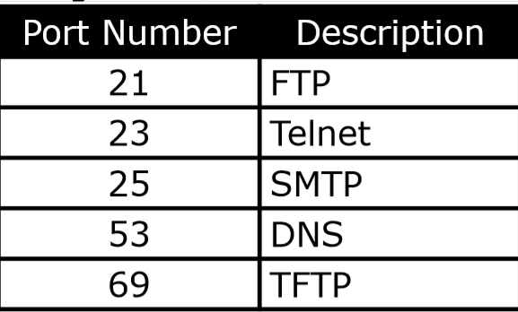
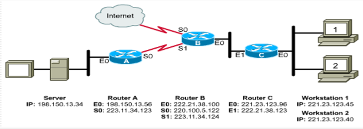
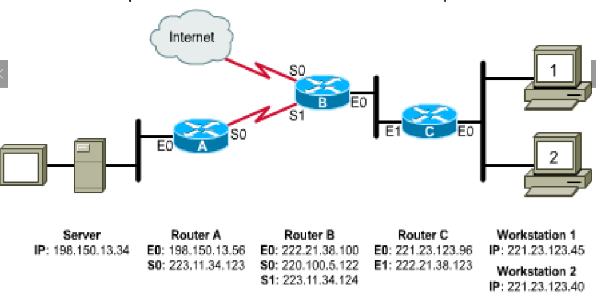
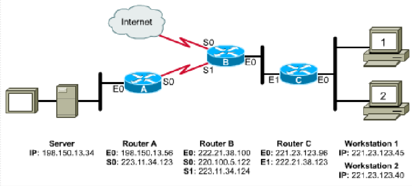

第11讲-网络安全
---

# 1. 网络安全问题概述
1. 计算机网络上的通信面临以下的四种威胁：

| 威胁 | 解释                         | 攻击类型 |
| ---- | ---------------------------- | -------- |
| 截获 | 从网络上窃听他人的通信内容。 | 被动攻击 |
| 中断 | 有意中断他人在网络上的通信。 | 主动攻击 |
| 篡改 | 故意篡改网络上传送的报文。   | 主动攻击 |
| 伪造 | 伪造信息在网络上传送。       | 主动攻击 |

## 1.1. 被动攻击和主动攻击


### 1.1.1. 被动攻击
1. 截获信息的攻击称为被动攻击(并不改变通讯的过程)
2. 在被动攻击中，攻击者只是观察和分析某一个协议数据单元PDU而不干扰信息流。

### 1.1.2. 主动攻击
1. 更改信息和拒绝用户使用资源的攻击称为主动攻击。(修改了通信的构成)
2. 主动攻击是指攻击者对某个连接中通过的PDU进行各种处理(理解PDU后)
   1. 更改报文流
   2. 拒绝报文服务
   3. 伪造连接初始化

## 1.2. 计算机网络通信安全的目标
1. 防止析出报文内容
2. 防止通信量分析(通信的习惯)
3. 检测更改报文流
4. 检测拒绝报文服务
5. 检测伪造初始化连接

## 1.3. 报文应该具有的性质
1. 保密性
2. 完整性
3. 可用性
4. 鉴别性
5. 不可否认(抵赖)性:确认是特定的发送方

## 1.4. 恶意程序(malicious program) 
1. 计算机病毒:会“传染”其他程序的程序，“传染” 通过修改其他程序来把自身或其变种复制进去而完成。
2. 计算机蠕虫:通过网络的通信功能将自身从一个结点发送到另一个结点并启动运行的程序。(特定场景才能使用，出现上商业行为)
3. 特洛伊木马:一种程序，它执行的功能超出所声称的功能。运作木马获得特殊的权限
   1. 逻辑程序:逻辑下载程序
   2. 控制器程序:远程控制
4. 逻辑炸弹:一种当运行环境满足某种特定条件时执行其他特殊功能的程序。

## 1.5. 计算机网络安全的内容
1. 保密性
2. 安全协议的设计
3. 访问控制

# 2. 一般的数据加密模型


1. 不确定有没有人修改:使用密文发送
2. 最早的是**凯撒密码**:
   1. 加密：明文按照数字mod的值进行偏移，得到密文
   2. 解密：密文反向偏移数字mod的值进行偏移，得到明文

## 2.1. 密码相关的重要概念
1. **密码编码学**(cryptography)是密码体制的设计学(设计密码)
2. **密码分析学**(cryptanalysis)则是在未知密钥的情况下从密文推演出明文或密钥的技术。密码编码学与密码分析学合起来即为密码学(cryptology)。
3. 如果不论截取者获得了多少密文，但在密文中都没有足够的信息来唯一地确定出对应的明文，则这一密码体制称为**无条件安全**的，或称为**理论上是不可破**的。
4. 如果密码体制中的密码不能被可使用的计算资源破译，则这一密码体制称为在**计算上安全**的。(目前一般的密码体系能够达到的标注)

# 3. 对称密钥和公钥密码体制

## 3.1. 对称密钥密码体系
1. 所谓常规密钥密码体制，即加密密钥与解密密钥是**相同**的密码体制。
2. 这种加密系统又称为**对称密钥系统**。

### 3.1.1. 数据加密标准 DES Data Encryption Standard
1. 数据加密标准DES属于常规密钥密码体制，是一种分组密码(对称加密算法)
2. 在加密前，先对整个明文进行分组。每一个组长为64位。
3. 然后对每一个64位二进制数据进行加密处理，产生一组64位密文数据。
4. 最后将各组密文串接起来，即得出整个的密文。
5. 使用的密钥为64位(实际密钥长度为56位，有8位用于奇偶校验)。
6. 对于64位密码有编排的过程，详细自己查找学习
7. 密钥长度不会太长，算法复杂度比较低

### 3.1.2. DES 的保密性
1. DES的保密性仅取决于对密钥的保密，而算法是公开的。尽管人们在破译DES方面取得了许多进展，但至今仍未能找到比穷举搜索密钥更有效的方法。
2. DES 是世界上第一个公认的实用密码算法标准，它曾对密码学的发展做出了重大贡献。
3. 目前较为严重的问题是DES的密钥的长度(算力提升)
   1. 由于算力的提升，破解DES所需的时间进一步降低，不再是计算上安全的了。
   2. 通过增加DES密钥的长度来提高安全性。
4. 现在已经设计出来搜索DES密钥的专用芯片(硬件层面的解决方案)

## 3.2. 公钥密码体制
1. 公钥密码体制使用**不同的加密密钥与解密密钥**，是一种"由已知加密密钥推导出解密密钥在**计算上是不可行**的"密码体制。(非对称密码体系)
   1. 经典算法:密钥E和N，明文是一个数字，加密时用明文做E的指数次方之后mod N得到密文C，解密是D和N，密文C做D次方再mod N得到明文
   2. 例子:密钥是7和187，明文88，88的7次方mod187 = 11(密文)，解密密钥23和187，11的23次方mod187得到88(明文)

$88(明文)^{7}\ mod\ 187=11(密文)$
$11(密文)^{23}\ mod\ 187=88(明文)$

2. 公钥密码体制的产生主要是因为两个方面的原因，一是由于常规密钥密码体制的密钥分配问题，另一是由于对数字签名的需求。
   1. 一个机构可以发送自己的公钥，保留自己的密钥。接收者受到密钥加密的就知道是谁发送的，保证机构可以发送安全认证，接受者使用公钥解密知道是谁发送的，做到密钥的分配
   2. 私钥加密的是机构的签名，大量数据传输使用对称密钥体系传输，公钥发送比较少的数据，因为公钥密码体系算法复杂度比较高，加密的时候是很多位的明文，计算量太大。
4. 现有最著名的公钥密码体制是RSA体制，它基于数论中大数分解问题的体制，由美国三位科学家Rivest，Shamir和Adleman于1976年提出并在1978年正式发表。

### 3.2.1. 公钥算法的例子


1. 在公钥密码体制中，加密密钥(即公钥)PK是公开信息，而解密密钥(即私钥或秘钥)SK是需要保密的
2. 加密算法E和解密算法D也都是公开的
3. 虽然SK是由PK决定的，但却不能根据PK计算出SK(单向的)
4. 公钥和私钥是成对生成的

### 3.2.2. 公钥算法的特点
1. 发送者A用B的公钥$PK_{B}$对明文X加密(E运算)后，在接收者B用自己的私钥$SK_{B}$解密(D 运算)，即可恢复出明文：
    + $D_{SK_B}(Y) = D_{SK_B}(E_{PK_B}(X)) = X$
2. 解密密钥是接收者专用的秘钥，对其他人都保密。
3. 加密密钥是公开的，但不能用它来解密，即 
    + $D_{PK_B}(E_{PK_B}(X))\neq X$
4. 加密和解密的运算可以对调，即(用私钥进行加密，意义有差别:这样子证明是B发送的，但是别人都知道公钥，相当于明文发送)
    + $E_{PK_B}(D_{SK_B}(X)) = D_{SK_B}(E_{PK_B}(X)) = X$
5. 在计算机上可容易地产生成对的PK和SK
6. 从已知的PK实际上不可能推导出SK，即从PK到SK是“计算上不可能的”
7. 加密和解密算法都是公开的

### 3.2.3. 应当注意
1. 任何加密方法的安全性取决于**密钥的长度**，以及**攻破密文所需的计算量**
2. 在这方面，公钥密码体制并不比传统加密体制更加优越
3. 由于目前公钥加密算法的开销较大，在可见的将来还不会放弃传统的加密方法
4. 公钥需要密钥分配协议，具体的分配过程并不比采用传统加密方法时更简单

# 4. 数字签名
1. 数字签名必须保证以下三点：
   1. 报文鉴别:接收者能够核实发送者对报文的签名
   2. 报文的完整性:发送者事后不能抵赖对报文的签名
   3. 不可否认:接收者不能伪造对报文的签名
2. 现在已有多种实现各种数字签名的方法。但采用**公钥算法**更容易实现

## 4.1. 数字签名的实现


1. 因为除A外没有别人能具有A的私钥，所以除A外没有别人能产生这个密文。因此B相信报文X是A签名发送的。
2. 若A要抵赖曾发送报文给B，B可将明文和对应的密文出示给第三者。第三者很容易用A的公钥去证实A确实发送X给B。
3. 反之，若B将X伪造成X'，则B不能在第三者前出示对应的密文。这样就证明了B伪造了报文。

## 4.2. 具有保密性的数字签名


1. 首先用自己的私钥进行签名，然后对密文用B的公钥加密
2. 收到密文的，如果没有B的私钥，不能进行解密
3. 然后用B的私钥解密，之后用A的公钥检验是A发送的，一般只用来传送对称密码，比较耗时。
4. 保障获取公钥的过程

# 5. 防火墙
1. 防火墙是由软件、硬件构成的系统，是一种特殊编程(ACL)的路由器，用来在两个网络之间实施接入控制策略。接入控制策略是由使用防火墙的单位自行制订的，为的是可以最适合本单位的需要。
2. 防火墙内的网络称为**可信赖的网络**(trusted network)，而将外部的因特网称为**不可信赖的网络**(untrusted network)。
3. 防火墙可用来解决内联网和外联网的**安全问题**。

## 5.1. 防火墙在互连网络中的位置


1. 其实只用一个路由器就可以完成防火墙的划分。
2. 例子中:应用网关，可以内部外部进行访问过滤。
3. 优点:在防火墙中的外局域网和内局域网都可以放置一些服务器，由左侧过滤的路由器控制访问，而右侧的路由控制内部网络的访问，从而达成一个访问权限控制
4. 内网络安全也是一个问题

## 5.2. 防火墙的功能
1. 防火墙的功能有两个：**阻止和允许**。
   1. **阻止**就是阻止某种类型的通信量通过防火墙（从外部网络到内部网络，或反过来）：比如阻止内部的对迅雷的请求向外发送
   2. **允许**的功能与**阻止**恰好相反。
2. 防火墙必须能够识别通信量的各种类型。不过在**大多数情况下防火墙的主要功能**是**阻止**。

## 5.3. 防火墙技术一般分为两类
1. **网络级防火墙**:用来防止整个网络出现外来非法的入侵。属于这类的有**分组过滤和授权服务器**
   1. 前者检查所有流入本网络的信息，然后拒绝不符合事先制订好的一套准则的数据
   2. 后者则检查用户的登录是否合法
2. **应用级防火墙**:从应用程序来进行接入控制。通常使用应用网关或代理服务器来区分各种应用，例如，可以只允许通过访问万维网的应用，而阻止FTP应用通过

## 5.4. 访问控制列表ACL(Access Control Lists)
1. ACL是指令列表，它告诉路由器允许或拒绝什么类型的数据包。
2. 如果要让路由器拒绝某些数据包，则必须配置ACL。否则，只要链路打开，路由器将接受并转发所有数据包
3. 您可以根据以下情况允许或拒绝数据包：
   1. 源地址
   2. 目的地址
   3. 上层的协议，比如TCP或UDP端口

## 5.5. 使用ACL的前提下，发送数据包
1. 为了确定是允许还是拒绝数据包，请按顺序对ACL语句进行测试。
   1. 当一个语句"匹配"时，**不再评估任何语句**。(前面的语句先匹配，处理掉)
   2. 允许或拒绝该数据包。
2. ACL末尾有一个隐含的"deny any"语句:如果数据包与ACL中的任何语句都不匹配，则将其丢弃。

## 5.6. Example:ACL 例子
1. 如果我们有如下所述的ACL列表：
```
Permit packets from 192.168.100.1 to pass
Permit packets from 192.168.100.2 to pass
Deny packets from 192.168.100.3
```
2. 然后
   1. Packets from 192.168.100.1 will be forwarded
   2. Packets from 192.168.100.3 will be denied
   3. But how does the router process the packets from 192.168.100.4? denied(默认被匹配掉)

## 5.7. 路由器如何使用出站ACL
1. 检查数据包是否可路由。如果是这样，请在路由表中查找路由
2. 检查出站接口的ACL
   1. 如果没有ACL，则将数据包切换出目标接口
   2. 如果是ACL，请按照ACL语句顺序检查数据包-根据匹配的条件拒绝或允许。
3. 如果没有语句匹配，会发生什么？拒绝所有没有匹配的包

## 5.8. 出站标准ACL流程


1. 收到packet，确定路由表确认路由表看能够转发
2. 可以转发的话，进入ACL确认
   1. 如果当前端口没有ACL配置，则直接进行转发
   2. 如果当前端口有ACL配置，开始匹配source地址(标准的ACL，只能对原地址进行判断)
      1. 语句满足条件，
         1. deny
         2. premit
      2. 语句不满足条件，看下一条，如果没有下一条，则默认deny

## 5.9. 标准ACL的两个基本使用
>在全局配置模式下顺序编写ACL语句。

```
Router(config)#access-list access-list-number{permit/deny} {test-conditions}
Lab-D(config)#access-list 1 deny 192.5.5.10 0.0.0.0 拒绝来自192.5.5.10的报文
```

>在接口配置模式下将ACL分组(Group)到一个或多个接口。

```
Router(config-if)#{protocol} access-group access-list-number {in/out}
Lab-D(config-if)#ip access-group 1 out/in
```

### 5.9.1. access-list-number参数
1. ACL有很多类型。访问列表号指定什么类型。
2. 下表显示了常见的访问列表类型。



- 注意默认的取值(扩展ACL不仅仅局限于源地址)

1. `Router(config)#access-list access-list-number {permit/deny}{test-conditions}`

### 5.9.2. 允许或拒绝的参数
1.  输入访问列表并选择正确的访问列表号后，根据您要执行的操作，输入允许还是拒绝。
2. `Router(config)#access-list access-list-number {permit/deny}{test-conditions}`


### 5.9.3. test-condition参数
1. 在ACL的{test condition}部分中，大多数访问列表的共同点是源地址的IP掩码和通配符掩码。
2. 源地址可以是子网，地址范围或单个主机。由于通配符掩码使用源地址检查位，因此也称为ip掩码。
3. 通配符掩码告诉路由器要检查哪些位。


>1. Ip mask:Ipv4的地址
>2. **Wilcard mask**:和netmask是不同的，指示哪些位置被检查
>3. `Router(config)#access-list access-list-number {permit/deny}{test-conditions}`

### 5.9.4. 通配符掩码 Wildcard Mask
1. 编写通配符掩码以告知路由器地址中要匹配的位以及要忽略的位。
   1. **0位表示检查该位位置**
   2. **1表示忽略该位位置**
2. 我们先前的192.5.5.10 0.0.0.0示例可以用二进制重写为：
   1. 11000000.00000101.00000101.00001010 (Source address)
   2. 00000000.00000000.00000000.00000000 (Wildcard mask)

#### 5.9.5. 通配符掩码的例子
1. 编写一个IP掩码和通配符掩码以检查网络上的所有主机：192.5.5.0 255.255.255.0(检查这一个网段)
2. Answer: 192.5.5.0  0.0.0.255(和net mask是取反的)
   1. 请注意，此通配符掩码是C类地址的默认子网掩码的镜像。
   2. 警告：仅当查看整个网络或子网时，这才是有用的规则。
3. 编写一个IP掩码和通配符掩码以检查子网中的所有主机：192.5.5.32 255.255.255.224
   1. If you answered 192.5.5.32 0.0.0.31
   2. 0.0.0.31 是 255.255.255.224 的镜像地址
   3. 二进制标识
      1. 11111111.11111111.11111111.11100000 (255.255.255.224)
      2. 00000000.00000000.00000000.00011111 (0.0.0.31)

### 5.9.6. 省时：任何命令
1. 由于ACL末尾有一个隐含的"deny any"语句，**因此您必须编写语句以允许其他人通过。**
2. 使用我们前面的示例，如果学生被拒绝访问而所有其他学生都被允许访问，则您将编写以下两个语句：
   1. `Lab-A(config)#access-list 1 deny 192.5.5.0 0.0.0.127`:拒绝一个
   2. `Lab-A(config)#access-list 1 permit 0.0.0.0 255.255.255.255`
3. 由于最后一条语句通常用于覆盖“拒绝任何”，因此思科为您提供了一个选项-any命令：
   1. `Lab-A(config)#access-list 1 permit any` == `Lab-A(config)#access-list 1 permit 0.0.0.0 255.255.255.255`

### 5.9.7. 省时：主机名支持
1. 很多时候，网络管理员将需要编写ACL来允许特定主机（或拒绝主机）。该语句可以用两种方式编写。
   1. `Lab-A(config)#access-list 1 permit 192.5.5.10 0.0.0.0`
   2. `Lab-A(config)#access-list 1 permit host 192.5.5.10(host 专指 192.5.5.10)`

## 5.9.8. 标准ACL的配置位置
1. 标准ACL没有目标参数。因此，您将标准ACL放置在尽可能靠近目标的位置。
2. 要了解原因，请问自己，如果在Lab-A的E0上放置“ deny 192.5.5.0 0.0.0.255”语句，将会对所有IP流量产生什么影响？




- 如果放到Lab A的E0口则会导致无法访问Lab B/C,应该放到Lab D的E0
- 约定:将标准ACL放到与将要生效的主机越近越好，但是其实会对带宽有一定的损耗

## 5.10. 扩展ACL(Extend Access Control Lists)
1. 扩展ACL的编号范围为100-199，并“扩展”了标准ACL的功能。
2. 扩展功能包括基于过滤流量的功能。
   1. 目的地址
   2. ip协议的部分(更加细分):您可以编写语句以仅拒绝“ICMP”等协议或“RIP”和“IGRP”之类的路由协议
   3. 协议套件的上层
      1. 您可以编写语句以仅拒绝诸如“TFTP”或“HTTP”之类的协议
      2. 您可以使用eq，gt，lt和neq（等于，大于，小于和不等于）之类的操作数来指定如何处理特定协议。
      3. 例如，如果您希望访问列表允许除http访问之外的所有流量，则可以使用“ permit ip any neq 80”(允许来自任意源地址和目的地址的不是80端口的信息)

### 5.10.1. 扩展ACL的两个功能
>在全局配置模式下顺序编写ACL语句。(语法更加丰富)
```
Router(config)# access-list access-list-number {permit|deny} {protocol|protocol-keyword}{source source-wildcard} {destination destination-wildcard} [protocol-specific options] [log]
Lab-A(config)#access-list 101 deny tcp 192.5.5.0 0.0.0.255 210.93.105.0 0.0.0.255 eq telnet log
```
>在接口配置模式下将ACL分组到一个或多个接口
```
Router(config-if)#{protocol} access-group
access-list-number {in/out}
Lab-A(config-if)#ip access-group 101 out 
```

### 5.10.2. 扩展参数
1. access-list-number:choose from the range 100 to 199
2. {protocol | protocol-number}:For the CCNA, you only need to know ip and tcp--many more are available
3. {source source-wildcard}:same as in standard 和标准的相似
4. {destination destination-wildcard}:formatted like the standard, but specifies the destination 和标准格式系统
5. [protocol-specific options]：这个参数用于确认协议的过滤部分

### 5.10.3. 端口号
1. 查看tcp和udp协议的各种端口号，并了解以下最常见的端口号。
2. 您还可以在{protocolspecific options}中键入名称（telnet）而不是数字（23）。



### 5.10.4. 配置扩展ACL的位置
1. 在下图中，我们要拒绝网络221.23.123.0访问服务器198.150.13.34

。

1. 访问列表应应用于什么路由器和接口？
   1. 将访问列表写在路由器C上，将其应用于E0，并在
   2. 这将使网络不受221.23.123.0发往198.150.13.34的访问，但仍允许221.23.123.0访问Internet

>按照标准的原则，应该放置到Route A，而用扩展的放置的是Route C的E0上，放置对应的命令
- 由于扩展的ACL具有目标信息，因此**您希望将其放置在尽可能靠近源的位置。**



### 5.10.5. 编写并使用ACL
```
Router-C(config)#access-list 100 deny ip 221.23.123.0 0.0.0.255 198.150.13.34 0.0.0.0
Router-C(config)#access-list 100 permit ip any any
Router-C(config)#int e0
Router-C(config-if)#ip access-group 100 in
```



### 5.10.6. ACLS的命名
1. Cisco IOS的一项不错的功能是可以命名ACL。如果在同一路由器上需要99个以上的标准ACL，这将特别有用。
2. 命名ACL后，提示将更改，您不再需要输入access-list和access-listnumber参数。
3. 在下面的示例中，ACL命名为over_and，以提示应如何将其放置在接口上


### 5.10.7. ACLS的校验
1. `show access-lists` 查看全部
2. `shows all access-lists configured on the router` 显示路由器上配置的所有访问列表
3. `show access-lists {name | number}` 查看某一个端口的
4. `shows the identified access list` 显示已识别的访问列表
5. `show ip interface`:显示了应用于接口的访问列表（入站和出站）。
6. `show running-config`:显示所有访问列表以及它们应用于什么接口