# 1. 数据分布与概率分布

## 1.1. 频数分布与频率分布
1. 频数是各个数据被观测到的次数。
2. 频率是频数除以总次数。

## 1.2. 累积频数与累积频率
1. 数据排序后（通常是降序）进行频数或者频率的累加。

## 1.3. 概率分布
1. 我们需要从特定数据到一般规律的抽象，才能奠定数据科学的基础。

### 1.3.1. 随机变量

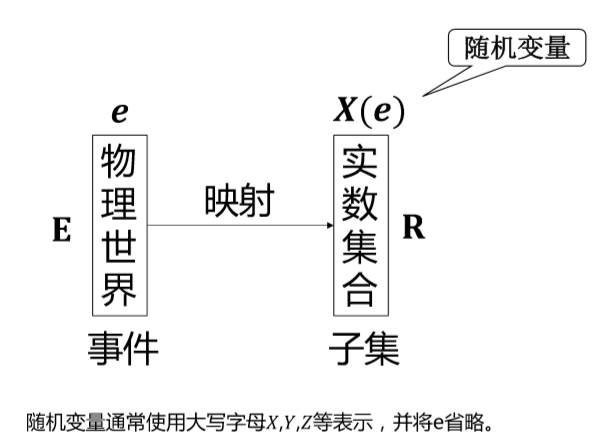

1. 例子:随机变量X，Y，Z
    + X更加符合需求

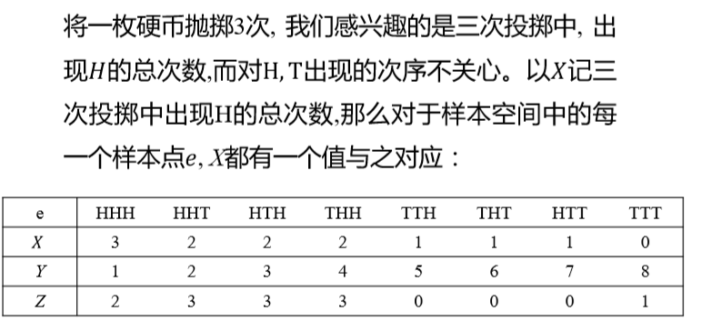

2. Summary:

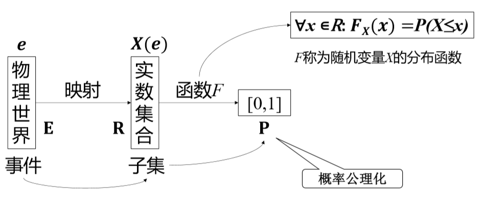

### 1.3.2. 分布函数
1. 对任意的X进行概率的累加，即从负无穷到X累加构建的一个函数成为随机变量X的分布函数
2. 分布函数一定是左连续的，但是概率密度函数不一定

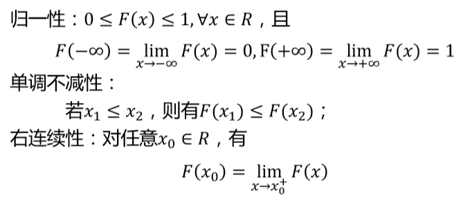

## 1.4. 随机变量
1. 为了进一步研究概率分布，我们对于随机变量进行深入研究分析。

### 1.4.1. 离散型随机变量(离散随机变量)
1. 一个随机变量 X 的可能取值为有限个或可列无穷多个, 则称X为离散型随机变量。
2. 概率分布律

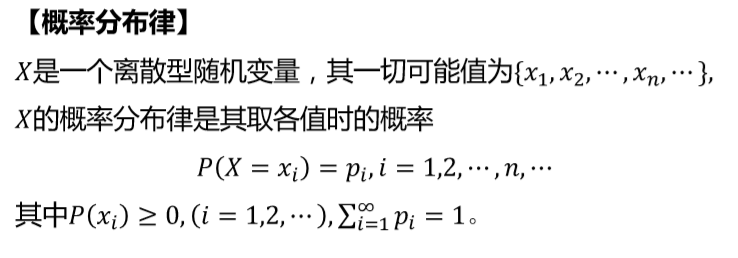

3. 之前的抛硬币问题的例子

### 1.4.2. 连续型随机变量

1. 例子:一个靶子是半径为2米的圆盘,设击中靶上任意同心圆盘上的点的概率与该圆盘的面积成正比,并设射击都能击中靶, 以X表示弹着点于圆心的距离。试求随机变量X的分布函数。

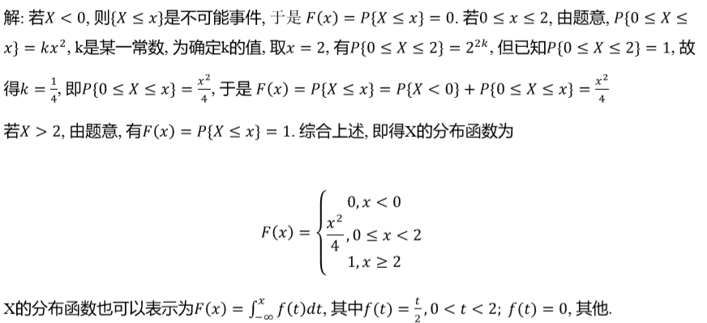

2. 概率密度函数:在断点处未必是连续的
    + 密度函数要求非负可积即可。当然在经典连续概率分布中，密度函数通常也是连续的。一来是比较符合自然世界，二来是容易得出优良的数学性质。

3. 性质:

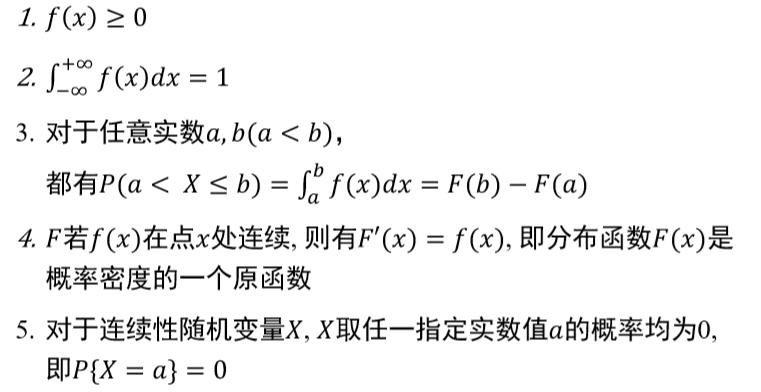

### 1.4.3. 强调
1. 随机变量还有其他形式，不是离散的未必是连续的，反之亦然。

# 2. 矩:数据动力学

## 2.1. 什么是矩?
1. 矩：是物理学中的一个丰富概念，涉及质量、 形状、空间、运动等各个方面。
2. Eg.力矩

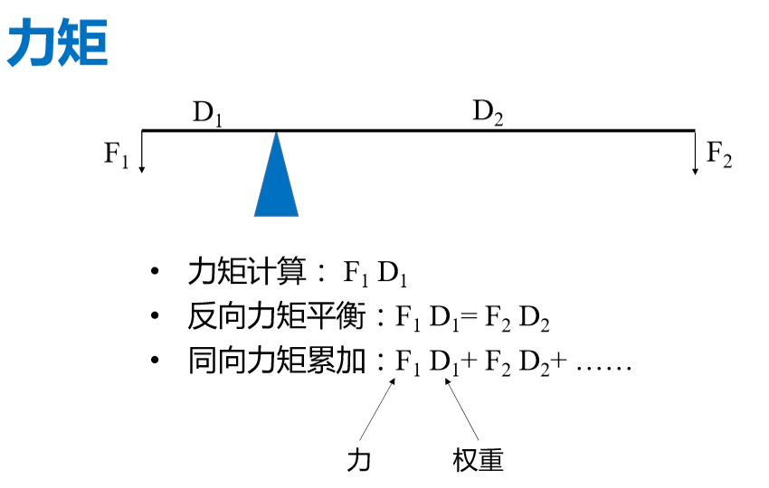

## 2.2. 数据原点矩

1. 一阶矩是算术平均值，代表数据集的“重心” 
2. 二阶矩代表数据集的转动惯量
3. 原点矩代表了数据集跟重量相关的动力度量

## 2.3. 数据中心距

1. 一阶中心矩B1为零
2. 二阶中心矩B2为方差
3. 三阶中心矩刻画偏度
4. 四阶中心矩刻画峰度
5. 中心矩代表了数据集跟几何相关的动力度量

## 2.4. 例子

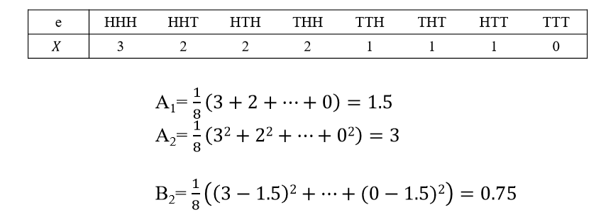

## 2.5. 数学期望

### 2.5.1. 离散变量数据期望

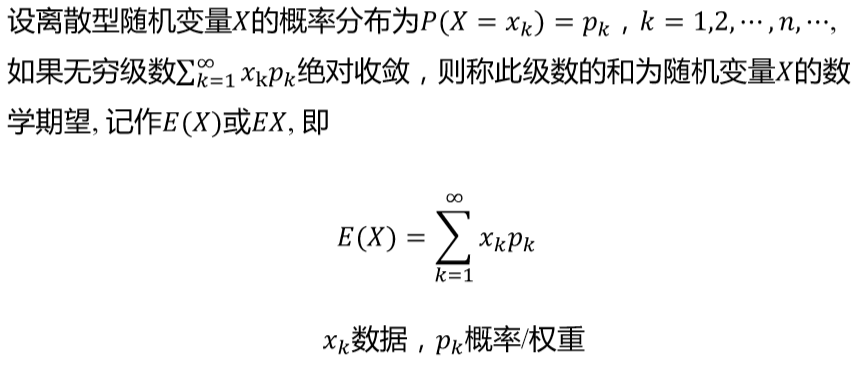

### 2.5.2. 连续随机变量数学期望

### 2.5.3. 数学期望的性质
1. 对于常数𝐶, 有𝐸(𝐶)=𝐶
2. 对于常数𝐶及随机变量𝑋, 有𝐸(𝐶𝑋)=𝐶𝐸(𝑋)
3. 设𝑋和𝑌为两个随机变量, 则𝐸(𝑋+𝑌)=𝐸(𝑋)+𝐸(𝑌)
4. 设随机变量𝑋和𝑌**独立**, 则𝐸(𝑋𝑌)=𝐸(𝑋)𝐸(𝑌)

## 2.6. 方差

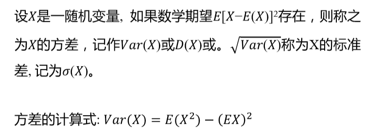

### 2.6.1. 方差的性质
1. 设𝐶是常数，则𝑉𝑎𝑟(𝐶)=0;
2. 设𝑋是随机变量, 𝐶是常数, 则 𝑉𝑎𝑟(𝑋+𝐶)=𝑉𝑎𝑟(𝑋),𝑉𝑎𝑟(𝐶𝑋)=𝐶2𝑉𝑎𝑟(𝑋).
3. 设随机变量𝑋与𝑌**相互独立**, 则 𝑉𝑎𝑟(𝑋±𝑌)=𝑉𝑎𝑟(𝑋)+𝑉𝑎𝑟(𝑌).

## 2.7. 概率分布的矩-数字特征
1. 随机变量X的矩定义如下
    + 若𝐸(𝑋k)存在(𝑘=1,2,⋯), 称𝐸(𝑋k)为𝑋的𝑘阶原点矩或𝑘阶矩, 记为𝜇𝑘
    + 若𝐸((𝑋−𝐸𝑋)k)存在(𝑘=1,2,⋯), 称𝐸((𝑋−𝐸𝑋)k)为𝑋的𝑘阶中点矩, 记为𝜐𝑘
2. 中心距的原点矩表示

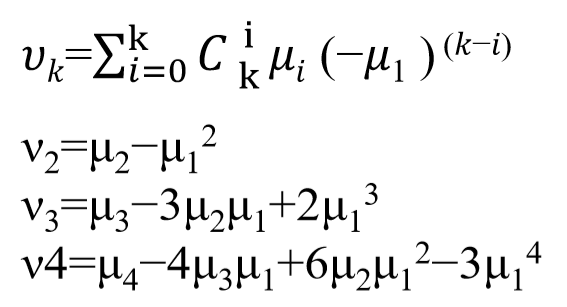

## 离散概率分布
1. 见离散概率分布