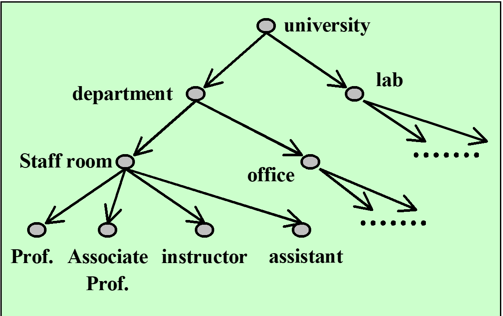
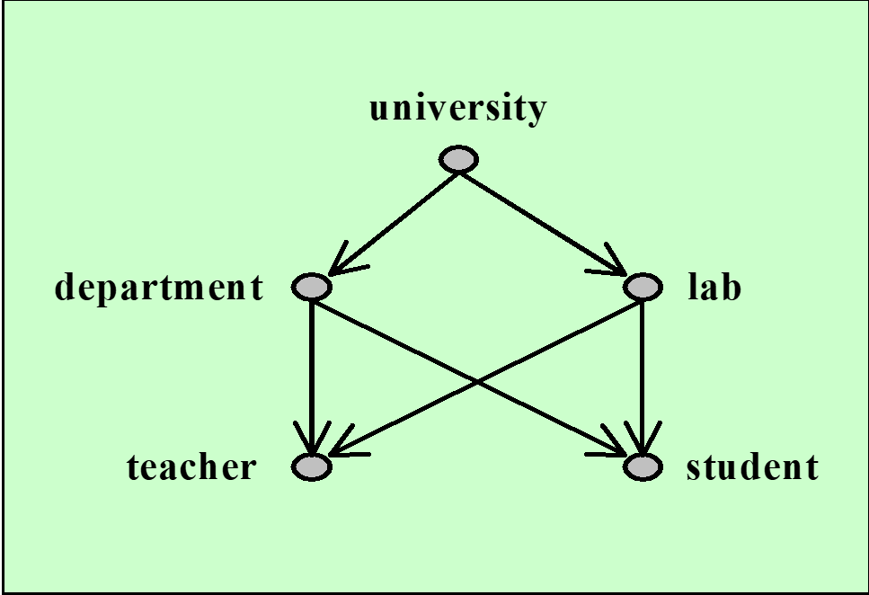

数据库概述
---

# 1. 数据库的基本概念

## 1.1. 数据库管理系统(DBMS - database management system)
1. DBSM是DB的管理软件，是一种软件产品，将一个企业的数据以记录的形式在计算机中保存起来。

## 1.2. 数据库 (Database)
1. 为同一个目的而保存起来的所有数据的集合称为数据库

# 2. 数据库用户
1. 最终用户(交互式用户)
  1. 临时用户(用SQL语句访问DBMS的用户)
  2. 缺乏经验的用户(通过菜单访问DBMS的用户)
2. 应用管理员(编写菜单程序的程序员)
3. 数据库管理员(DBA):在数据库系统中，负责数据库的设计、建立、日常管理和运行维护的人员。

# 3. 数据模型(data model)

## 3.1. Hierarchical：层次数据模型
1. 把数据组织成了一棵根在上、叶再下的有向树
2. 不同的记录按照层次结构进组织

## 3.2. Network：网状数据模型
1. 把数据组织称有向无环图
2. 层次模型的概括，其中一层中的一组记录可能在下一层向上具有两个不同的包含层次。

## 3.3. Relational：关系模型
1. 一个利用关系模型的数据库管理系统被称为是关系数据库管理系统(RDBMS)

## 3.4. Object-Oriented：面向对象模型

