ch03-基本SQL查询语言
---

# 1. SQL(Structured Query Language)
1. 关系数据库管理语言
  
## 1.1. SQL History
```
1976: SEQUEL  (IBM, SYSTEM-R)
1979: SQL (Oracle公司，第一个商用版本)
1986: SQL-86 (ANSI)
1989: SQL-89 (ANSI/ISO) (SQL1)
1992: SQL-92 (ANSI/ISO) (SQL2)
1999: SQL-99 (ANSI/ISO) (SQL3)
2003: SQL-2003 (ANSI/ISO) (SQL4)
```

## 1.2. SQL 数据类型

### 1.2.1. 字符类型
1. CHARACTER(n),CHAR(n):定长字符串
2. CHARACTER VARYING(n):可变长字符串
3. CHAR VARYING(n):可变长字符串

### 1.2.2. 数值类型

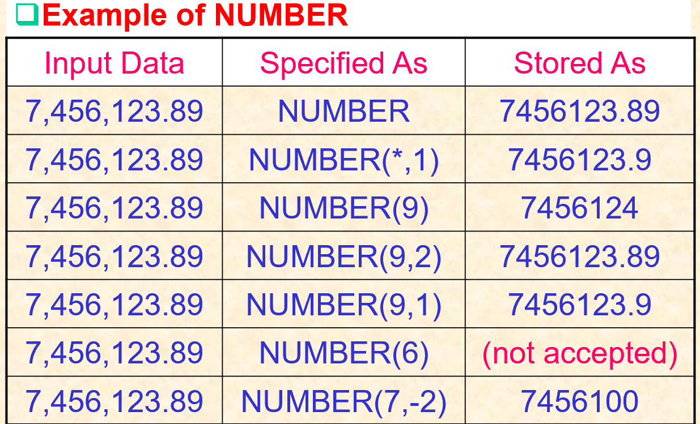

1. NUMERIC(p,s),DECIMAL(p,s),DEC(p,s)
   1. precision:总共有多少位数字,可以多，不可以少
   2. scale:小数点右边有位(可以为负数)，**默认为0**，解释了上表中的第三个。
2. INTEGER,INT,SMALLINT
3. FLOAT(p)
4. REAL
5. DOUBLE PRECISION

## 1.3. 表查询
```sql
SELECT  * | colname { , colname ... }
  FROM  tablename { , tablename ... }
  [ WHERE search_condition ]
  [ GROUP BY colname { , colname ... }
  [ HAVING search_condition ] ]
  [ ORDER BY colname [ ASC | DESC ]
  { , colname [ ASC | DESC ] ... } ];
```

### 1.3.1. 表查询的例子
| 自然关系                                          | SQL语句                                                      | 备注 |
| ------------------------------------------------- | ------------------------------------------------------------ | ---- |
| `( R where Condition ) [ A1, A2, ..., Am ]`       | `SELECT  A1, A2, ..., Am FROM R WHERE Condition`             | -    |
| `((R1*R2*...*Rn) where Condition) [A1,A2,...,Am]` | `SELECT A1, A2, ..., Am FROM R1, R2, …, Rn WHERE  Condition` | -    |
| `( R*Condition S ) [ A1, A2, ..., Am ]`           | `SELECT  A1, A2, ..., Am FROM R, S WHERE Condition`          | -    |

1. 每一个对应题目的理论上都有很多种答案
   1. 正常查询(不一定有答案)
   2. 独立子查询:优先独立筛选出来一些情况
   3. 相关子查询
2. 差:INTERSECT

### 1.3.2. 典型多解问题


- 上图所示的题目一共有五种答案
  - 第一种：表的连接查询
  - 第二种：IN谓词 + 独立子查询
  - 第三种：SOME + 子查询
  - 第四种：IN谓词 + 相关子查询
  - 第五种：EXISTS + 相关子查询

1. 课件63页之后给出了大量的例子
2. 课本73页

### 1.3.3. 子句执行顺序
1. 首先对FROM子句中的所有表做笛卡尔积
2. 然后删除所有不符合WHERE子句的行
3. 然后根据GROUP BY子句对剩余的行进行分组
4. 最后求出选择列表中的表达式的值

## 1.4. 谓词

### 1.4.1. ALL
1. 所有的值，默认

### 1.4.2. DISTINCT
1. 不包含重复的值，注意在查询子句中的使用
2. 会为查询带来额外的开销

### 1.4.3. IN
1. expr [NOT] IN (subquery)
2. 使用IN，结合子查询可以提高查询速度，如下图的查询便是，因为这种查询可以减少循环的层数。

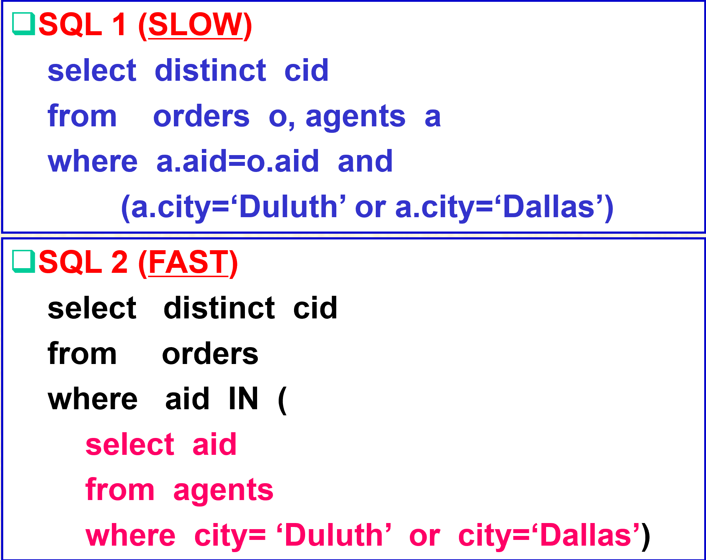
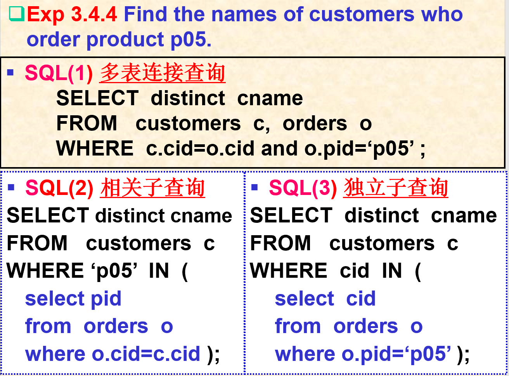

1. 注意内部子查询可以使用外部，而外部不可以使用内部

### 1.4.4. SOME|ANY|ALL
1. expr θ SOME|ANY|ALL (subquery)
2. SOME/ANY:只要返回不止一个，基本上是等价的，ANY用的少
3. ALL:对于返回的每一个元素
4. IN  is =SOME
5. NOT IN is <>ALL
6. 查找最小值

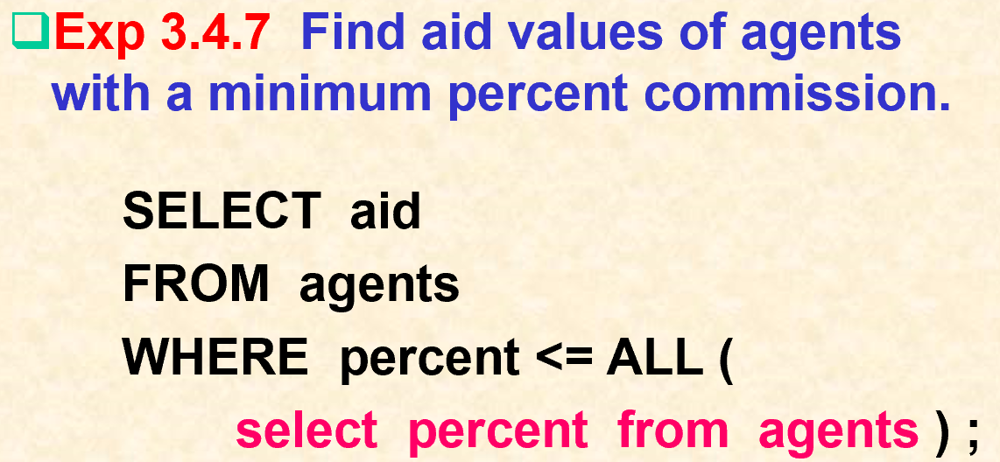

### 1.4.5. EXISTS
1. [NOT] EXISTS (subquery)
2. EXISTS为真的条件，需要子查询返回一个非空集合。
3. IN替换EXISTS谓词，往往需要调换条件的情况。

### 1.4.6. BETWEEN
1. expr [NOT] BETWEEN expr1 AND expr2

### 1.4.7. IS
1. column IS [NOT] NULL

### 1.4.8. LIKE
1. column [NOT] LIKE val1[ESCAPE val2]
2. 通配符:
   1. `_`:代替任何一个字符
   2. `%`:代替0个或者更多个字符的序列

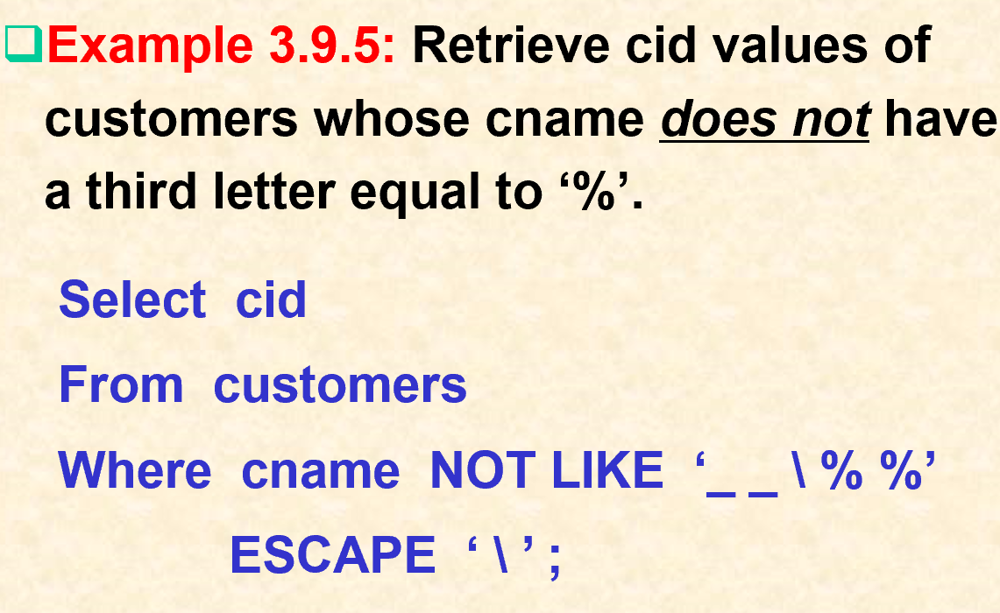


## 1.5. 表别名(alias)
1. FROM子句:`table_name as alias_name`或`table_name alias_name`
2. SELECT子句:`expr as alias_name`
3. 谨慎使用表的别名

## 1.6. 表连接
1. UNION:结果中没有重复的行
2. UNION ALL:结果中可以有重复的行

## 1.7. 表除法
1. 使用双重否定，全部=没有一个不


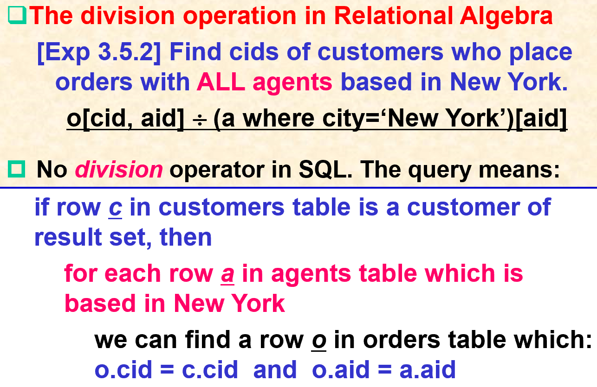
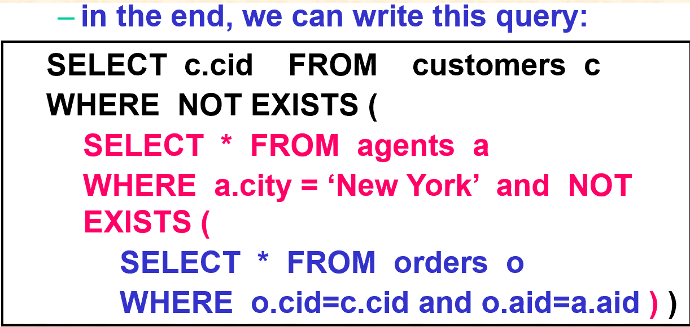

2. 例子见课件91页开始


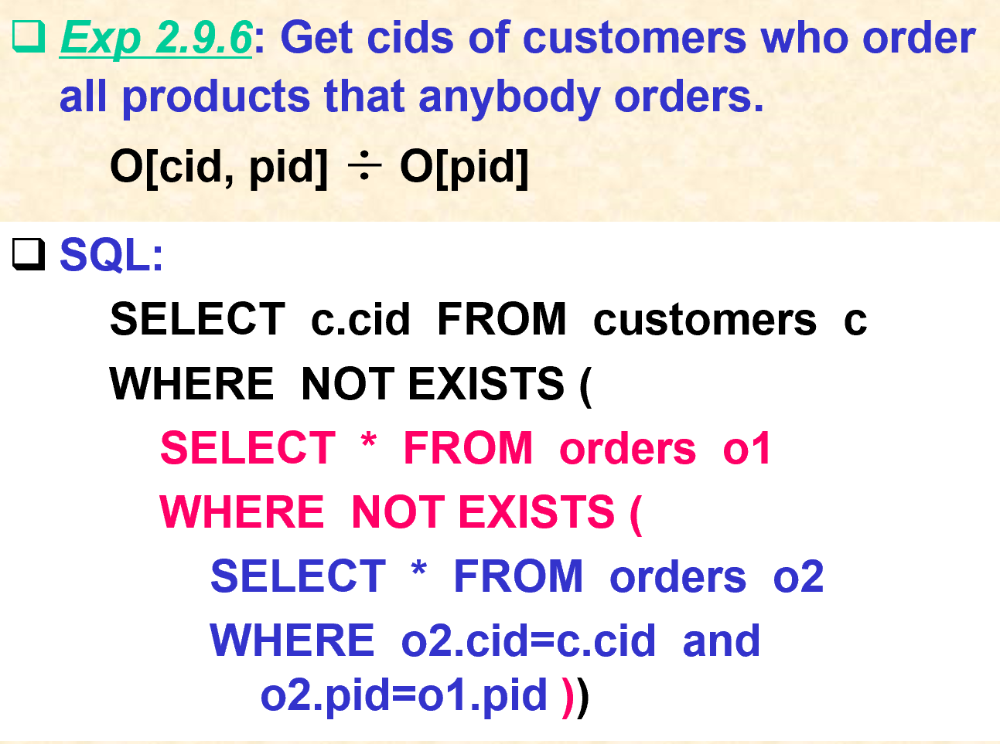


## 1.8. 部分子句
1. FROM:`FROM  tableref {, tableref … }`
2. JOIN:`INNER JOIN | [LEFT | RIGHT | FULL] [OUTER] JOIN`
3. tableref: (subquery) AS name

### 1.8.1. GROUP BY 子句
1. 要保证获取的字段多余GROUP BY后的字段数量

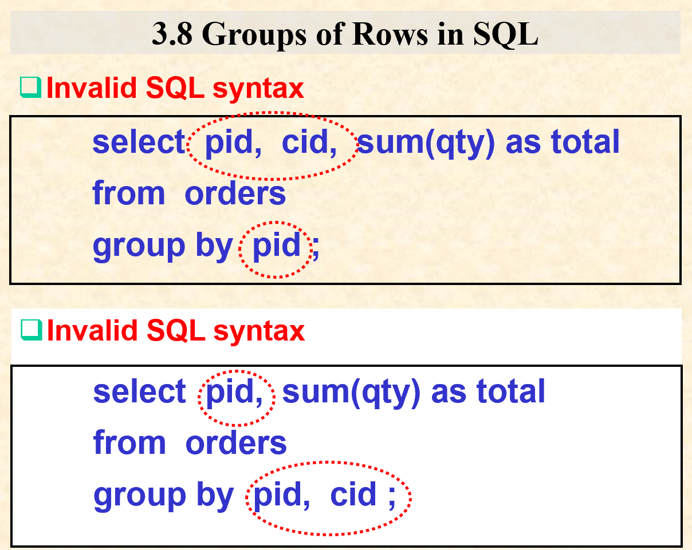


### 1.8.2. HAVING 子句
1. 搭配GROUP BY子句，筛选出来满足的群组

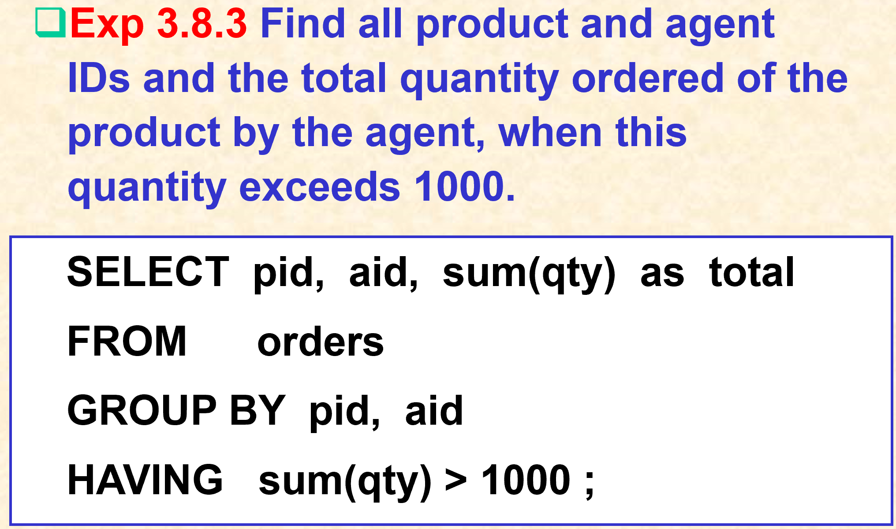
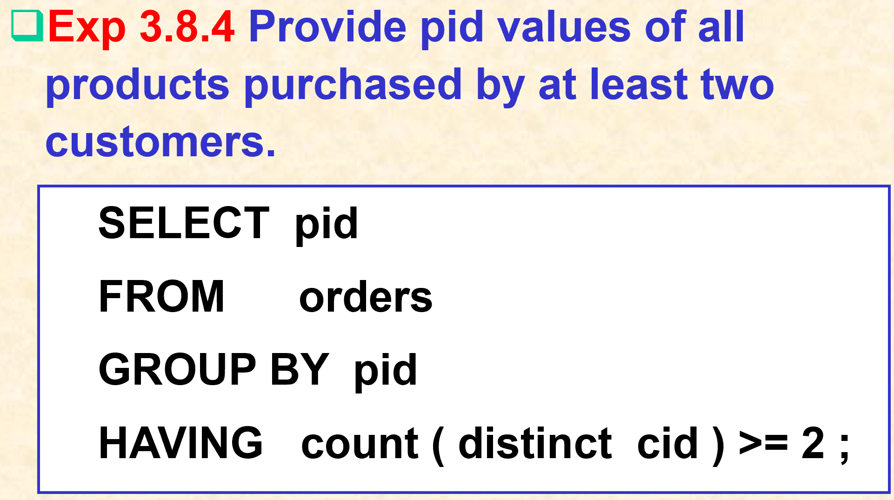

## 1.9. 内置函数
| 函数名 | 参数类型   | 结果类型       | 函数用途     | 备注 |
| ------ | ---------- | -------------- | ------------ | ---- |
| COUNT  | *          | 数值           | 计数有多少个 | 不含空值的统计，空集返回0    |
| SUM    | 数值       | 数值           | 求和         | 空集返回空值    |
| AVG    | 数值       | 数值           | 求均值       | 空值在计算均值前已经抛弃，空集返回空值    |
| MAX    | 字符或数值 | 和参数类型相同 | 求最大值     | 空集返回空值    |
| MIN    | 字符或数值 | 和参数类型相同 | 求最小值     | 空集返回空值   |

1. 在COUNT的时候，注意使用distinct关键字
2. count(*):不存在空值问题(不统计空值)
3. MAX的使用注意:
   1. 错误:`select cid from customers where discnt < max ( discnt )`
   2. 正确:`select cid from customers where discnt < max ( discnt )`
4. 集合函数需要谨慎的考虑空值的问题
5. 检索空值的唯一方法:IS NULL
6. 集合函数禁止嵌套，禁止出现子查询

# 2. 表结构操作

## 2.1. 表创建
```sql
CREATE TABLE tablename (
  colname datatype [ NOT NULL ]
  { , colname datatype [ NOT NULL ] ... }
  [ , PRIMARY KEY ( colname { , colname ... } ) ]
);
```

## 2.2. 表插入
```sql
INSERT INTO tablename [ ( colname, ...... ) ]
  VALUES ( expr|NULL, ...... ) | subquery
```
1. insert 操作支持插入子查询的结果

## 2.3. 表更新
```sql
UPDATE  tablename
  SET colname=expr|NULL|subquery, ......
  [ WHERE  search-condition ] ;
```

## 2.4. 表删除
```sql
UPDATE  tablename
  SET colname=expr|NULL|subquery, ......
  [ WHERE  search-condition ];
```

# 3. 其他零散知识点
1. 集合:用来存储常数序列:`("12","23")`

## 3.1. 特殊运算符
1. INTERSECT:做差
2. EXCEPT:NOT EXISTS
