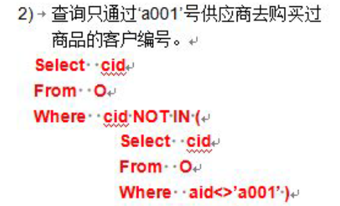
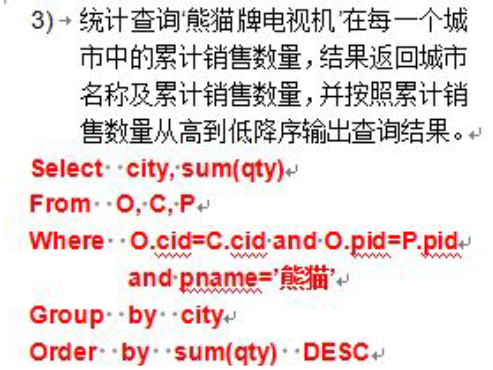
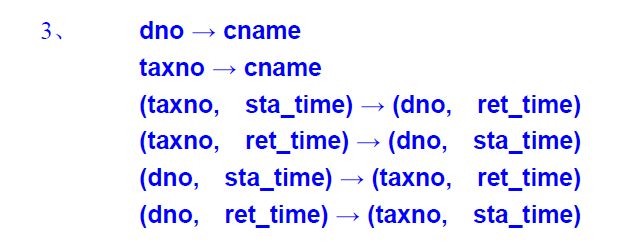
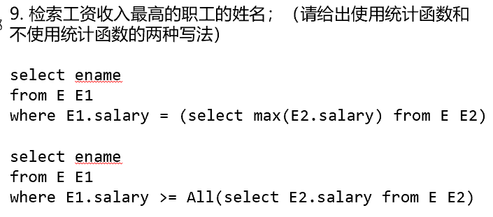
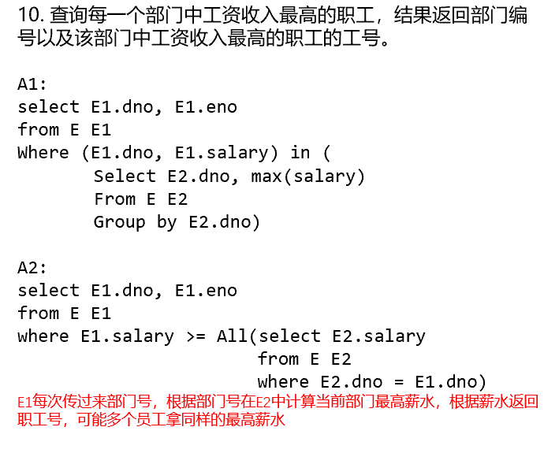
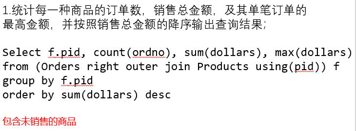
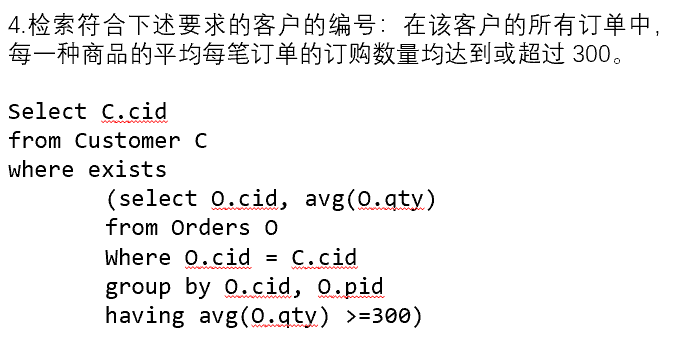
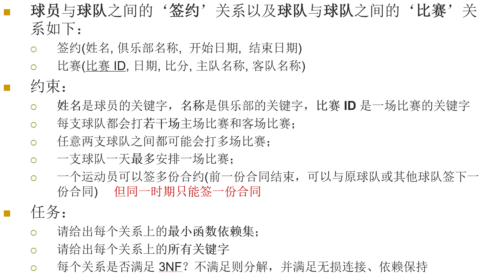
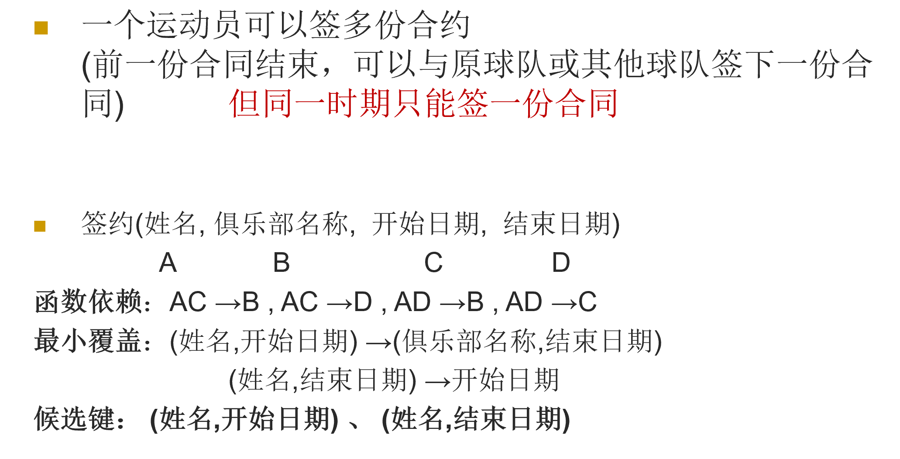

Exam01-考试题目考点整理
---

# 1. 考试题:2012年
1. 二维表的表头被称为**模式**，其他每一行被称为**元组**
2. 对于传统数据库而言，对象关系数据库(Oracle)在数据类型方面的扩充是**对象类型**和**集合类型**。
3. 在关系代数中，运算对象是单个关系的运算符是**投影**和**选择**。
4. R(A,B,C)和S(C,D)，使用自然关系的笛卡尔积、选择和投影运算实现自然联接(JOIN):R JOIN S = ((R*S) where R.C = S.C)[R.A, R.B, R.C ,S.D]
5. 事务性质：原子性、一致性、隔离性和持久性。
6. 假设n个事务之间的一个调度H，如果可以通过一组非冲突的动作讲调度转换为这n个事务之间的一个串行调度，则调度H被称为**可串行化调度**。
7. 可以在事务中设置**检查点**来提供事务的部分回滚。
8. REDO日志只能用于**已提交**事务的故障恢复。
9. 嵌入式SQL中和Cursor声明相关的命令有四条，分别为：**DECLARE, OPEN, FETCH, CLOSE**
10. 在关系数据库系统中，可以通过建立UNIQUE索引和非空约束来定义关键字。
11. SQL查询语句，SELECT FROM搭配使用
12. 收回权限：REVOKE SELECT ON customer from blob
13. 关系中任意两列的值域不能相同，错误
14. 使用关系运算对关系进行操作，得到结果仍为关系
15. R(A,B,C,D) JOIN S(C,D)，得到结果中关系属性个数为4
16. NULL参加逻辑运算，计算结果**不确定**(IS NULL)
17. R(U, F),U为属性，F为函数依赖，分解为R1(U1,F1),R2(U2,F2)是无损分解的含义是**R = R1 JOIN R2**，依赖保持性的含义是F<sup>+</sup> = (F1 并 F2)<sup>+</sup>
18. 不属于冲突可串行化调度的是(A不等于B)：(不可串行化？)
    1. R2(A), R1(B), W2(A), W1(B) 可串行化
    2. R2(A), R1(A), W2(A), W1(B) 可串行化
    3. R2(A), W1(B), W2(A), R1(A) 可串行化
    4. R2(B), R1(A), W2(A), W1(B) 不属于冲突可串行化调度(不可串行化)
19. 二段锁协议是值事务对某数据对象的封锁包括申请封锁和释放封锁两个操作。
20. 使用日志进行故障处理过程，先**逆向**扫描日志，对**未提交**事务进行UNDO处理，再**正向**扫描日志，对**已提交**事务进行REDO处理
21. 提交事务T并确保其更新结果的持久化实现的标志是将缓存区中的`<Commit T>`日志记录写入日志文件的磁盘。
22. Access Rows By Content Only Rule的含义说明了**属性的无序性和元组的无序性**。
23. 关系代数的二元运算符中，不属于基本操作符的是Join，Division，Theta Join
24. 关系代数的二元运算符中，属于基本操作符的有并、差、积、选择、投影
25. 冲突的三个前置条件
    1. 不是同一个事务
    2. 不是同一个数据单元
    3. 包含至少一个写操作
26. 如果关系R满足BCNF，则必然满足3NF
27. 如果关系R上的最小函数依赖集为空，那么这个关系一定满足BCNF
28. 如果关系R上的非主属性集为空，那么这个关系一定满足BCNF,错误
29. 注意关系代数中也可以声明表的别名
30. 创建别名:`Create View name as [SQL]`
31. 查找每一个部门中年薪收入最高的职工，不一定适用GROUP BY，可以直接正常找最大加一个同部门条件
32. 第六大题：注意DE->B可以推导出来(再过一下)
33. 第七大题：主键、关系情况

# 2. 考试题：2013年
1. 二维表的每一列是一个**属性**，列的第一行是**属性名**
2. 二维表中，取值具有唯一性的属性集合被称为表的**超键**，最小属性集合是**候选键**
3. 关系数据模型上进行数据访问的结果也构成一个**关系**
4. 关系数据库是关系的组合，关系是元组的组合
5. 显示结束事务，COMMIT和ROLLBACK
6. 关系数据库系统中，提高SELECT查询速度的最常用的方法就是创建**索引**
7. E-R模型设计中，如果一个实体的存在必须依赖其他的实体，则该实体被成为弱实体。
8. SQL的正则查询:like
9. "First Normal Form Rule":属性的原子性
10. LIKE不能操作子查询
11. view试图定义命令中，视图对应的子查询不能使用ORDER BY结果排序
12. 一个只有两个属性所构成的关系模式最高可以被满足到**BCNF**
13. 对关系数据库进行关系的规范设计，不能解决**空值过多**的问题
14. 关系代数中，功能不能用其他运算符实现的是：并、差
15. 关系代数中，功能能使用其他运算符实现的是：交、自然连接
    1. 交可以被差重写：A交B = A - (A - B)
    2. R和S的自然连接可以用积、选择、投影和赋值算子重写
    3. 除法可以用投影、乘积和差重写。
16. 不影响结果的关系模式的有：并、差、选择(where)
17. SELECT中可能用到的SQL的统计函数子句有SELECT和HAING子句
18. 可以处理已提交事务：REDO日志和UNDO/REDO日志
19. 可以处理未提交事务：UNDO日志和UNDO/REDO日志
20. 关系代数中写JOIN和符号均可
21. 关系代数第五小问看一下




22. 第六题分解
23. 注意(0,N)和(1,N)的区别：注意描述，还有(0,1)和(1,1)
24. 注意最后找函数依赖要找全




# 3. 考试题：2016年

## 3.1. 填空题
1. 数据库管理系统
2. 长方形、椭圆形、线条
3. 原子性
4. 可串行化调度
5. IS NULL

## 3.2. 单选题
1. D
2. A
3. A
4. B
5. D(重要)


## 3.3. 多选题
1. DE
2. AE(数据冗余 + 三个异常)
3. BD

## 3.4. 大题
1. 连接不需要用条件相等了
2. 注意Group by后面的条件不能比前面的条件还短


3. 注意SQL第二题的第二小问:使用O表而不是A表，因为有的经销商根本就没有卖，而不是只卖了


3. 范围使用between x and y
4. 返回最大值


5. 最大满足的范式


# 4. 复杂关系代数
1. 只购买过p01和p02号两种商品的顾客编号 找到买了p01也买了p02的再操作
2. 只购买过一种商品的顾客编号 笛卡尔积
3. count([distinct])

# 5. 习题二
1. 注意没有家属要判断非空或者使用having和count搭配。
2. 使用统计函数找最大，MAX搭配=符号




3. 包含未销售的商品的相关信息。




4. 不确定直接Count(*)

# 6. 习题三
1. 处理的时候一定要注意删除冗余删除全


2. 现实条件寻找依赖





3. 最高满足的范式


4. CREATE VIEW name(属性名)

# 7. 其他
1. Create Type name as object{}
2. Create table table_name of type_name{Primary Key(id)}
3. Create Type name as varray(4) of int{}
4. C语言结合SQL
```c
//声明部分
exec sql begin declare section;
    char cust_id[5];
exec sql end declare section;
//条件控制
exec sql whenever sqlerror goto handle_error;
exec sql whenever not found goto notfound;

handle_error:
  exec sql whenever sqlerror continue ;
  exec sql drop table customers ;
  exec sql disconnect ;
  fprintf(stderr, “Couldn’t create customers table”);
  return  –1;
//连接数据库
EXEC SQL CONNECT TO target-server
	[AS connect-name] [USER username];
EXEC SQL CONNECT TO DEFAULT;
//程序主体
while (prompt(cid_prompt, 1, cust_id, 4) >= 0){
    exec sql select cname, discnt
        into :cust_name, :cust_discnt
        from customers
        where cid = :cust_id;
    exec sql commit work;
        printf("CUSTOMER'S NAME IS  %s AND DISCNT IS  %5.1f\n", cust_name, cust_discnt);
        continue;                                 
notfound:
    printf("Can't find customer %s, continuing\n", cust_id);
}
//提交事务
EXEC SQL COMMIT WORK ;
//回滚事务
EXEC SQL ROLLBACK WORK ;
//断开数据库
EXEC SQL DISCONNECT connect-name ;
//或
EXEC SQL DISCONNECT CURRENT ;
```
- 游标
```c
//声明游标
EXEC SQL DECLARE cursor-name CURSOR FOR subquery
//开启游标
EXEC SQL OPEN agent_dollars;
//拉取数据
exec sql fetch agent_dollars into :agent_id, :dollar_sum;
//关闭游标
EXEC SQL CLOSE agent_dollars;
```

- 数据库设计是研究数据项的基本属性与他们之间的相互关系。
- ER模型是一种用来描述数据库的抽象方式
  - 实体是具有公共属性的可区分的现实世界对象的集合。
  - 属性是描述实体或关系（定义如下）的属性的数据项。
  - 关系R定义了这些实体的实例之间的对应规则。
- 数据库模式是数据库中所有表的标题集，以及设计人员希望保留在这些表的联接上的所有函数依赖的集。
- 几种外键约束
  - RESTRICT：禁止删除
  - CASCADE：同步删除reference的部分
  - SET NULL：设置为NULL


- 视图：视图对象作为一个对象被存放在系统目录中。
- 删除视图：DROP VIEW
- 索引

```sql
# 创建索引
CREATE [UNIQUE] INDEX indexname 
  ON tablename (colname [ASC | DESC]
    { , colname [ASC | DESC] ...});
# 删除索引
DROP INDEX indexname;
```

- 事务是将一个进程执行的许多数据库操作打包在一起的一种方式，因此数据库系统可以提供几种保证，称为ACID属性。

```sql
BEGIN TRANSACTION
op1; 
op2; 
......
opN;
END TRANSACTION
```

- 任意经历H的解释包括3部分
   1. 经历中关于事务的逻辑目的的描述，应该足以证明事务对数据写入的值和事务对统一数据对象读取的值有关系。
   2. 经历中读写操作的值要给出具体的说明。
   3. 一致性规则。具有隔离性的事务执行过程中必须保持的某种逻辑属性，这些事务具有第1点中所陈述的逻辑属性。

- 在一个事务访问数据库中的数据时，必须先获得被访问的数据对象上的封锁，以保证数据访问操作的正确性和一致性。
- 隔离级别

```sql
SET TRANSACTION ISOLATION LEVEL
  READUNCOMMITTED  | 未提交读
  READCOMMITTED  | 提交读
  READREPEATABLE  | 重复读
  SERIALIZABLE 可串行化
```


- 一致性检查点：（CKPT）
  1. 在一致性检查点完成前没有新的事务可以开始
  2. 数据库操作将继续直到所有当前事务提交，并且他们的log文件写入磁盘
  3. 当前的日志缓冲区被写出到日志文件中，然后，系统将确保缓冲区中的所有脏页都已写出到磁盘上。
- 高速一致缓存检查点：（CKPT，列表）
  1. 没有新的事务允许开始
  2. 当前所有事务禁止进行任何操作
  3. 当前的日志缓冲区被写到磁盘上，然后，系统将确保缓存缓冲区中的所有脏页都被写到磁盘上。
- 模糊检查点
  1. 在启动检查点之前，将先前检查点之前的所有脏页面强制驱出到磁盘上（但是写入速率应保留I/O容量以支持当前正在进行的事务；这样做没有紧要的时间）。
  2. 在检查点过程开始时，不允许新事务开始。现有事务无法启动任何新操作。
  3. 当前日志缓冲区将通过附加的日志条目（CKPT<sub>N</sub>，列表）写出到磁盘，如高速缓存一致性检查点过程中所述。