01-软件工程基础
---
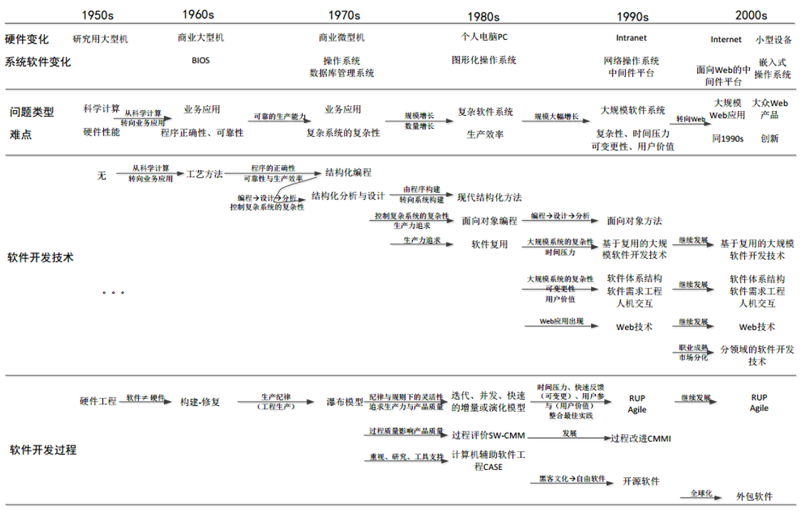

# 1. Software 软件
1. 信息可以记录、交流和存储
2. 信息 -> 计算 -> 数字计算机 -> 软件

## 1.1. 数字计算历史

### 1.1.1. Foundation of Digital Computing - 30s
1. 硬件:微分计算器、继电器式计算机、ABC原型计算、Harvard Mark 1 IBM实验室
2. Theory 理论
    1. 《论可计算数及其在判定问题上的应⽤》-Alan Turing
    2. 电⼦继电器可以实现布尔符号逻辑  Claude Elwood Shannon

### 1.1.2. Digital Computers - 40s
1. ENIAC:第一台计算机
2. Programming the ENIAC
3. Programming chart
4. 编程的步骤
    1. 将问题映射到机器上的任务很复杂，通常需要几个星期。
    2. 程序在纸上完成后，通过操纵开关和电缆将程序“导入”ENIAC的过程需要额外的几天时间。
    3. 随后是一段时间的验证和调试，借助于机器的“单步”能力。
5. EDVAC：(了解)
    1. EDVAC（Electronic Discrete Variable Automatic Computer）是最早的电子计算机之一。与它的前身ENIAC不同，ENIAC是二进制的，而不是十进制的，它是一台存储程序计算机。
    2. 埃克特、莫奇利和其他ENIAC设计师与约翰·冯·诺依曼一起担任顾问职务；冯·诺依曼在1945年EDVAC报告初稿中总结和讨论了逻辑设计发展。埃克特、莫奇利和其他ENIAC设计师与约翰·冯·诺依曼一起担任顾问职务；冯·诺依曼在1945年EDVAC报告初稿中总结和讨论了逻辑设计发展。

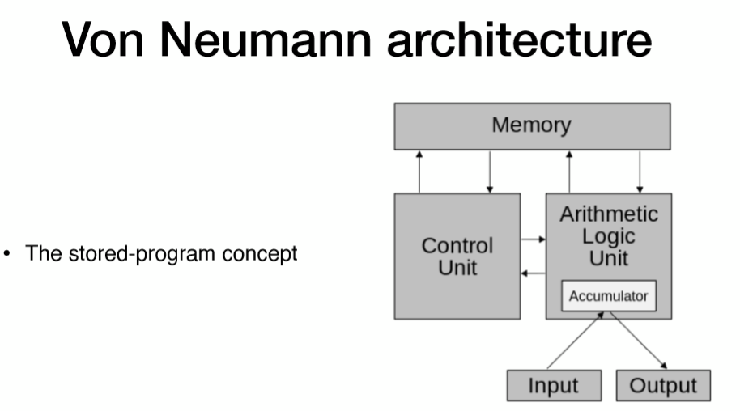

### 1.1.3. Software is one part of Hardware -50s
1. 商业大型机：Ferranti Mark I、UNIVAC I、LEO I、IBM 701、IBM 650
2. 编程语言，1955 FORTRAN，1958 LISP，1959 COBAL
3. 命名：John W. Tukey在1958年发表在《美国数学月刊》上的一篇文章中，成为第一个定义运行电子计算器的程序的人。

### 1.1.4. Software is not Hardware - 60s
1. 变革、ASCII美国信息交换标准码出现、ATM、IBM信息管理系统IMS应⽤于阿波罗航天器、软件咨询业务、IBM S/360、信⽤卡、DEC PDP-1⼩型机
2. 软件的特性
    1. 软件与现实世界关系更加密切，对需求的规格化更加困难
    2. 软件⽐硬件容易修改的多，并且不需要昂贵的⽣产线复制产品
    3. 软件没有损耗
    4. 软件不可见

### 1.1.5. Program = Algorithm + Data Structure - 70s ~ 80s
1.  Algorithms + Data Structures = Programs是Niklaus Wirth在1976年写的一本书，涵盖了计算机编程的一些基本主题，特别是算法和数据结构之间的内在联系。
2. For example, if one has a sorted list one will use a search algorithm optimal for sorted lists. 例如，如果一个人有一个已排序的列表，他将使用一个对已排序列表最合适的搜索算法。

### 1.1.6. Software Development is much more complicated than Programming  - 90s ~ now

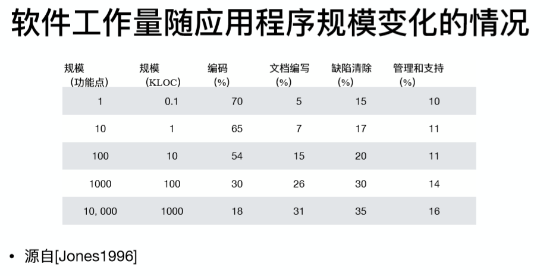
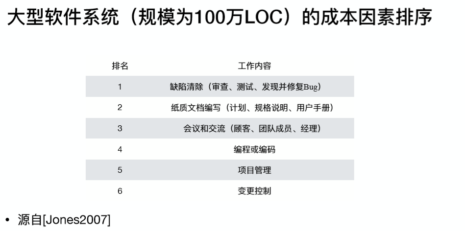

1. 软件类别
    + 系统软件:操作系统、数据库、数据仓库、嵌⼊式设备、安全
    + 编程软件IDE、测试、持续集成、建模、度量
    + 应用软件:商业、政府、休闲、医疗、教育、国防、 个⼈、专业、科学
2. 应用软件基于现实又高于现实
    + 应用软件被开发的目的和意图来源于现实世界的问题。
    + 应用软件必须基于现实才能解决问题。
    + 软件最终要被用于现实并改进现实。

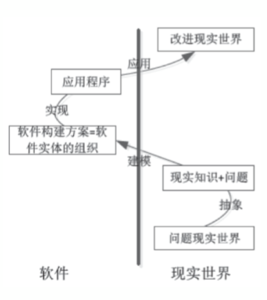

3. 如上图，所以我们可以形成进一步的迭代。

## 1.2. 什么是软件工程总结
1. 软件独立于硬件
2. 软件是工具
3. 软件 = 程序 + 文档 + 数据 + 知识
4. 软件的发展比编码更加复杂
5. 应用软件源于现实，但是高于现实(课本P4)

# 2. 工程
1. 美国工程师专业发展委员会（ECPD，ABET的前身）将“工程”定义为：创造性地应用科学原理，设计或开发结构、机器、仪器或制造工艺，或单独或组合使用它们的工程；或在充分了解它们的设计的情况下建造或操作它们；或在特定操作条件下预测它们的行为；就预期功能、运行的经济性或生命财产安全而言
2. CCSE - About Engineer 关于工程师
    1. 工程师通过⼀系列的**讨论决策**，仔细评估项⽬的可选活动，并在每个决策点选择⼀种在当前环境中适合工当前任务的⽅法进⾏工作。可以通过对成本和收益进⾏折衷分析调整相应策略。
    2. 工程师需要对某些对象进⾏度量，有时需要定量的工作；他们要校准和确认度量⽅法，并根据经验和实验数据进⾏估算。
    3. 软件工程师强调**项目设计过程的纪律性**，这是团队⾼效工作的条件。
    4. 工程师可胜任研究、开发、设计、⽣产、测试、构造、操作、管理，以及销售、咨询和培训等**多种角色**。
    5. 工程师们需要在某些过程中使⽤工具，选择和使用合适的工具是工程的关键要素。
    6. 工程师们通过专业协会发展和确认原理、标准和最佳实践⽅法，并提⾼个⼈能⼒。
    7. 工程师们能够重用设计和设计制品。
3. 工程师的决策往往进行折中，选择最优解。

## 2.1. 工程学科的发展
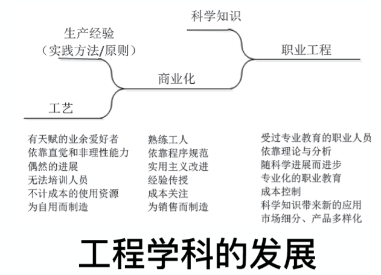

## 2.2. 工程要素
1. 问题:动力
2. 科学知识:工具
3. 解决方法/机器:物体
4. 成本效益/条件

# 3. 软件工程

## 3.1. 什么是软件工程？(重要)
1. 应用系统的、规范的、可量化的方法来开发、运行和维护软件，即将工程应用到软件。
2. 对1)中各种方法的研究。

## 3.2. 软件的工程的特点
1. 具有解决实际问题的动机：工程学解决实际问题，⽽这些问题来源于工程领域之外的⼈：消费者。
2. 应⽤科学知识指导工程活动：工程学不依赖于个⼈的技能，⽽是强调以科学知识为指导，按照特定⽅法与技术，进⾏规律性的设计、分析等活动，实现工程活动的可学习性和可重复性。
3. 以成本效益⽐有效为基本条件：工程学不单单只是解决问题，它要有效利⽤所有资源，⾄少成本要低于效益，即成本效益⽐有效。
4. 构建机器或事物：工程学强调构建实物⼯具，例如机器、事物等，并利⽤实物⼯具来解决问题。
5. **以服务人类为最终目的**：工程学考虑的不是单个客户的需要，⽽是要运⽤技术和经验实现全社会的进步。

### 3.2.1. 软件工程师面临的问题
1. 现实世界是复杂的：如果现实世界的状况与我们的期望不符，这就产生了问题。
2. 很广阔的范围：所有人类所涉及的领域、在其他工程领域，问题是有限的
3. 大多数是不明确的，需要我们去发现：在其他工程领域，问题是确定和明确的
4. 工程思维：客观的，知道你想要什么

### 3.2.2. 科学知识
1. 以计算科学为科学基础，基于科学和逻辑作为标准工具
2. 很多领域都是被对称的创造出来的，依据方法/方法论/技术，使用语言、工具，进行研究

### 3.2.3. 工程 = 科学 + 原则 + 艺术
1. 科学:计算科学知识是软件工程的基础
2. 原则:实践知识也应该被广泛的分享
3. 艺术：创造力:分析，设计

### 3.2.4. 问题/机器和产品
1. 虚拟机 = 通用机 + 特定的解决方案
2. 解决方案可以在编程语言的帮助下映射到通用计算机上
3. 并不像其他工程一样，不同问题有不同机器
4. 解决方案的发展是软件工程首要的任务
5. 将解决方案映射到通用机上是软件工程的次要任务

### 3.2.5. 成本效益
1. 可行性研究
    + 利益取决于用户
    + 成本取决于软件工程师
2. 到达目的地的方法总是很多的，软件工程师应该选择最具成本效益的方法（而不是最先进的方法）
3. 当成本和效益的关系不再重要的时候，软件工程师将会消失
    + 成本低：小规模编程
    + 收益不明确：勘探研究
    + 不计成本：计算科学研究
    + 工程思想：成本和收益相平衡
    + 控制和管理

### 3.2.6. Understanding of Software Engineering 软件工程的理解
1. 软件工程是⼀种工程活动
2. 软件工程的动机是解决实际问题
3. 软件工程是科学性、实践性和⼯艺性并重的
4. 软件工程追求⾜够好，不是最好
5. 软件工程真正的产品是基于虚拟计算机的软件⽅案
6. 软件工程的最终⽬的是要**促进整个社会的进步**

# 4. 知识域

## 4.1. SWEBOK
1. 软件工程知识体系（SWEBOK）是由IEEE计算机协会赞助的软件工程协调委员会的产品

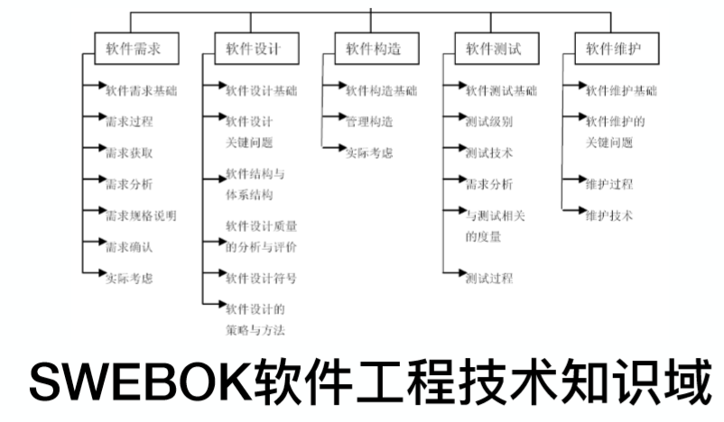
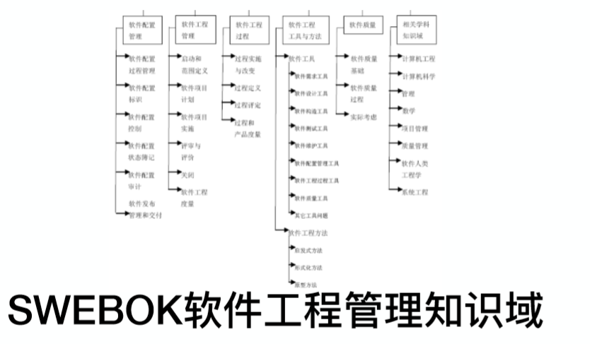
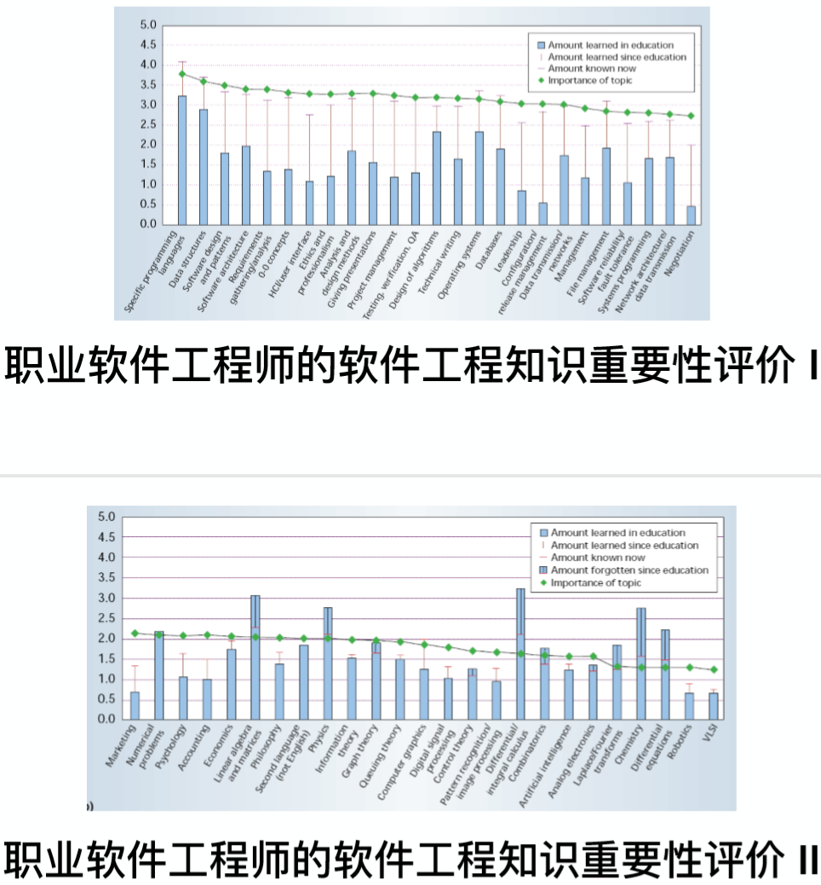

## 4.2. 软件开发活动

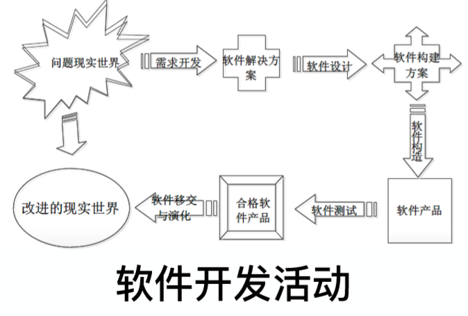

## 4.3. 软件发展活动

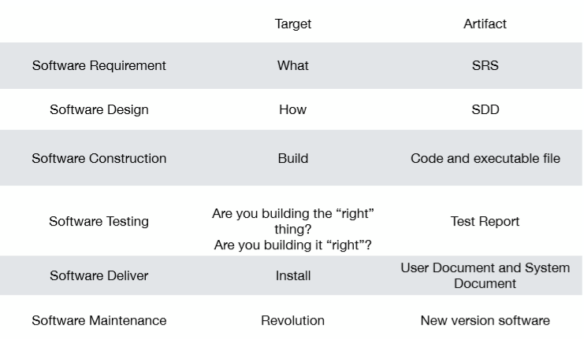

## 4.4. 角色分工
1. 需求工程师，⼜被称为需求分析师：承担需求开发任务。软件产品的需求开发⼯作通常由多个需求工程师来完成，他们共同组成⼀个需 求工程师⼩组，在⾸席需求工程师的领导下开展⼯作。通常⼀个团队只有⼀个需求工程师⼩组。
2. 软件体系结构师：承担软件体系结构设计任务。通常也是由多⼈组成⼀个⼩组，并在⾸席软件体系结构师的领导下开 展⼯作。通常⼀个团队只有⼀个软件体系结构师⼩组。
3. 软件设计师：承担详细设计任务。在软件体系结构设计完成之后，可以将其部件分配给不同的开发⼩组。开发⼩ 组中负责所分配部件详细设计⼯作的⼈员就是软件设计师。⼀个团队可能有⼀个或多个开发⼩组。 ⼀个⼩组可能有⼀个或多个软件设计师。
4. 程序员：承担软件构造任务。程序员与软件设计师通常是同⼀批⼈，也是根据其所分配到的任务开展⼯作。
5. ⼈机交互设计师：承担⼈机交互设计任务。⼈机交互设计师与软件设计师可以是同⼀批⼈，也可以是不同⼈员。在有 多个⼩组的软件工程团队中，可以有⼀个单独的⼈机交互设计师⼩组，也可以将⼈机交互设计师分 配到各个⼩组。
6. 软件测试⼈员：承担软件测试任务。软件测试⼈员通常需要独⽴于其他的开发⼈员⻆⾊。⼀个团队可能有⼀个或多个测试⼩组。⼀个⼩组可能有⼀个或多个软件测试⼈员。
7. 项⽬管理⼈员：负责计划、组织、领导、协调和控制软件开发的各项⼯作。相⽐于传统意义上的管理者，他们不完全是监控者和控制者，更多得是协调者。通常⼀个 团队只有⼀个项⽬管理⼈员。
8. 软件配置管理⼈员：管理软件开发中产⽣的各种制品，具体⼯作是对重要制品进⾏标识、变更控制、状态报告等。通常⼀个团队只有⼀个软件配置管理⼈员。
9. 质量保障⼈员：在⽣产过程中监督和控制软件产品质量的⼈员。通常⼀个团队有⼀个质量保障⼩组，由⼀个或多个⼈员组成。
10. 培训和⽀持⼈员：负责软件移交与维护任务。他们可以是其他开发⼈员的⼀部分，也可以是独⽴的⼈员。
11. ⽂档编写⼈员：专⻔负责写作软件开发各种⽂档的⼈员。他们的存在是为了充分利⽤部分宝贵的⼈⼒资源（例如需求工程师和软件体系结构师），让这些⼈⼒资源从繁杂的⽂档化⼯作中解放出来。