15-面向对象的信息隐藏
---

# 1. 课前测试


```c++
void Copy(ReadKeyboard& r, WritePrinter& w){
    int c;
    while ((c = r.read ())!= EOF) 
        w.write(c);
}
void Copy(ReadKeyboard& r, WritePrinter& wp, WriteDisk& wd, OutputDevice dev){
    int c;
    while((c = r.read())!= EOF)
        if(dev == printer)
            wp.write(c);
        else
            wd.write(c);
}
```

# 2. 封装类的职责

## 2.1. 结构化设计中的信息隐藏

### 2.1.1. 信息隐藏
1. 每一个模块都隐藏了这个模块中关于重要设计决策的实现，以至于只有这个模块的每一个组成部分才能知道具体的细节

### 2.1.2. 设计细节应当被隐藏
1. 最重要的细节:职责的变更
   1. 隐藏对于软件设计者特别的信息
   2. 来自于需求规格说明文档
2. 次要的细节:实现的变更
   1. 当设计者在实现一个模块的时候为隐藏次要秘密而做出的实现决策
   2. 变化

## 2.2. 类的职责

### 2.2.1. 什么是职责？
职责是类或对象维护一定的状态信息，并基于状态履行行为职能的能力。

### 2.2.2. 职责来源于需求
1. 业务类:Sales、Order(职责来自于业务)
2. 辅助类:View、Data、exception、transaction(事务处理)
3. 除了业务类以外，软件设计中添加很多辅助类的职责也是源自于需求的。

### 2.2.3. 职责的体现
封装:一个模块应该通过稳定的接口对外体现其所承载的要求，而隐藏它对需求的内部实现细节。

# 3. 类的封装
1. 目的是信息隐藏

## 3.1. 封装包含什么？
1. 封装将数据和行为同时包含在类中，分离对外接口与内部是实现。

### 3.1.1. 接口
1. 接口是模块的可见部分：描述了一个类中的暴露到外界的可见特征

### 3.1.2. 实现
1. 实现被隐藏在模块之中：隐藏实现意味着只能在类内操作，更新数据，而不意味着隐藏接口数据。

## 3.2. 面向对象中的接口通常包含的部分
1. 对象之间交互的消息（方法名）
2. 消息中的所有参数
3. 消息返回结果的类型
4. 与状态无关的不变量(前置条件和后置条件)
5. 需要处理的异常

## 3.3. 封装数据类型

### 3.3.1. 封装的源头 — ADT
1. ADT = Abstract Data Type 抽象数据类型
   1. 一个概念，并不是实现(逻辑上的)
   2. 一组（同构）对象以及对这些对象的一组操作
   3. 并没有体现出来这些操作是怎么实现的
   4. Example:栈
2. Encapsulation = data abstraction + type 封装 = 数据的抽象 + 数据的类型
   1. 数据抽象：一组数据和操作
   2. 类型:隐藏实现，保证使用正确

### 3.3.2. 为什么类型
1. 一种数据类型可以看作是一套衣服（或盔甲），可以保护基础的无类型表示形式免受任意使用或意外使用。
2. 它提供了一个保护性遮盖物，该遮盖物隐藏了底层表示并限制了对象与其他对象交互的方式。
3. 在无类型的系统中，无类型的对象是裸露的，其基础表示形式公开给所有人看。
4. type代表(封装)了一些操作

## 3.4. 封装实现的细节 重要
1. 封装数据和行为
2. 封装内部结构
3. 封装其他对象的引用
4. 封装类型信息
5. 封装潜在变更

### 3.4.1. 封装数据和行为
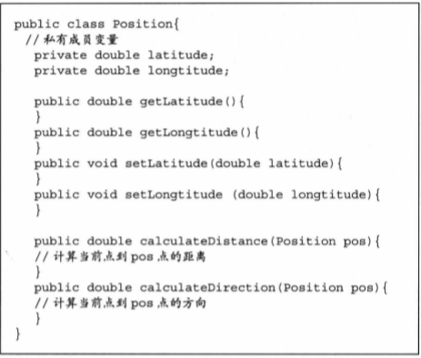

- 如果不是必要，不应该提供get和set方法
- 同样不应该从名字上暴露类内部的实现形式
- 所有数据应该是private，不是所有变量都有getter和setter的，同时getter和setter是为了检查正确性的。

#### 3.4.1.1. 数据的封装 — 访问器和变量
1. 如果需要，请使用访问器和变量，而不是公共成员
2. 访问器和变量是有意义的行为：约束，转换，格式 ...

```java
//防止非法输入
public void setSpeed(double newSpeed) {
    if (newSpeed < 0) {
        sendErrorMessage(...);
        newSpeed = Math.abs(newSpeed);
    }
    speed = newSpeed;
} 
```

#### 3.4.1.2. 使用Getter和Setter方法的时候，不单纯将这些方法与类的成员关联
1. 类内部可能只是记录了生日，而并没有记录年龄，那么我们应该提供的是getAge()方法而不是calculateAge()暴露内部的实现
2. 所有数据应该是private，不是所有变量都有getter和setter的，同时getter和setter是为了检查正确性的。

### 3.4.2. 封装内部结构

#### 3.4.2.1. 暴露了内部结构
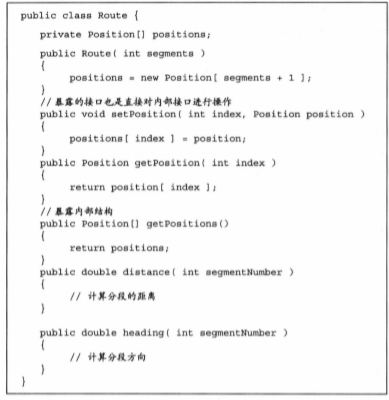

- 不合适的get和set方法的命名:比如getPositionsArray()
- getPostion里面写成return new Position(position[index])也可以隐藏
- 目的是:不应该在接口的地方就带有实现性的实现接口，同时内部的修改不应该影响到外部的具体实现。
- 改动内部结构危险！外部修改内部结构，内部允许并且无法得知。

#### 3.4.2.2. 隐藏内部结构
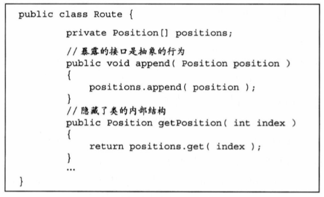

1. 在函数名上应该避免直接暴露内部实现的方式

#### 3.4.2.3. Collection暴露了内部的结构 
1. 参考16章的迭代器模式

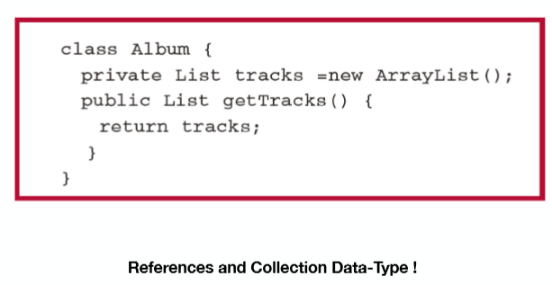

2. 直接返回集合暴露了内部封装的行为。

#### 3.4.2.4. 迭代器实现
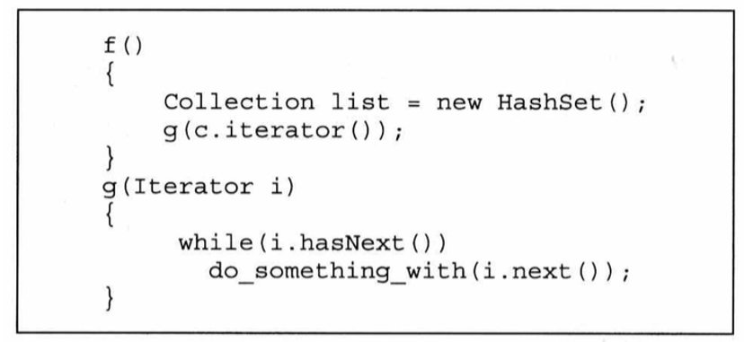

1. 通过迭代器的封装来隐藏内部具体结构。
2. 传递迭代器对象而不是原来对象(隐藏内部实现)
3. 参考课本249页的例子

### 3.4.3. 封装其他对象的引用
1. new一个新对象返回，防止原对象被修改。

#### 3.4.3.1. 隐藏内部对象


- 注意是重新创建了一个新的对象，而不是直接返回对象，避免通过引用的方式对原来的对象进行了修改。

#### 3.4.3.2. 委托隐藏了与其他对象的协作
1. 协同设计：组成； 委托

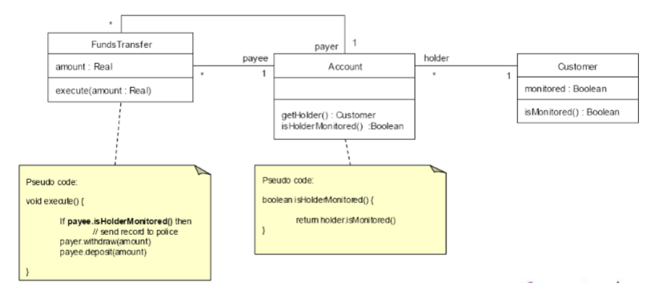

- 左侧使用代理，直接访问最右侧的
- 多层调用会增加隐式耦合

#### 3.4.3.3. 更多例子
1. 参考Sales和SaleItem的例子，参考课本250页
2. 关于以上的Position例子的描述同样也参考课本250页

### 3.4.4. 封装类型信息

#### 3.4.4.1. LSP的隐藏
1. LSP 里氏替换原则：指向超类或接口的指针；
2. 所有派生类都必须可以替代其基类
3. 子类要求更少，能做的更多，这样才能替换父类

### 3.4.5. 封装潜在的变更

#### 3.4.5.1. 封装变更（或变化）
1. 确定应用程序中可能更改的各个方面，并将它们与保持不变的部分分开。
2. 将变化的部分封装起来，以便以后可以更改或扩展变化的部分，而不会影响不变的部分。

#### 3.4.5.2. 封装变更
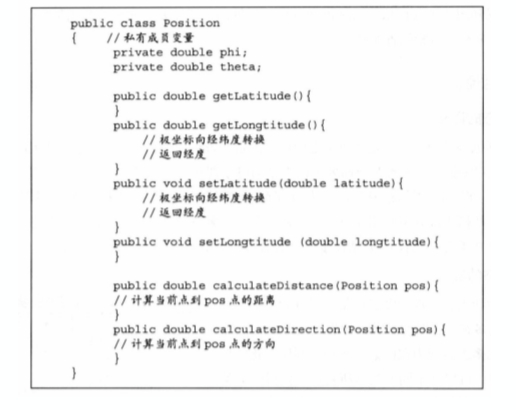

1. 接口是面向上层实现的，现有实现和接口对于外部都是合理的。

## 3.5. 原则十：最小化类和成员的可访问性

1. 抽象化：抽象集中于对象的外部视图，并将对象的行为与其实现分开
2. 封装形式：类不应公开其内部实现细节
3. 权限最小化原则

## 3.6. 类和成员的可访问性
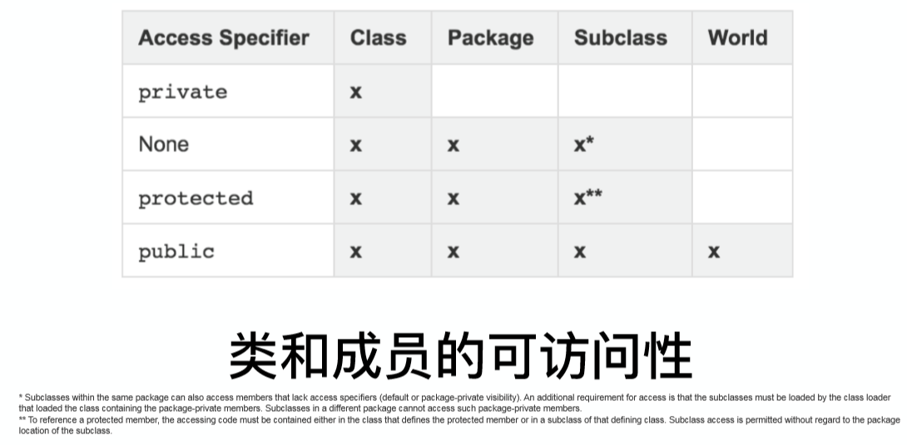

- x表示可见

### 3.6.1. Example:最小化可达性
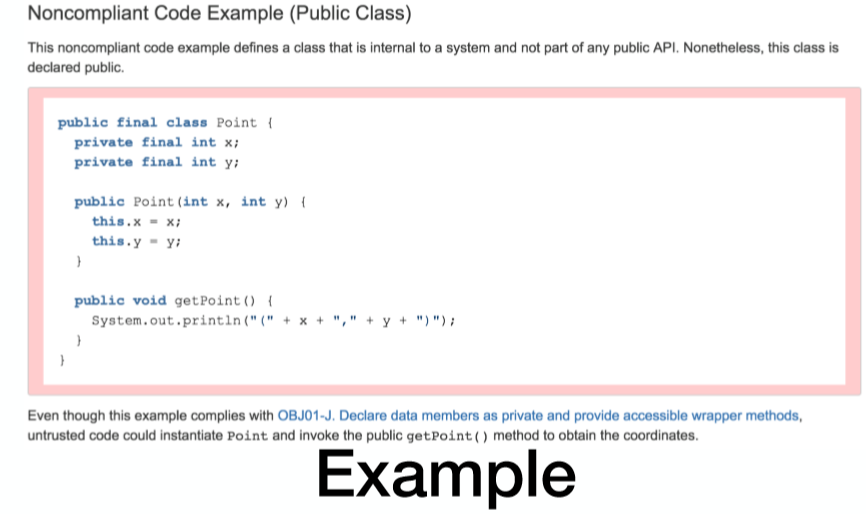

- public class:考虑问题:public类的public方法可以被全局访问到，是不是需要public
- 是否应该对包内开放
- 上面的设计是不合适的

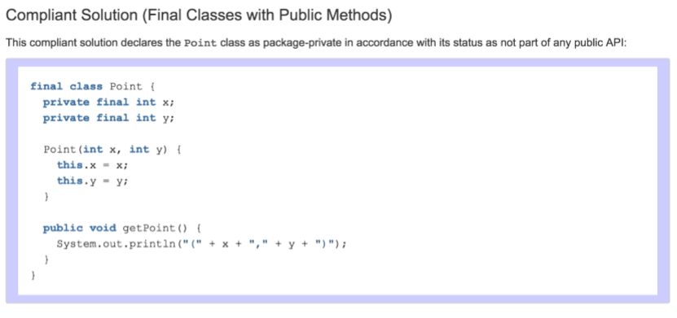

- 包内可见:没有public
- final:表示不能继承
- 要做到:满足业务需求的最小的可达性

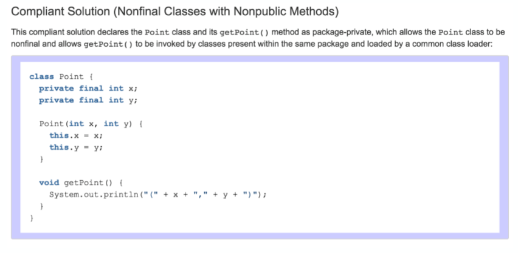

- 包内可见，getPoint()可以被包内方法和常规类加载器加载。

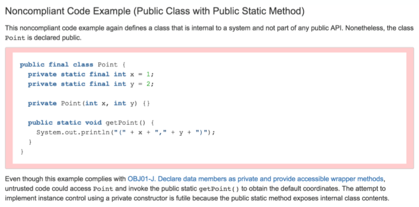

- 全局可见，不可继承，方法是public的

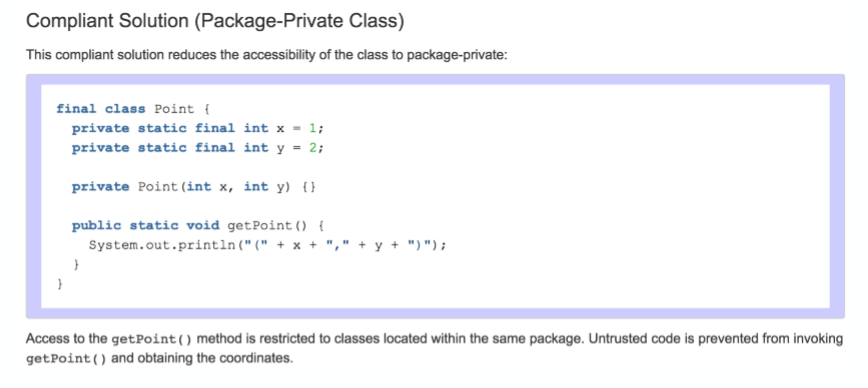

- getPoint()在包内可见，是不是需要

# 4. 为变更而设计

## 4.1. OCP(开闭原则，Open/Close Principle) 重要

### 4.1.1. 职责修改的例子


```c++
void Copy(ReadKeyboard& r, WritePrinter& wp, WriteDisk& wd, OutputDevice dev){
    int c;
    while((c = r.read())!= EOF)
        if(dev == printer)
            wp.write(c);
        else
            wd.write(c);
}
void Copy(ReadKeyboard& r, WritePrinter& w){
    int c;
    while ((c = r.read ()) != EOF)
        w.write (c);
}
```

1. 修改很复杂，修改后需要重新编译，有一定代价

### 4.1.2. 怎么解决上面修改的问题
1. 抽象是关键
2. 使用多态依赖完成

### 4.1.3. 例子的解决方案
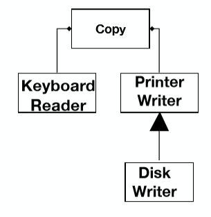

```c++
DiskWriter::Write(c){
    WriteDisk(c);
}
void Copy(ReadKeyboard& r, WritePrinter& w){
    int c;
    while ((c = r.read ()) != EOF)
        w.write (c);
}
```

## 4.2. 原则十一：开放/封闭原则（OCP）
1. 软件实体应该开放进行扩展，而封闭以进行修改— B. Meyer，1988年/ R。Martin，1996年引用
2. 对**扩展**开放：模块的行为可以被扩展，比如新添加一个子类
3. 对**修改**关闭：模块中的源代码不应该被修改
4. 统计数据表明，修正BUG最为频繁，但是影响很小；新增需求数量一般，但造成了绝大多数影响
5. 应该编写模块，以便可以扩展它们而无需修改它们

### 4.2.1. RTTI:运行时类型信息是丑陋并且危险的
1. RTTI = Run-Time Type Information RTTI = 运行时类型信息
2. 如果模块尝试将基类指针动态转换为多个派生类，则每次扩展继承层次结构时，都需要更改模块
3. 通过类型切换或if-else-if结构识别它们

### 4.2.2. RTTI违背了开闭原则和里氏替换原则
```java
class Shape {}
class Square extends Shape {
    void drawSquare() {
        // draw         
    }     
}
class Circle extends Shape {
    void drawCircle() {
        // draw         
    }     
} 
void drawShapes(List<Shape> shapes) {
    for (Shape shape : shapes) {
        //这里写法不合适
        if (shape instanceof Square) {
            ((Square) shape).drawSquare();
        } else if (shape instanceof Circle) {
            ((Circle) shape).drawCircle();
        }
    }
}
```

1. 都有draw方法，应该将draw放到shape里面

## 4.3. 多态
1. 多态是指针对类型的语言限定，指的是不同类型的值能够通过统一的接口来操纵。

### 4.3.1. 多态的分类
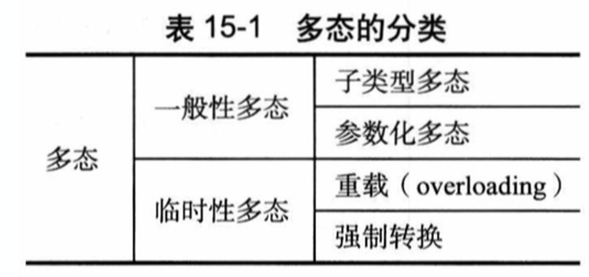

1. 参数化多态:template
2. C++使用template机制，Java使用泛化机制。

### 4.3.2. Abstraction and Polymorphism that does not violate the open-closed principle and LSP 不违反开放原则和LSP的抽象和多态性

```java
 interface Shape {
    void draw();
}
class Square implements Shape {
    void draw() {
        // draw implementation
    }
}
class Circle implements Shape {
    void draw() {
        // draw implementation
    }
}
void drawShapes(List<Shape> shapes) {
    for (Shape shape : shapes) {
        shape.draw();
    }
}
```


- 违反开闭原则:对扩展开放，对修改关闭，因为如果发生扩展，必须要进行代码的修改。

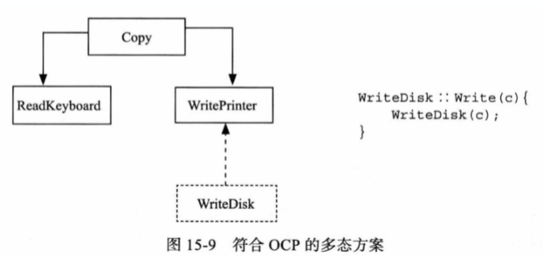

- 通过多态来满足开闭原则

### 4.3.3. 开闭原则总结
>没有重大的计划可以100％封闭 R.Martin，
1. 使用抽象获得显式关闭 
2. 根据可能发生的变化来计划课程：最小化未来的变更地点
3. OCP需要DIP && LSP 开闭原则需要依赖导致原则和里氏替换原则作为基础。

## 4.4. DIP 依赖倒置原则
>依赖倒置原则是指:
1. 抽象不应该依赖于细节，细节应该依赖于抽象。因为抽象是稳定的，细节是不稳定的。
2. 高层模块不应该依赖于低层模块，而是双方都依赖于抽象，因为抽象是稳定的，而高层模块和低层模块都可能是不问稳定的。

### 4.4.1. 原则十二：Dependency Inversion Principle (DIP) 依赖倒置原则
1. 高级模块不应依赖于低级模块：两者都应依赖抽象。
2. 抽象不应该依赖细节：详细信息应取决于抽象-R。 马丁（1996）

### 4.4.2. 耦合的方向性
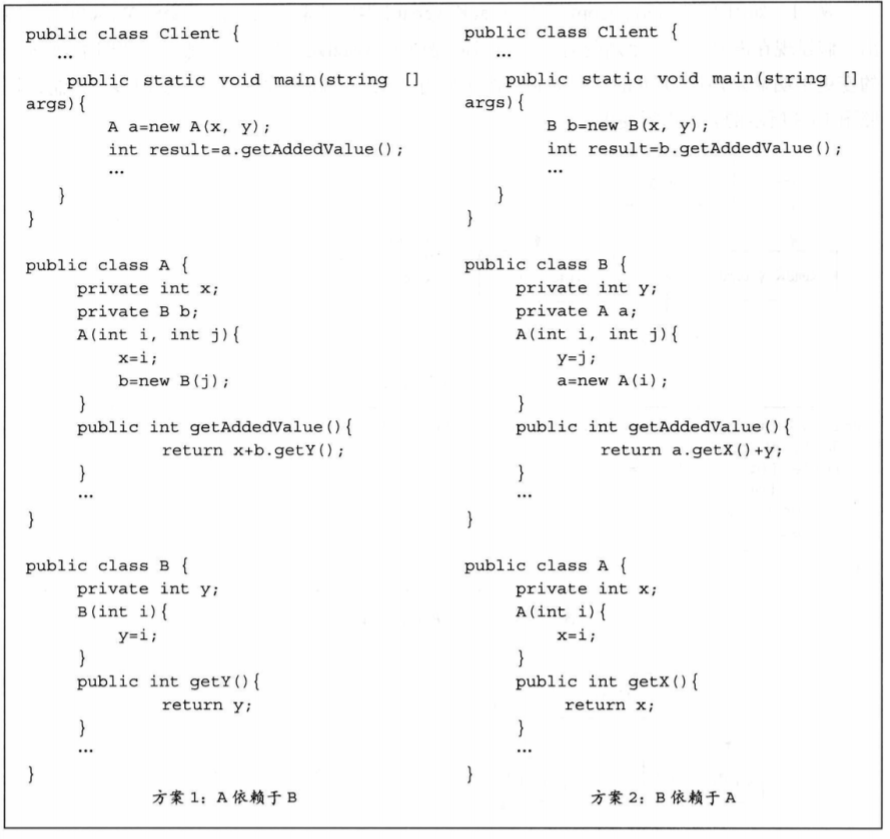

- 左边A依赖于B，右边B依赖于A

### 4.4.3. 依赖倒置:将接口从实现中分离出来 —— 抽象
1. 设计接口，而不是实现！
2. 使用继承来避免直接绑定到类

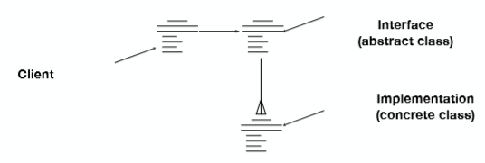

3. 实现依赖于接口(都依赖于接口)

### 4.4.4. DIP的实现
1. 如果我们需要B依赖于A
   1. 如果A是抽象的，那么符合DIP
   2. 如果A不是抽象，那么不符合DIP，我们为A建立抽象借口接口IA，然后使用B依赖于IA、A实现IA，所以这样子B就依赖于IA，A也依赖于IA。

### 4.4.5. 依赖倒置的例子

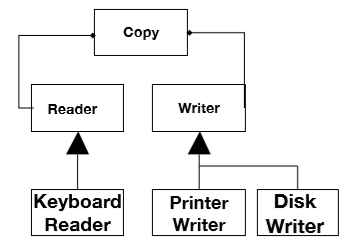

- 抽象:Writer，扩展的时候只需要被扩展类实现Writer

```c++
class Reader {
    public:
        virtual int read() = 0;
};
class Writer {
    public:
        virtual void write(int) = 0;
};
void Copy(Reader& r, Writer& w){
    int c;
    while((c = r.read()) != EOF)
        w.write(c);
} 
```

### 4.4.6.依赖倒置过程和面向对象结构层次

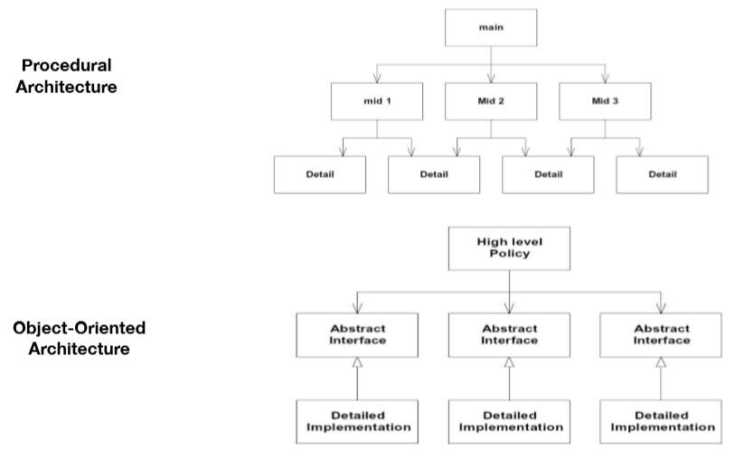

- 抽象的接口而不是实现

### 4.4.7. 依赖倒置总结
1. 抽象类/接口：
   1. 倾向于不经常改变
   2. 抽象是“铰接点”，在此更易于扩展/修改
   3. 不必修改代表抽象（OCP）的类/接口
2. 例外情况
   1. 有些类很不可能修改
      1. 因此对插入抽象层没有什么好处
      2. 示例：字符串类
   2. 在这种情况下可以直接使用具体的类：在这种情况下可以直接使用具体的类...
3. 符合DIP的分层设计图参考课本256页

### 4.4.8. 如何应对变化
1. OCP陈述了目标； DIP陈述了机制；
2. LSP是DIP的保险

## 4.5. 总结

### 4.5.1. 信息隐藏：设计变更！
1. 最常见的秘密是您认为可能会更改的设计决策。
2. 然后，您可以通过将每个设计秘密分配给自己的类，子例程或其他设计单元来分离它们。
3. 接下来，您隔离（封装）每个机密，这样，如果它确实发生了更改，则更改不会影响程序的其余部分。
4. DIP是有代价的，它增加了系统的复杂度，如果没有迹象(通常是需求的可变性)表明某个行为是不稳定的，就不要强行为其使用DIP，否则会导致过度设计的问题。