19-软件测试
---

# 1. 考试题
1. 给出功能需求，设计功能测试用例
2. 给出设计图，按要求写集成测试用例，Stub和Driver
3. 给出方法的描述，按要求写单元测试用例，Mock Object
4. Junit基本用法

# 2. Bug起源

## 2.1. 第一个Bug
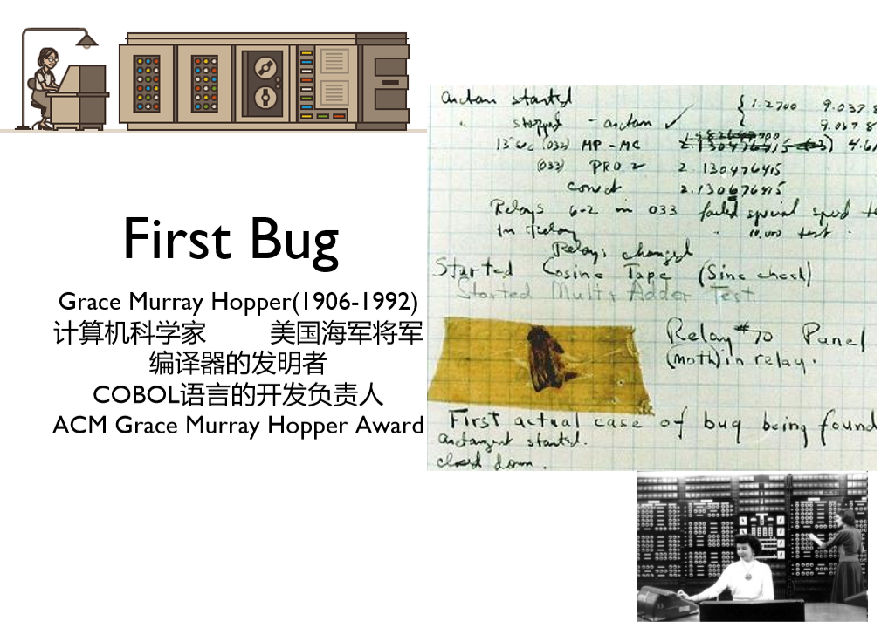

## 2.2. 千年虫病毒
1. 在七十年代，程序员利用宝贵的内存和磁盘空间通过两位来存储年份
2. 他们从来没有想到程序可以运行到2000年

## 2.3. 辐射机问题
1. Therac-25放射治疗机中的软件有缺陷，导致数名癌症患者接受致命的过量放射。 四名患者死亡
2. 独立科学家进行的一项调查发现，即使在加拿大原子能有限公司（AECL）认为已修复特定错误之后，仍发生了事故。
3. 他们在报告中写道：“这里的基本错误涉及不良的软件工程实践，以及建立依赖该软件进行安全操作的机器。”

## 2.4. 爱国者导弹防御1991
1. 爱国者导弹防御系统未能防御多种导弹
2. 系统时钟中累积了微小的计时误差，因此14小时后，跟踪系统不再准确
3. 在对KSA达兰的攻击中，该系统已运行100多个小时
4. 该系统是可移动的，因此开发人员没想到它会在一个地方停留14小时

## 2.5. 奔腾处理器的浮点数bug
1. (4195835/3145727) * 3145727 - 4195835 ≠ 0
2. 测试工程师企图淡化Bug，管理人员认为这并不要紧
3. 一位用户报告说，1994年10月30日，英特尔试图淡化该错误。 如果您可以证明自己受到影响，可以更换芯片
4. 最终，他们道歉。 更换所有芯片，耗资4.5亿美元
5. 有趣的是，1.13 MHz Pentium III导致软件冻结

## 2.6. 迪士尼的《狮子王动画故事书》 1994
1. 迪士尼发行了第一张针对儿童的多媒体CD-ROM
2. 一个大型广告系列，称其为“购买游戏”
3. 圣诞节过后，许多生气的父母正与迪斯尼通电话，背景中有哭泣的孩子
4. 问题是游戏只能在少数平台上运行，而包装盒上对此一无所知，因为迪斯尼尚未意识到问题所在
5. 兼容性的问题，只能在部分CD中进行播放

# 3. 什么是对的软件？

## 3.1. 你是否正确的构造了软件
1. 软件正确性
   1. 在且仅在以下情况下，才根据规范S考虑程序P：对于每个有效输入，P的输出均符合规范S
2. 验证：常常我们会将软件与终端用户或者其他利益相关者的需求进行比较。

## 3.2. Verification and Validation 验证和确认 重要
1. Verification: 验证，检查开发者是否正确地使用技术建立系统，确保系统能够在于其的环境中按照技术要求正确地运行。
2. Validation: 确认，检查开发者是否家里了正确的系统，确保最终产品符合规格。
3. V＆V差异无关紧要
4. V＆V通常是指试图确保软件按要求运行的任何活动。
5. Ex见课本320页,重要，会考V&V

### 3.2.1. 如果软件是错误的
1. 定义
   1. 缺陷:系统代码中存在的不正确的地方，计算时存在除0可能
   2. 错误:如果系统执行到缺陷代码，就可能使得执行结果不符合预期且无法预测，表现出来的不稳定的状态，比如计算时存在除0可能的代码，一旦除0则会发生错误
   3. 失败，有Failure一定有fault和Error，而倒过来是未必成立的。失败是指错误的发生会使得软件的功能失效，比如，系统某个功能输出不正确、异常终止、不符合时间或者空间的限制等。
2. 关系
   1. 缺陷可能在被活动激发前很长时间不被检测到
   2. 如果错误传播到输出，则最终会导致失败。
3. 缺陷、错误和失败：该链可以递归地迭代：依次由其他交互系统的故障引起故障。

# 4. Common V&V Activities 常见的V＆V活动
1. 静态分析技术
   1. 仅基于（手动或自动）检查软件模型和代码的项目文档以及有关需求和设计的其他相关信息
   2. 通常会产生有效的结果，但精度可能较弱
   3. 容易产生误报，因为多态的存在导致很多只能在运行的时候才报错。
2. 动态测试技术
   1. 运行软件以暴露可能的故障
   2. 还观察了程序的行为和性能属性
   3. 产生更精确的结果，但仅适用于经过检查的执行
   4. 动态容易漏报，没有运行到一定不会报告

## 4.1. 静态分析技术
1. 可以在需求阶段应用； 在设计阶段； 在实施阶段
2. 传统静态技术–大量手动操作，容易出错，耗时
   1. 软件检查–根据已编译的常见和历史缺陷清单，对生成的文档（可交付成果）进行逐步分析
   2. 软件评审–将工作产品的不同方面呈现给项目人员（经理，用户，客户等）和其他感兴趣的涉众以征求意见或批准的过程
   3. 阅读代码–对生成的代码进行桌面分析，以发现不违反样式或语法的键入错误
   4. 算法分析和跟踪–可以得出所用算法的复杂性以及最坏情况，平均情况和概率分析评估的过程
3. 依靠形式化方法的静态分析技术
4. 27min漏了

## 4.2. 动态分析技术
1. 测试–基于对有价输入的代码执行（必要时必须包括表征系统状态的参数和环境条件的定义）
   1. 检查指定输入和指定输出
2. 性能分析–程序配置文件记录了一组受控执行过程中某些感兴趣的实体出现的次数
   1. 频谱执行情况:一个向量，从第一行到最后一行，形成一个01向量
   2. 分支覆盖法

## 4.3. 软件开发中的验证与确认活动
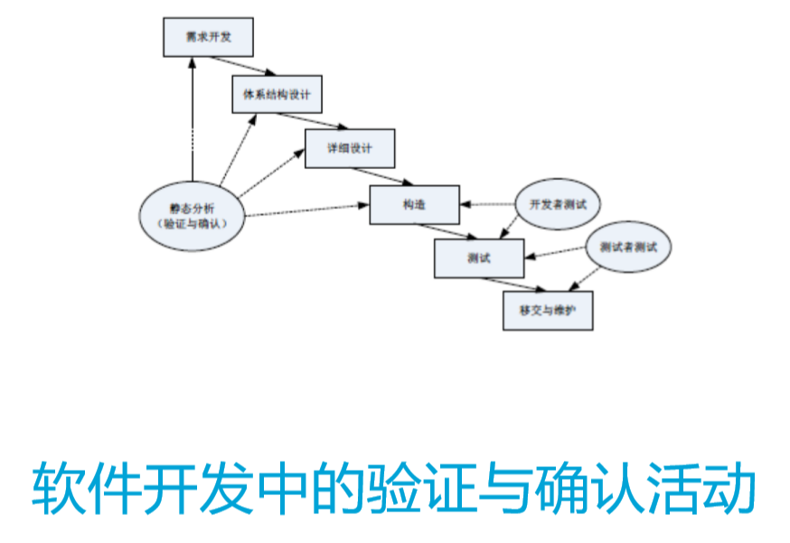

# 5. 软件测试的目的
1. 目的一:向开发者和用户展示软件满足了需求，表明软件产品是一个合格的产品。
   1. 有效性测试
2. 目的二:找出软件中的缺陷和不足
   1. 缺陷测试:只有发现了缺陷的测试才是成功的测试
3. 总而言之，软件测试是为评价与改进产品质量、标识产品缺陷和问题而进行的活动。

## 5.1. 测试用例

1. 差分测试

- 开发者：理解系统含义，但是只是大体上，通过流程进行了测试
- 独立测试人员：必须学习系统相关，但是会去尝试破坏系统，并且是通过质量来驱动测试

## 5.2. 桩与驱动
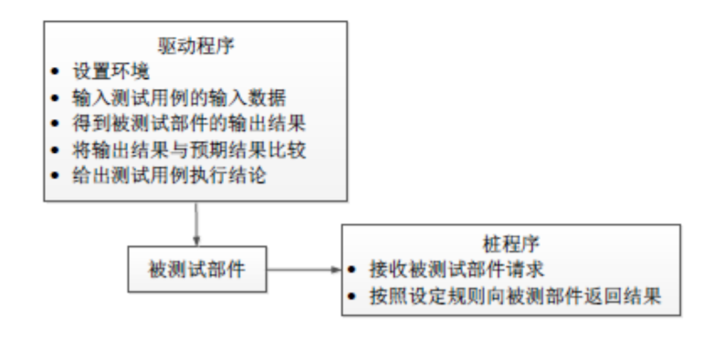

1. 桩程序是被测试部件的交互环境，他扮演被测试部件需要调用的其他系统部件。桩程序对其他系统部件的扮演仅限于规格相同，内部代码要简单的多，通常是直接返回固定数据或者按照固定规则返回数据。
2. 驱动程序负责创建被测试部件的执行环境，并驱动和监控被测试部件执行测试用例的过程，判定测试用例的执行结果。

## 5.3. 测试空间
1. 黑盒测试、白盒测试、灰盒测试

# 6. 测试层次

- 开发者主要是进行单元测试，可以进行一定程度上的集成测试和系统测试
- 重点:
  - α测试:在软件发布前，让小规模、有代表性的潜在用户试用，可以在开发机构中进行。
  - β测试:在用户处进行

## 6.1. 单元测试
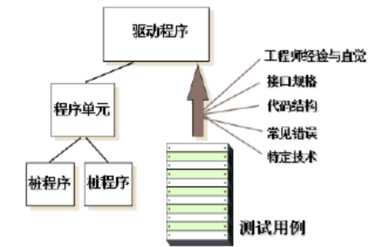

1. 在过程化编程中，一个单元就是一个函数与过程。
2. 在面向对象编程中，一个单元就是类的一个方法。
3. 发现技术缺陷和代码缺陷

## 6.2. 集成测试
1. 集成测试一般在单元测试和系统测试之间

### 6.2.1. 自顶向下的集成测试
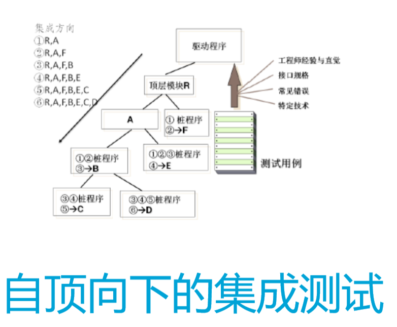

1. 一定要一步一步集成

### 6.2.2. 自底向上的集成测试
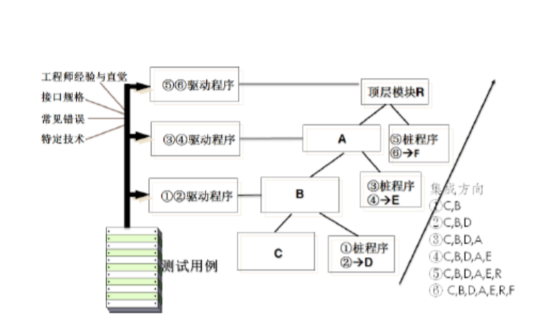

## 6.3. 系统测试
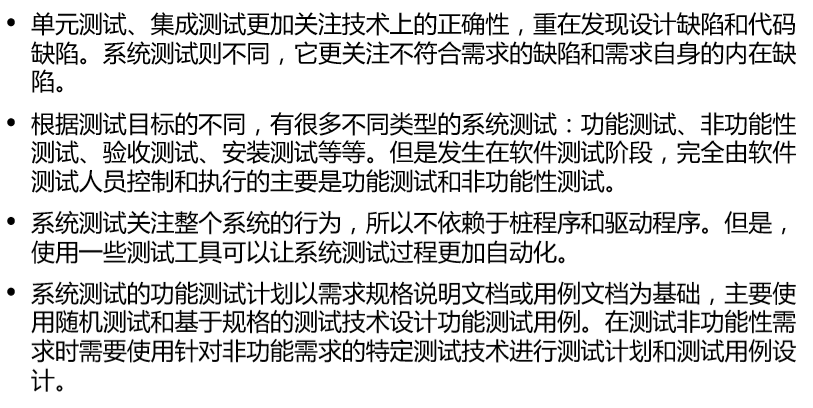

# 7. 测试技术
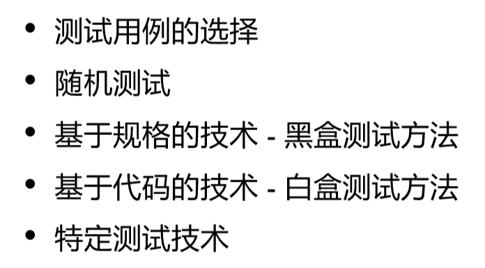

1. 测试的目的是发现尽可能多的缺陷，并不绝对要求发现所有缺陷。

## 7.1. 测试用例的选择
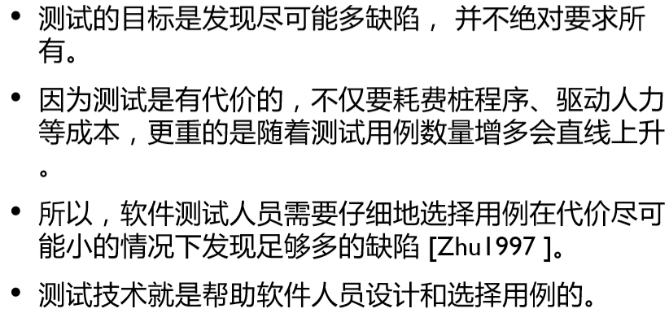

1. 课本P326页图 19-7 :工程追求足够好，而不是最好。

## 7.2. 随机测试
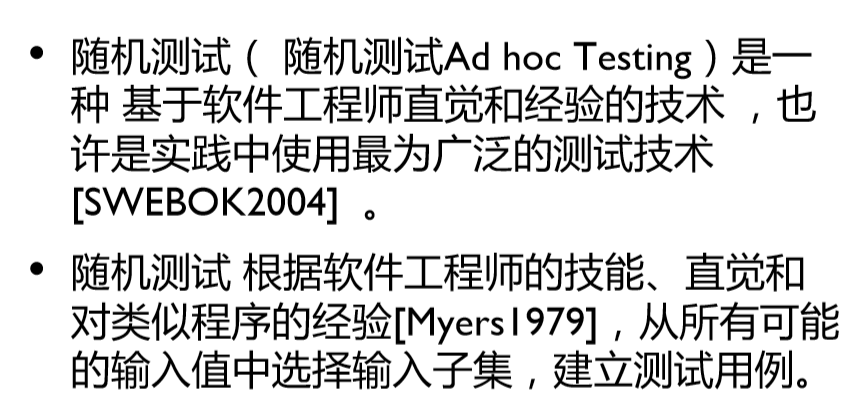

1. 比如int的越界问题:两类测试用例，不越界和越界

## 7.3. 黑盒测试 重要
1. 黑盒测试是将测试对象作为一个黑盒子，完全基于输入和输出数据来判断测试对象的正确性。

### 7.3.1. 黑盒测试方法-等价类划分
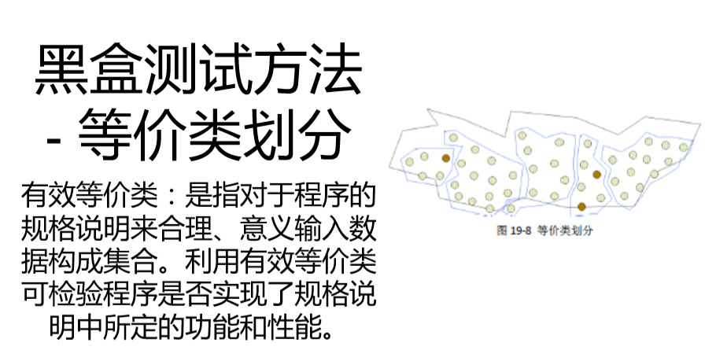

- 把所有可能的输入数据，即程序的输入域划分为若干部分（子集），从每个子集中选取少量具有代表性的数据作为测试用例。
- 例子

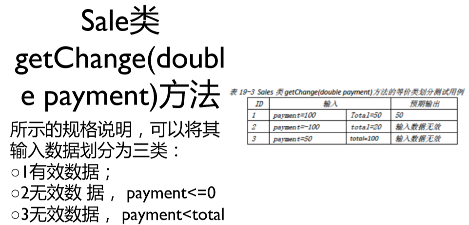

### 7.3.2. 黑盒测试方法-边界值分析
1. 边界值分析是等价类划分方法的补充，实践证明，错误最容易发生在各等价类的边界，而不是等价类的内部。
2. 对定价类划分的补充，错误容易发生在各个等价类的边界上，而不是等价类的内部，因此针对边界情况设计测试用例，可以发现更多的缺陷。

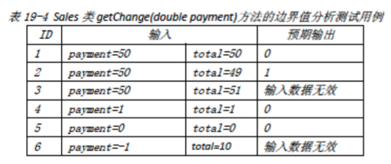

### 7.3.3. 黑盒测试方法-决策表
- 决策表是为复杂逻辑判断设计测试用例的技术。决策表示由条件声明、行动声明、规则选项和行动选项等四个象限组成的表格。

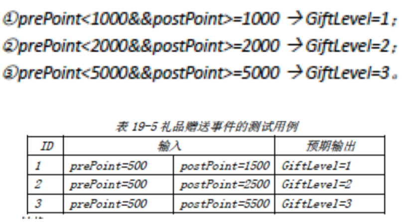

### 7.3.4. 黑盒测试方法-状态转换
- 状态转换是针对复杂测试对象的测试技术。该类复杂测试对象对输入数据的反映是多样的，还需要依赖自身的状态才能决定。
- 状态转换包含有效转换和无效转换，只有在复杂情况和可靠性要求较高的情况下才会为无效转换设计测试用例。

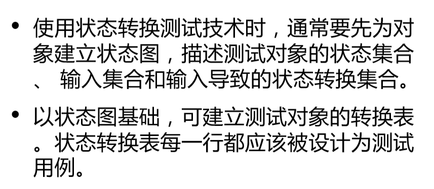

- 例子

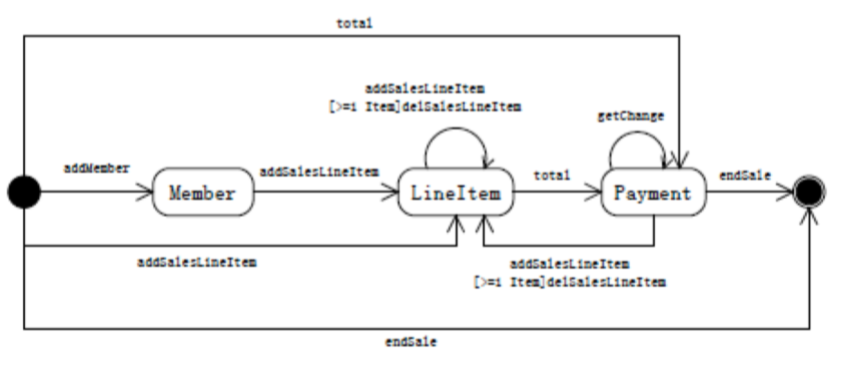
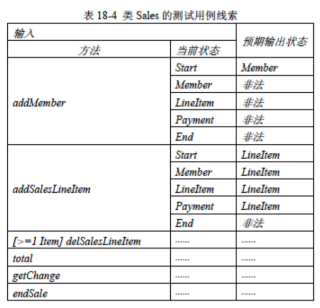
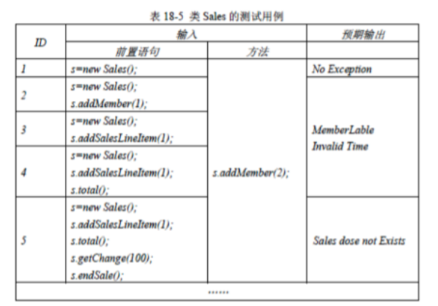

## 7.4. 白盒测试 重要
1. 白盒测试是将测试对象看做透明的，不关心测试对象的规格，而是按照测试对象内部的程序结构来设计测试用例进行测试工作。

### 7.4.1. 白盒测试方法-语句覆盖
1. 语句覆盖设计测试用例的标注是保证被测试的对象的每一行代码都至少执行了一次。

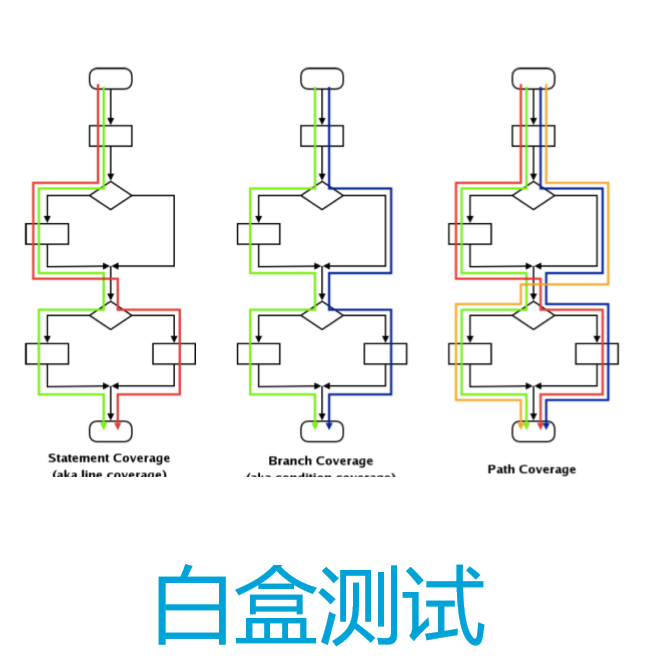

- 所有的路径都覆盖一遍，路径覆盖

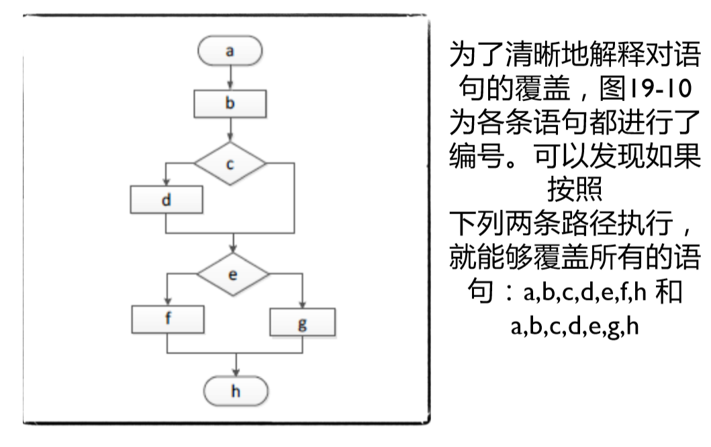

### 7.4.2. 白盒测试方法-条件覆盖
1. 条件覆盖设计测试用例的标准是确保程序中每个判断的每个结果都至少满足一次。

### 7.4.3. 白盒测试方法-路径覆盖
1. 路径覆盖测试用例的标准是确保程序中每一条独立执行的路径都至少执行一次。

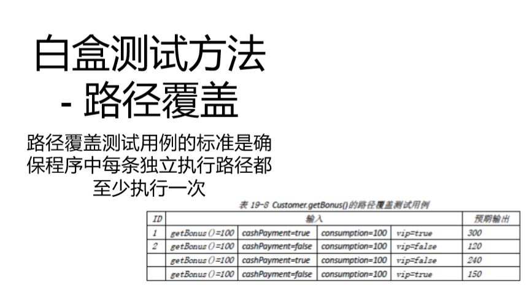

## 7.5. 特定测试技术
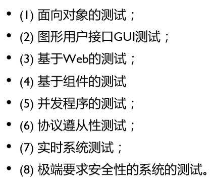

## 7.6. 面向对象的测试技术
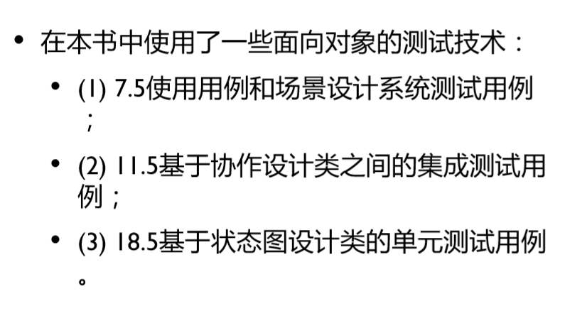

# 8. 测试活动
1. 测试计划:在开始具体的软件测试活动之前，必须首先进行测试计划，以明确测试的工作范围、资源与成本、基本策略、进度安排等。
2. 测试设计:测试的成功取决于有效设计的测试用例
3. 测试执行:执行测试前需要选择好测试工具
4. 测试评价:在测试完成后，必须评价测试结果
5. 以上详见课本332页

## 8.1. 测试用例日志
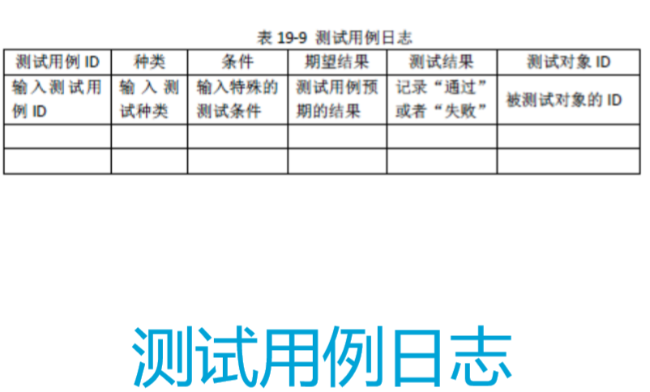

## 8.2. 缺陷报告
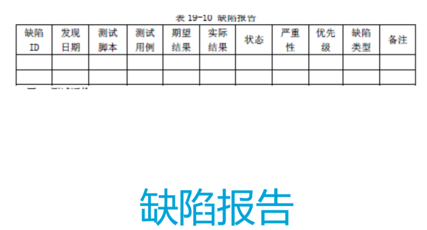

# 9. 测试度量
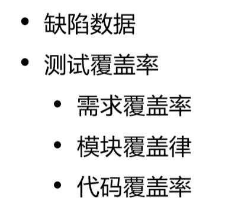

- 需求覆盖率=被测试的需求数量/需求总数
- 模块覆盖率=被测试的模块数量/模块总数
- 代码覆盖率=被测试的代码行/代码行数

## 9.1. 缺陷度量
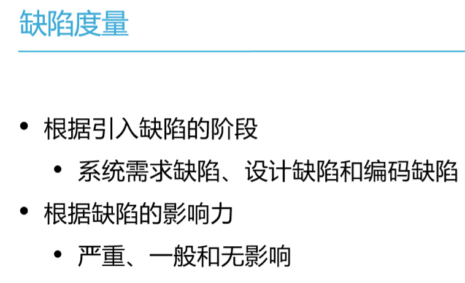

## 9.2. 覆盖率
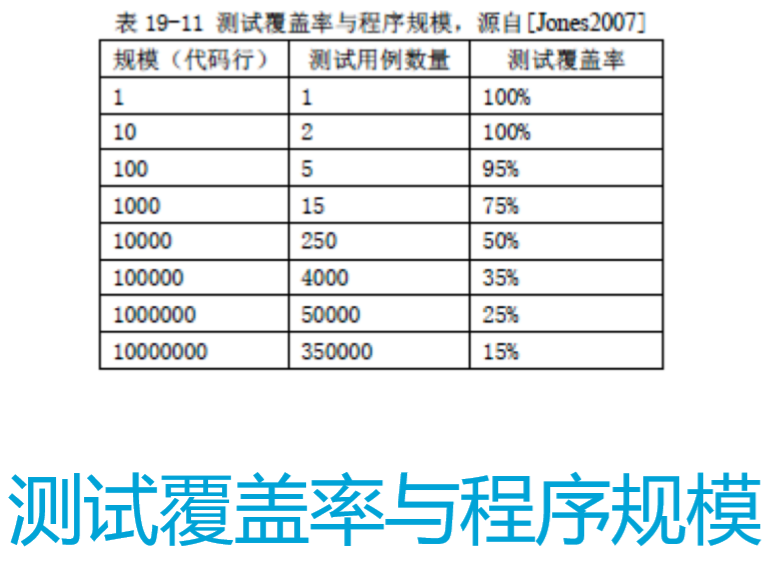
