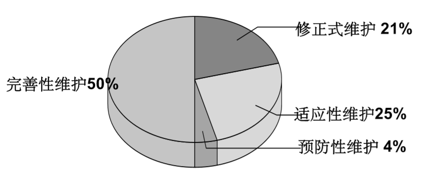
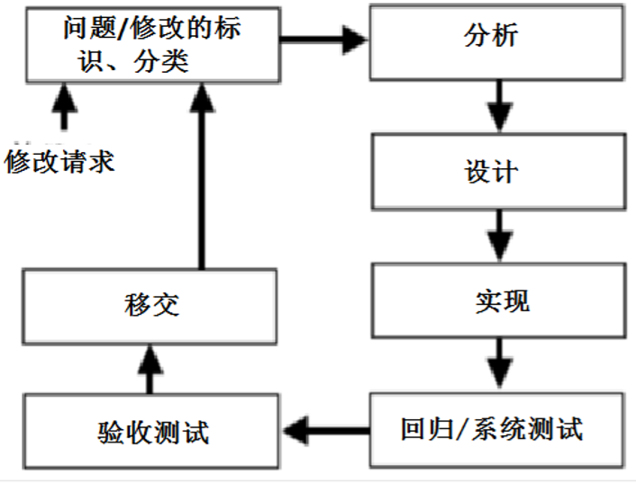
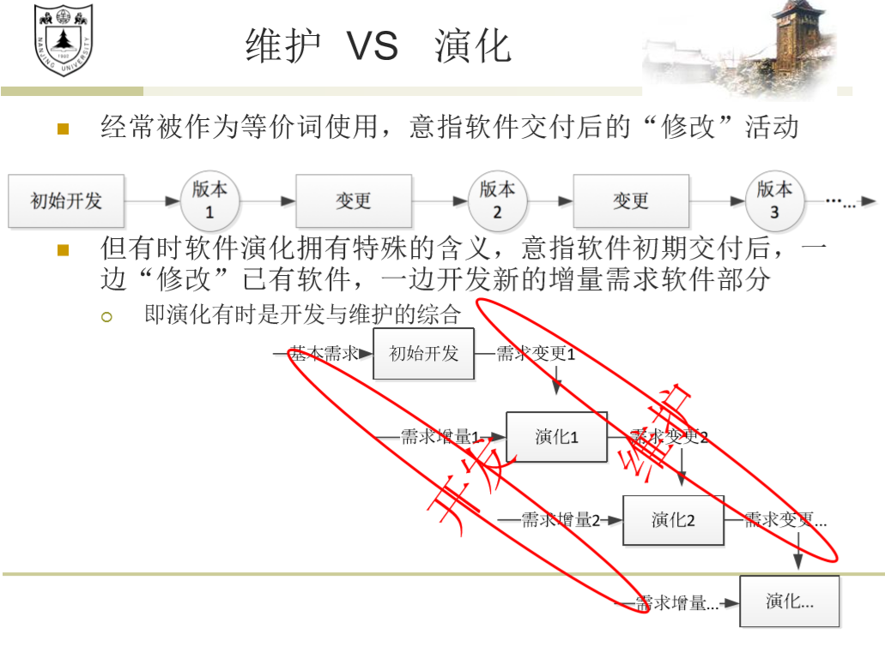
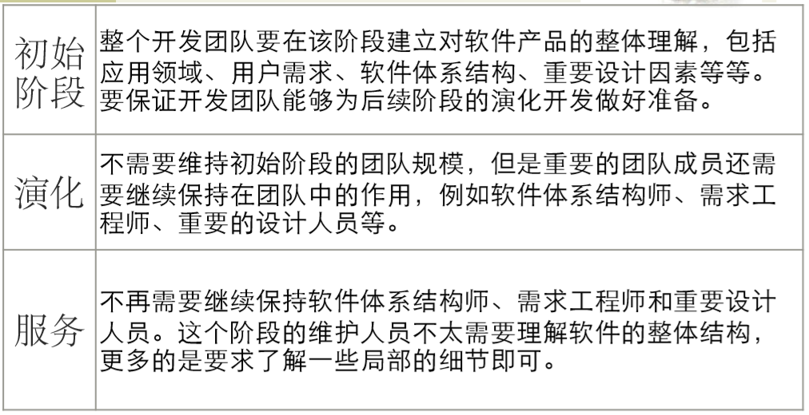
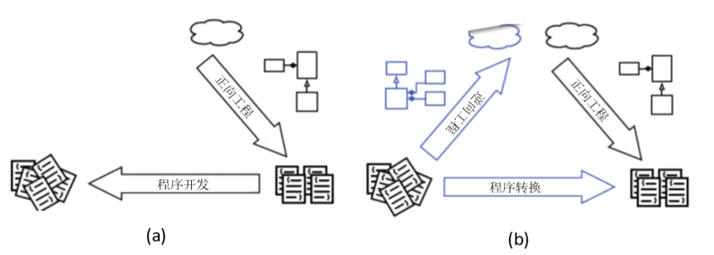
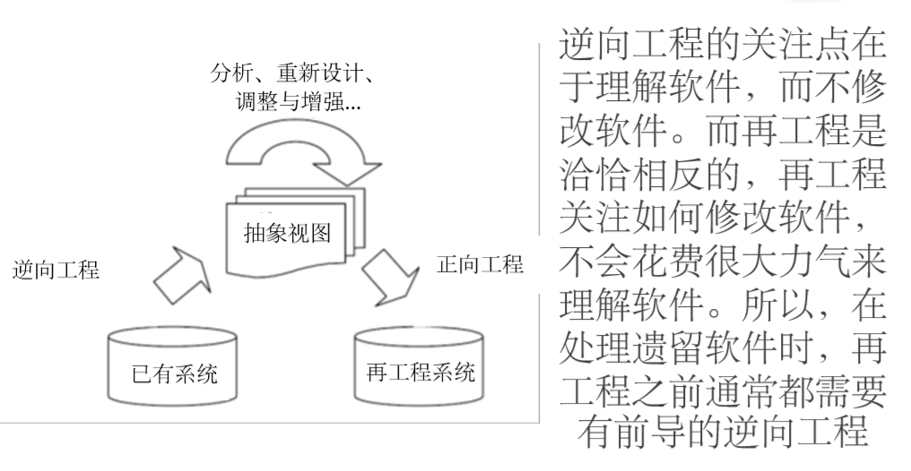

21-软件的维护与演化
---

# 1. 维护
1. 软件维护的主要工作是“修改” 
2. 软件维护代价高昂
3. 软件维护的过程

## 1.1. 软件维护的主要工作是"修改"

### 1.1.1. 维护是什么
1. 各个工程领域都会在将产品交付给用户之后进行维护工作
   1. 主要是为了保证产品的正常运转而进行使用帮助、故障解决和磨损处理等工作。
2. 软件的维护主要是“修改”
   1. 软件不会磨损，硬件的变更会影响软件产品
   2. 软件维护只需要完成少量的使用帮助、故障解决和磨损处理等工作
   3. 软件特性上是易于修改的
   4. 软件只有持续修改才能保持价值

### 1.1.2. 软件维护
1. 修改软件的代价非常高，软件维护的重点在于软件修改和变更上。
2. IEEE就定义软件维护为[IEEE610.12-1990]：软件维护是在交付之后修改软件系统或其部件的活动过程，以修正缺陷、提高性能或其他属性、适应变化的环境。

## 1.2. 软件变更的常见情景
1. 问题发生了改变。
   1. 随着时间的发展，形势可能会发生变化，导致用户的问题发生变化。这些使得软件的需求发生变化，出现新的需求，否则软件将减小甚至失去服务用户的作用。
2. 环境发生了改变。
   1. 随着软件产品的生命周期越来越长，在软件生存期内外界环境发生变化的可能性越来越大，因此，软件经常需要修改以适应外界环境的改变。
   2. 比如硬件上出现了变更。
3. 软件产品中存在缺陷。
   1. 软件开发的理想结果当然是建立一个完全无缺陷的软件产品，但这是不可能达到的目标。最终的软件产品总是或多或少的会遗留下一些缺陷。当这些缺陷在使用中暴露出来时，必须予以及时的解决。

### 1.2.1. 软件维护类型划分[Lientz1980]
1. 完善性维护（Perfective maintenance）：为了满足用户新的需求、增加软件功能而进行的软件修改活动。
2. 适应性维护（Adaptive maintenance）：为了使软件能适应新的环境而进行的软件修改活动。
3. 修正性维护（Corrective maintenance）：为了排除软件产品中遗留缺陷而进行的软件修改活动。
4. 预防性维护（Preventive maintenance）：为了让软件产品在将来可维护，提升可维护性的软件修改活动。
   1. 随着持续的修改，软件的复杂度会上升，质量会下降。预防性修改是为了解决上述问题而进行的软件调整，是一种特殊类型的“修改”
   2. 只有这一种维护是根源于软件维护中的规律性。

### 1.2.2. 软件维护
1. 理想情况下，为满足一些变更而执行的维护活动应该不会降低软件产品的质量，尤其是可维护性，否则，本次的维护活动将使得未来的维护活动更加困难。
2. 但是实践表明软件维护活动的确会降低软件产品的质量，甚至导致一个软件产品在进行一系列维护活动之后会失去可维护性。
3. [Lehman1980,1984]将这种现象表述为：在一个程序发生变更时，它的结构倾向于变得更复杂，因此需要投入一些额外的资源以在保持功能的同时简化程序结构。
   1. 别人来维护代码，可能会降低代码效率等等
4. 预防性维护就是为了简化维护后的软件结构以提高软件可维护性的额外投入。

## 1.3. 软件维护代价高昂 

### 1.3.1. 软件维护成本远远超出开发
1. 一般认为，维护成本是开发成本的3倍以上(目前可能是4倍以上)

### 1.3.2. 从事维护工作的人员比率在上升
1. [Jones2006]在对美国的软件开发者进行调查时发现：1975年时有不超过75,000人在从事维护工作，占所有开发人员的17%；1990年时有大概800,000人在从事维护工作，占所有开发人员的47%；2005 年时有2,500,000人在从事维护工作，占所有开发人员的76%。
2. 软件工程的成功绝不仅是开发的成功，更要求维护工作的成功；只有降低软件维护的成本，才能降低整个软件工程的成本。

### 1.3.3. 为什么软件维护有这么高的代价？
1. 变更频繁
2. 维护工作困难

### 1.3.4. 需求变更非常频繁
1. [Jones1996]发现：对于管理信息系统，其需求一般每月增长1％左右；商业软件的增长率可以高达3.5％；其他类型的软件介于这两者之间。
2. 如果需求每个月变更2％，则相当于需求每年要变化1/4，所以这是一个惊人的数字。n 在[Stark1999]的调查中，需求的可变性（可变性＝变化的需求数量÷总需求数量）也高达48％。

### 1.3.5. 频繁变更的需求推高了维护成本
1. [Lientz1980]发现在各种变更中，为满足新需求而进行的完善性维护占用了最多的软件维护成本

2. 为什么在数量上少于新开发需求，但是变更需求却耗费了比新开发大得多的成本？
   1. 程序理解
   2. 影响分析
3. 重构可以极强地降低了我们的维护成本

### 1.3.6. 维护的困难性
1. 程序的理解
   1. 在维护中修改软件时，不论被修改的是哪个部分，维护人员都需要全面理解整个软件系统的结构和行为，只有这样才能确定需要修改的程序位置和修改方法。理解软件系统的结构和行为就需要准确理解程序代码，而这是一个困难的任务。
   2. 实践调查表明维护时间的**50%～90%**都被消耗在了程序理解上[Corbi1989, Livadas1994]。
2. 软件维护人员通常不是程序代码的编写者，不同人的思维方式不同，维护人员不仅要读懂程序逻辑还要理解编写者的思路
3. 实践中很多软件项目的文档不全或者更新不及时，维护人员无法获得足够的帮助，只能单纯依赖代码片段拼接来形成对系统的整体理解
4. 影响分析
   1. 在开发软件时，具体功能和需求并不是各自独立实现的，即不是每一个需求都被单独实现为一段代码。通常，每条需求会被实现为相互联系的多个程序代码片段，而且每个程序代码片段要同时承载多个具体需求的实现。程序代码片段与具体需求之间是多对多的复杂关系。而且软件的程序代码也是互相联系的，维护人员在修改一部分程序代码时，可能会影响到其他部分。
   2. 有统计调查表明：每修正一个缺陷，都有20～50%的几率引入新的缺陷
   3. 为了阻止修改带来坏的连锁反应，开发者需要耗费很多精力
      1. 回归测试、需求跟踪等

## 1.4. 开发可维护的软件
1. 通过分析软件维护的高代价性可以发现，很多软件维护中的困难和问题根源于软件开发阶段。
2. 虽然软件维护工作表现在软件交付之后，但是需要在软件开发时就预备一些前期工作。

### 1.4.1. 前期（开发阶段）更充分的准备可以减轻后期维护的压力和困难
1. 考虑软件的可变更性
2. 为降低维护困难而开发

### 1.4.2. 考虑软件的可变更性
1. 预测变更并将其独立封装，便于修改时的程序定义与理解，防止修改时的连锁反应
   1. 分析需求的易变性，尽可能发现和预测可能的变更
   2. 为变更进行设计，开发人员需要进行关注点分离，使用信息隐藏等设计思想为可能的变更进行设计，将其封装起来

### 1.4.3. 为降低维护困难而开发
1. 为后期理解程序和进行影响分析提供额外的便利
   1. 编写详细的技术文档并保持及时更新。
   2. 保证代码的可读性。
   3. 维护需求跟踪链。
      1. 需求跟踪链从正反两个方向纪录“需求、设计、编码、测试”之间的跟踪与回溯关系
   4. 维护回归测试基线。
      1. 回归测试基线包含了系统修改之前的有效测试用例集合， 因此只需要根据修改情况对回归测试基线进行简单的修正

## 1.5. 软件维护的过程

### 1.5.1. 步骤1:问题/修改的标识、分类与划分优先级
1. 该步骤的主要任务是进行变更管理（Change Management）：
   1. 用户、客户或其他人员提出变更请求；
   2. 维护人员为变更请求建立变更记录（Change Record），赋予标识，进行变更类别分类，确定其优先级。
   3. 初步评估变更的可能影响，并据此确定是否接受该变更请求。
   4. 如果决定执行变更，就为其安排修改时间。通常多个小的修改会安排到一个时间内批量完成。

### 1.5.2. 步骤2:分析
1. 该步骤的主要任务是为后续的修改（设计、实现、测试、交付发布等）确定一个基本的规划，包括2个阶段：
   1. 步骤2.1 可行性分析。
      1. 该步骤的任务是提出候选方案，并分析方案的可行性，建立可行性报告。
      2. 可行性报告的内容包括：变更的影响范围、候选方案、需求变化分析、对安全性和保密性的影响、人的因素、短期和长期成本、修正的价值与效益等。
   2. 步骤2.2 详细分析
      1. 该步骤的任务是准确定义修改的需求，标识需要修改的元素、标识修改中的安全与保密因素、确定一个测试策略和建立一个实现计划。

### 1.5.3. 步骤3:设计
1. 该步骤的主要任务是依据变更分析的结果和已有系统的信息，完成对系统设计的变更。
2. 具体工作包括：标识被影响的软件模型、修改软件设计文档、为新的设计创建测试用例、更新回归测试集、更新需求文档。
   1. 在进行完善性维护和适应性维护时，设计步骤要针对新的功能需求执行一个完整的详细设计过程。
   2. 在进行修正性维护时，设计要防止程序修改带来连锁的负面效应。
   3. 在进行预防性维护时，设计要重点关注软件结构的质量，以此为依据修改程序代码和软件系统结构。

### 1.5.4. 步骤4:实现
1. 该步骤的主要任务是根据变更的设计，完成代码实现。
2. 具体工作包括：编码与单元测试、集成新修改代码、集成测试、风险分析和代码评审。

### 1.5.5. 步骤5:回归测试
1. 该步骤的主要任务是确保对变更的修改不会带来连锁的负面效应，要保证系统仍然能够满足其他未被修改的需求。
2. 具体工作包括：针对变更情况进行功能测试和界面测试、对整个系统进行回归测试、验证系统是否准备好进行验收测试。

### 1.5.6. 步骤6:验收测试
1. 该步骤的主要任务是由用户、客户或客户指定的第三方来验证系统是否满足用户的变更请求。
2. 具体工作包括：针对变更请求的功能测试、针对用户使用环境的兼容性测试、对整个系统进行回归测试。

### 1.5.7. 步骤7:移交
1. 该步骤的主要任务是将修正的系统发布用于安装和运营。
2. 具体工作包括：进行配置审计；通知用户团体、为了备份系统而开发一个阶段性版本、在客户的设施上进行安装和培训。其中配置审计是要通过配置管理系统确定一个系统的发布包，包括文档、软件程序、培训文档、以及其他相关文档。

# 2. 软件演化

## 2.1. 维护和演化

## 2.2. 软件演化定律
1. 在研究的基础上，Lehman提出了大型软件系统演化的8条定律，下面是其中的3条：
   1. 持续变化：一个大型软件系统要么进行不断的变化，要么用处会越来越少。
   2. 不断增加的复杂度：随着软件系统的发展，它的复杂性会不断增加，除非进行一定的工作来维持或降低复杂度。
   3. 质量降低：系统的质量将出现下滑，除非进行一定的工作来适应环境变化。

## 2.3. 软件演化生命周期模型

### 2.3.1. 步骤一:初始开发
1. 初始开发阶段按照传统的软件开发方式完成第一个版本的软件产品开发。第一版的软件产品可以实现全部需求，也可以（通常是）只包含部分需求——对用户来说非常重要和紧急的最高优先级需求。
2. 初始阶段的一个极其重要的工作是建立一个好的软件体系结构。
   1. 具有很好的可扩展性，能够包容后续的演化增量。
   2. 具有很好的可修改性，能够处理后续阶段中的预期变更请求和未预期变更请求。
   3. 比较坚实、可靠，能够在后续演化保持稳定的表现。
3. 在初始阶段的详细设计也要关注软件系统的可扩展性和可修改性，编程要关注程序的可读性以方便后续阶段的程序理解，技术文档的准备要充分以帮助后续阶段的程序理解

### 2.3.2. 步骤二:演化
1. 在完成初始开发之后，软件产品就进入演化阶段。该阶段可能会有预先安排的需求增量，也可能完全是对变更请求的处理，它们的共同点都是保持软件产品的持续增值，让软件产品能够满足用户越来越多的需要，实现更大的业务价值。
2. 总的来说，该阶段可能的演化增量有：
   1. 预先安排的需求增量；
   2. 因为问题变化或者环境变化产生的变更请求；
   3. 修正已有的缺陷；
   4. 随着用户与开发者之间越来越相互熟悉对方领域而新增加的需求。
3. 演化阶段的软件产品要具备两个特征：
   1. 软件产品具有**较好的可演化性**。一个软件产品在演化过程中复杂性会逐渐增高，可演化性会逐渐降低直至无法继续演化。演化阶段的软件产品虽然其可演化性低于初始开发阶段的软件产品，但是还没有到达无法演化的地步，还具有较好的可演化性。
   2. 软件产品能够帮助用户实现较好的**业务价值**。只有这样，用户才会继续需要该产品，并持续提供资金支持。
4. 如果在演化过程中，一个软件产品开始不满足第（2）条特征，那么该产品就会提前进入停止阶段。如果软件产品满足第（2）条的同时不满足第（1）条特征，那么该产品就会进入服务阶段。如果开发团队因为竞争产品的出现或者其他市场考虑，也可以让同时满足上面两条特征的软件产品提前进入服务阶段。

### 2.3.3. 步骤三:服务
1. 服务阶段的软件产品不再持续的增加自己的价值，而只是周期性的修正已有的缺陷。
2. 一个软件产品被置于服务阶段可能是因为它的软件结构已经无法继续演化，也可能是开发团队出于市场考虑，不再重点关注该产品。
3. 服务阶段的产品还仍然被用户使用，因为它仍然能够给用户提供一定的业务价值，所以开发团队仍然需要修正已有缺陷或者进行一些低程度的需求增量，保证用户的正常使用。

### 2.3.4. 步骤四:逐步淘汰
1. 在逐步淘汰阶段，开发者已经不再提供软件产品的任何服务，也即不再继续维护该软件。
2. 虽然在开发者看来软件的生命周期已经结束，但是用户可能会继续使用处于该阶段的软件产品，因为它们仍然能够帮助用户实现一定的业务价值。只是用户在使用软件时必须要容忍软件产品中的各种不便，包括仍然存在的缺陷和对新环境的不适应。
3. 对于该阶段的产品，开发者需要考虑该产品是否可以作为有用的遗留资源用于新软件的开发，用户需要考虑如何更换新的软件产品并转移已有的业务数据。

### 2.3.5. 步骤五:停止
1. 一个软件正式退出使用状态之后就进行停止状态。开发者不再进行维护，用户也不再使用。

## 2.4. 开发团队在不同阶段的不同工作

# 3. 软件维护与演化的技术
1. 遗留软件
2. 逆向工程
3. 再工程

## 3.1. 遗留软件
1. 这些软件可能非常古老，并且规模很大
2. 已经被严重修改过了
3. 基于过时的技术
4. 没有可用的文档
5. 找不到任何一个最初的开发人员
6. 拥有大量有用的数据
7. 这些软件通常是业务的核心元素，替换它们需要一大笔花费。

### 3.1.1. 对于遗留软件的不同处理方式
1. 如果遗留软件已经没有使用价值，就直接丢弃该软件。
2. 如果遗留软件还有使用价值，但是其维护的成本效益比低于新开发一个软件系统的成本效益比，那么冻结遗留软件，将其作为一个新的更大系统的组成部分进行使用。
3. 如果遗留软件的成本效益比低于新开发一个软件系统的成本效益比，而且该遗留软件仍然具备较好的可维护性，那么就逆向工程遗留软件并继续维护一段时间；
4. 如果遗留软件的成本效益比高于新开发一个软件系统的成本效益比，而且该遗留软件已经不具备可维护性，那么就修改系统使其获得新生（即再工程该系统），然后继续维护再造后的系统。

## 3.2. 逆向工程
1. 处理遗留软件时，维护人员接受的维护对象可能是一个没有任何文档也没有程序源代码的软件程序，此时，维护人员需要使用逆向工程技术
2. 逆向工程技术是指：“分析目标系统，标识系统的部件及其交互关系，并且使用其它形式或者更高层的抽象创建系统表现的过程[Chikofsky1990]”。
3. 逆向工程的基本原理是抽取软件系统的需求与设计而隐藏实现细节，然后在需求与设计的层次上描述软件系统，以建立对系统更加准确和清晰的理解。

4. 逆向工程技术在实践中得到了广泛的应用，并在下列方面取得了较大的成功：
   1. 识别可复用资产
   2. 在过程程序中寻找对象
   3. 发现软件体系结构
   4. 推导概念数据结构（即数据的需求分析模型和设计模型）
   5. 检测重复冗余
   6. 将二进制程序转换为某种源代码
   7. 重写用户界面
   8. 将串行化程序并行化
   9. 转换、约减、移植和包装遗留软件代码。

## 3.3. 再工程
1. 再工程的目的是对遗留软件系统进行分析和重新开发，以便进一步利用新技术来改善系统或促进现存系统的再利用。[Chikofsky1990]将再工程定义为：检查和改造一个目标系统，用新的模式及其实现复原该目标系统。

### 3.3.1. 再工程与逆向工程的关系

### 3.3.2. 再工程
1. [Arnold1993]认为再工程主要是下列两类活动：
   1. 改进人们对软件的理解
   2. 改进软件自身，通常是提高其可维护性、可复用性和可演化性
2. 常见的具体活动有
   1. 重新文档化
   2. 重组系统的结构
   3. 将系统转换为更新的编程语言
   4. 修改数据的结构组织。
3. 是抽象出来一个视图，然后完全重新开始开发，而不是基于逆向工程得到的结果进行再工程

# 4. 总结
1. 软件维护与一般工程领域的维护活动不同，软件维护主要是进行修改（尤其是需求变更），而不是进行零件保养、维修与替换
2. 虽然软件开发是软件工程的主要关注点，但软件维护耗费了更多的成本，所以需要在软件开发阶段进行一些预备工作以降低软件维护阶段的成本
3. 软件演化式的开发模糊了开发与维护的边界，既解决了软件开发周期太长的问题，又降低了“修改”所导致的软件质量下降的速度，延长了整个产品的有效生命周期
4. 软件维护与开发中常用的专门技术有：遗留软件处理、逆向工程和再工程