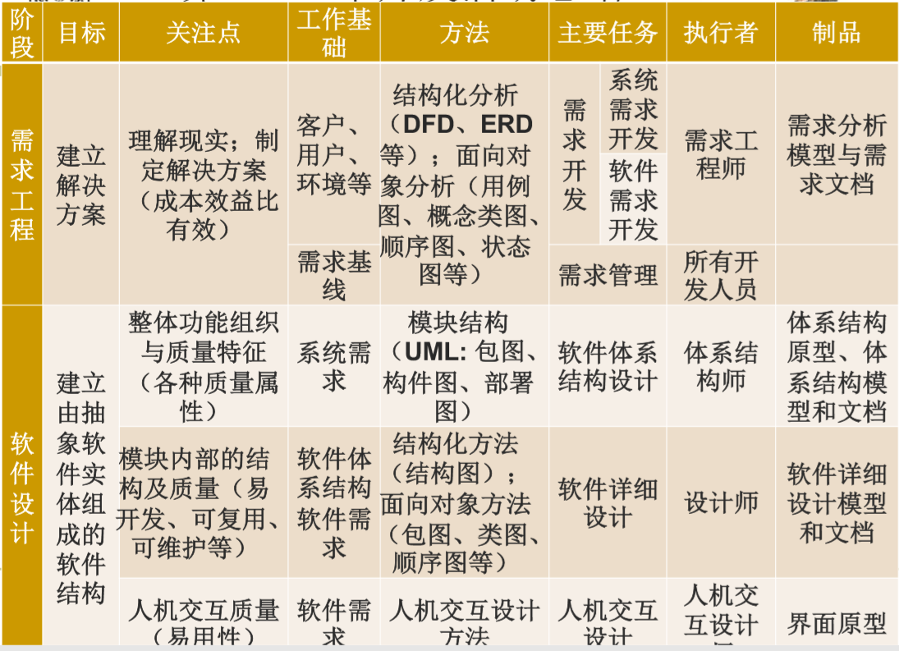
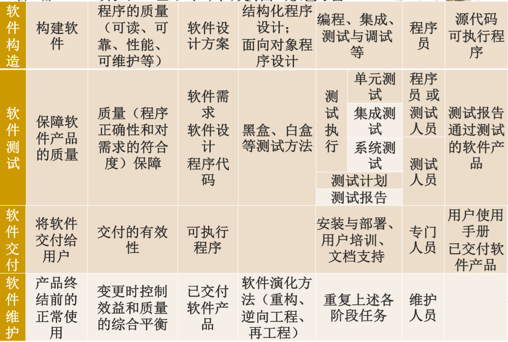
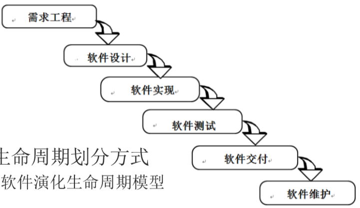
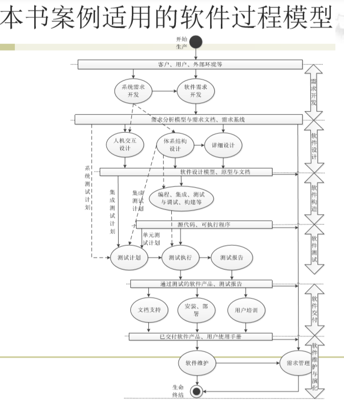
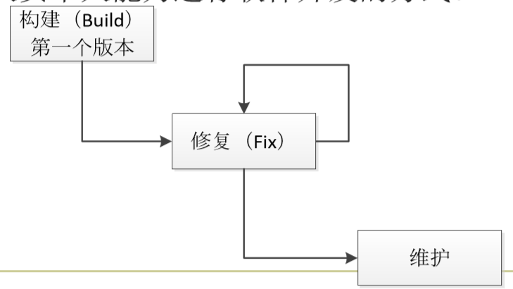
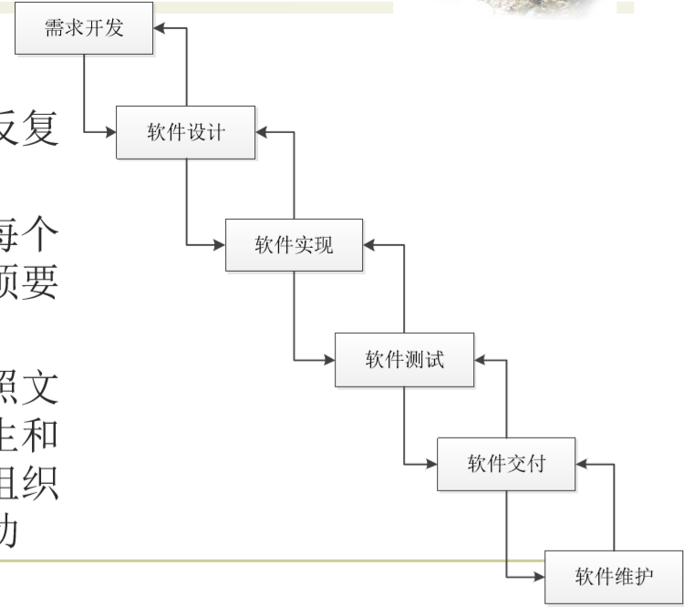
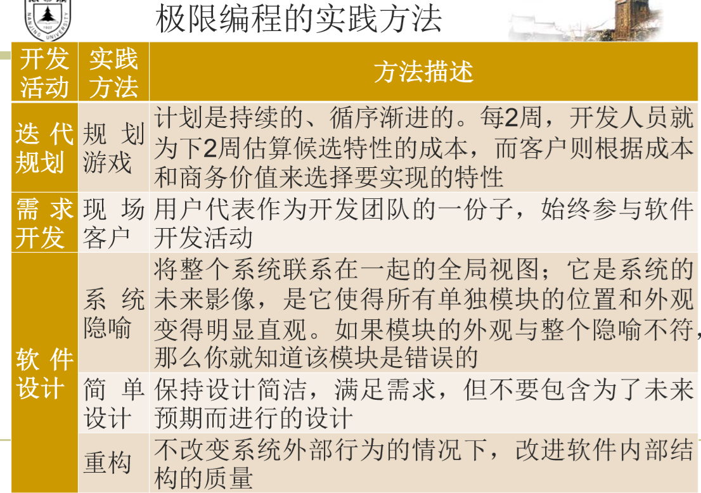
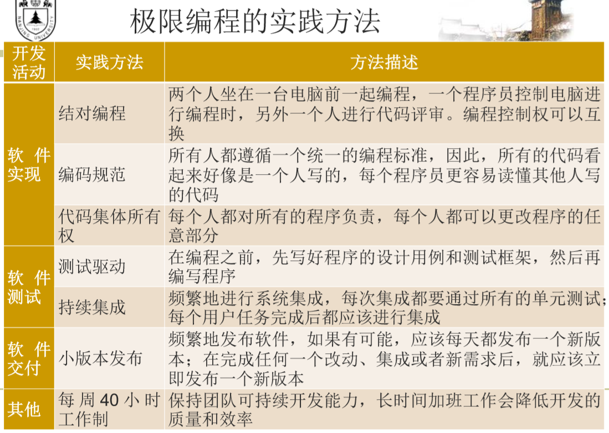

22-软件开发过程模型
---
- 各类别模型很重要

# 1. 软件开发各典型阶段
1. 具体详见课本360-362页

## 1.1. 第4-21章开发活动总结

- 系统需求的开发和软件需求的开发
- 分析系统的相应约束
- 软件设计:
  - 软件结构设计
  - 软件细节设计
  - 人机交互设计:包含美工

- 软件构造:
  - 构造软件就是进行编码
- 软件测试进行单元测试，集成测试、系统测试等等
  - 软件测试的覆盖情况
  - 各种测试的概念(重要)
- 软件交付:
  - 安装与部署
  - 用户培训
  - 文档支持
- 更精细的表格参考课本362页

# 2. 软件生命周期模型
1. 人们将软件从**生产到报废**的生命周期分割为不同阶段，每段阶段有明确的典型输入/输出、主要活动和执行人，各个阶段形成明确、连续的顺次过程，这些阶段划分就被称为软件生命周期模型。
2. 典型的软件生命周期
3. 可以有不同的生命周期划分方式
   1. 例如第21章的软件演化生命周期模型
4. 软件维护的结束就是软件报废。

# 3. 软件过程模型 重要
1. 软件过程模型在生命周期模型的基础则进一步详细说明各个阶段的任务、活动、对象及其组织、控制过程。
2. 与简略的软件生命周期模型不同，软件过程模型可以被看作是网络化的活动组织
3. 不同的生命周期模型有不同的软件过程模型
   1. 阶段划分不一样
4. 同一个生命周期模型也会有多个不同的软件过程 模型
   1. 虽然阶段划分一样，但是各个阶段的时间安排、先后衔接等执行过程不一样

## 3.1. 构建-修复模型 
1. 最早也是最自然产生的软件开发模型，对软件开发活动没有任何规划和组织，是完全依靠开发人员个人能力进行软件开发的方式。

### 3.1.1. 缺点
1. 在这种模型中，没有对开发工作进行规范和组织，所以随着软件系统的**复杂度提升**，开发活动会超出个人的直接控制能力，构建-修复模型就会导致开发活动无法有效进行而失败；
2. 没有分析**需求的真实性**，给软件开发带来很大的风险；
3. 没有考虑**软件结构的质量**，使得软件结构在不断的修改中变得质量越来越糟，直至无法修改；
4. 没有考虑测试和程序的可维护性，也没有任何文档，软件的维护十分困难。

### 3.1.2. 适用范围
1. 软件规模很小，只需要几百行程序，其开发复杂度是个人能力能够胜任的；
2. 软件对质量的要求不高，即使出错也无所谓；
3. 只关注开发活动，对后期维护的要求不高，甚至不需要进行维护。

## 3.2. 瀑布模型
1. 瀑布模型是按照软件生命周期模型将软件开发活动组织为需求开发、软件设计、软件实现、软件测试、软件交付和软件维护等活动，并且规定了它们自上而下、相互邻接的次序。
2. 允许活动出现反复和迭代，重点在于要求每个活动的结果必须要进行验证
3. 文档驱动：按照文档的划分、产生和验证来规划、组织和控制开发活动

### 3.2.1. 优点
1. 为软件开发活动定义了清晰的阶段划分（包括输入/输出、主要工作及其关注点），这让开发者能够以关注点分离的方式更好地进行那些复杂度超越个人能力的软件项目的开发活动。

### 3.2.2. 缺点
1. 对文档的过高期望具有局限性。
  1. 一方面会耗费很大的工作量和成本
  2. 另一方面很难为经常变化的需求建立完备可靠的文档。
2. 对开发活动的线性顺序假设具有局限性。
   1. 要求一个阶段的工作经过验证后才能进入后续阶段是不切实际的。在实际开发中，常常需要进行一定的后续工作才能验证当前的工作是否正确、可靠。
3. 客户、用户参与具有局限性。
   1. 成功的项目开发需要客户、用户从始至终的参与，而不仅仅是一个阶段。
4. 里程碑粒度具有局限性：里程碑粒度过粗，基本丧失了“早发现缺陷早修复”这一思想

### 3.2.3. 适用范围
1. 需求非常成熟、稳定，没有不确定的内容，也不会发生变化；
2. 所需的技术成熟、可靠，没有不确定的技术难点，也没有开发人员不熟悉的技术问题；
3. 复杂度适中，不至于产生太大的文档负担和过粗的里程碑。

## 3.3. 增量迭代模型
1. 增量迭代模型是在项目开始时，通过系统需求开发和核心体系结构设计活动完成项目对前景和范围的界定，然后再将后续开发活动组织为多个迭代、并行的瀑布式开发模型。需求驱动。
2. 软件规模日益增长带来了挑战及其对策
   1. 周期过长-渐进交付
   2. 时间压力-并行开发
3. 迭代式、渐进交付和并行开发共同促使了增量迭代模型的产生和普及。

1. 增量迭代模型需要在项目早期就确定项目的目标和范围，项目需求要比较成熟和稳定
2. 少量的不确定性和影响不大的需求变更通过迭代的方式加以解决 
3. 每个迭代的增量需求相对独立，被开发为产品的独立部分交付给用户
4. 第一个迭代完成的往往是产品的核心部门，满足基本的需求
5. 需求驱动：增量需求是增量迭代模型进行迭代规划、开发活动组织和控制的主要依据

### 3.3.1. 优点
1. 迭代式开发更加符合软件开发的实践情况，具有更好的适用性；
2. 并行开发可以帮助缩短软件产品的开发时间；
3. 渐进交付可以加强用户反馈，降低开发风险。

### 3.3.2. 缺点
1. 由于各个构件是逐渐并入已有的软件体系结构中的，所以加入构件必须不破坏已构造好的系统部分，这需要软件具备开放式的体系结构。
2. 增量交付模型需要一个完备、清晰的项目前景和范围以进行并发开发规划，但是在一些不稳定的领域，不确定性太多或者需求变化非常频繁，很难在项目开始就确定前景和范围。

### 3.3.3. 适用性
1. 因为能够很好地适用于大规模软件系统开发，所以增量迭代模型在实践中有着广泛的应用，尤其是比较成熟和稳定的领域。

## 3.4. 演化模型
1. 演化模型将软件开发活动组织为多个迭代、并行的瀑布式开发活动。
2. 演化模型与增量迭代模型相比
   1. 都是迭代、并行开发和渐进交付，都适合大规模软件开发
3. **演化模型能够更好地应对需求变更，更适用于需求变更比较频繁或不确定性较多的领域。**
   1. Ch21：演化模糊了维护与新开发的界限

### 3.4.1. 优点
1. **使用了迭代式开发，具有更好的适用性**，尤其是其演化式迭代安排能够适用于那些需求变更比较频繁或不确定性较多的软件系统的开发；
2. 并行开发可以帮助**缩短**软件产品的开发时间；
3. 渐进交付可以**加强用户反馈**，降低开发风险。

### 3.4.2. 缺点
1. 无法在项目早期阶段建立项目范围，所以项目的整体计划、进度调度、尤其是商务协商事宜无法准确把握；
2. 后续迭代的开发活动是在前导迭代基础上进行修改和扩展的，这容易让后续迭代忽略设分析与设计工作，蜕变为构建-修复方式。
3. 容易退化为构建修复方式

### 3.4.3. 适用性
1. 在实践中，不稳定领域的大规模软件系统开发适合使用**演化模型**进行组织。

## 3.5. 原型模型
1. 原型模型将需求开发活动展开为抛弃式原型开发活动和演化史原型开发活动
2. 原型模型在整体安排迭代的情况下，强调“抛弃式原型”的演化模型。抛弃式原型解决对未来知识的局限性产生的**不确定性**，将未来置于现在进行推敲。
3. 抛弃式原型
   1. 它通过模拟“未来”的产品，将“未来”的知识置于“现在” 进行推敲，解决不确定性。
   2. 存在的原因是"不确定的"，这一类原型在后续的开发过程中会被抛弃
4. 演化式原型
   1. 在迭代中构建，是系统的核心，并不断扩充，最终成为真正的软件产品。
   2. 它将作为真正产品的一部分，所以必须有很好的质量。在迭代式开发中，通常会在第一个迭代中构建一个核心的体系结构演化式原型，并且在后续迭代中不断扩充，成为真正的软件产品。

1. 原型模型的基本特征是注重使用抛弃式原型，适用 于不确定性较多的软件开发。

### 3.5.1. 优点
1. 对原型方法的使用加强了与客户、用户的交流，可以让最终产品取得更好的满意度；
2. 适用于非常新颖的领域，这些领域因为新颖所以有着大量的不确定性。

### 3.5.2. 缺点
1. 原型方法能够解决风险，但是自身也能带来新的风险，例如原型开发的成本较高，可能会耗尽项目的费用和时间；
2. 实践中，很多项目负责人不舍得抛弃“抛弃式原型”，使得质量较差的代码进入了最终产品，导致了最终产品的低质量。

### 3.5.3. 适用性
1. 实践中，原型模型主要用于在有着大量不确定性的新颖领域进行开发活动组织。

## 3.6. 螺旋模型
1. 螺旋模型是风险驱动的，完全按照风险解决的方式组织软件开发活动。
   1. 确定目标、解决方案和约束
   2. 评估方案，发现风险
   3. 寻找风险解决方法
   4. 落实风险解决方案
   5. 计划下一个迭代
2. 风险是指因为不确定性（对未来知识了解有限）而可能给项目带来损失的情况
3. 螺旋模型的基本思想是尽早解决比较高的风险，如果有些问题实在无法解决，那么早发现比目结束时再发现要好，至少损失要小得多。
4. 原型能够澄清不确定性，所以原型能够解决风险，螺旋模型是充分利用原型方法来解决风险的。
5. 原型模型 vs 螺旋模型
   1. 原型模型：使用原型解决需求的不确定性
   2. 螺旋模型：实用原型解决项目开发中常见的各种类型的技术风险，包括系统需求开发、软件需求开发、软件体系结构设计、详细设计等各个阶段
6. 自内向外，螺旋模型有4次风险解决迭代，分别解决了几个高风险的阶段的问题
   1. 解决系统需求开发中的风险，尤其是产品概念设计风险，得到一个确定的产品前景和范围。
   2. 解决软件需求开发中的风险，得到清晰的软件需求
   3. 解决软件体系结构设计中的技术风险，构建高质量的核心体系结构原型。
   4. 解决详细设计和实现中的关键技术风险，建立一个可实现的高质量软件结构。
  
### 3.6.1. 过程描述

### 3.6.2. 优点
1. 可以降低风险，减少项目因风险造成的损失。

### 3.6.3. 缺点
1. 风险解决需要使用原型手段，也就会存在原型自身带来的风险，这一点与原型模型相同；
2. 模型过于复杂，不利于管理者依据其组织软件开发活动；

### 适用性
1. 在实践中，螺旋模型在高风险的大规模软件系统开发中有着较多的应用。

## 3.7. Rational 统一过程
1. 统一过程（Rational Unified Process，RUP）总结和借鉴传统上的各种有效经验，建立最佳实践方法的集合，并提供有效的过程定制手段，允许开发者根据特定的需要定制一个有效的过程模型。

### 3.7.1. RUP核心思想
1. 迭代式开发，这是过去被反复证明的最佳实践方法；
2. 管理需求，重视需求工程中除了需求开发之外的需求管理活动；
3. 使用基于组件的体系结构，它帮助建立一个可维护、易开发、易复用的软件体系结构；
4. 可视化建模，利用UML进行建模；
5. 验证软件质量，尽早和持续地开展验证，以尽早发现缺陷，降低风险和成本；
6. 控制软件变更，适应1990s以后需求变更越来越重要的事实。
7. 注:
   1. 每一个迭代中都可能有很多个不同阶段在同时运行

### 3.7.2. RUP裁剪
1. RUP是一个通用的过程模板，在一个项目使用RUP指导开发活动组织时，需要对RUP进行裁剪和配置。
  1. 确定本项目需要哪些工作流。RUP的9个核心工作流并不总是需要的，可以取舍。
  2. 确定每个工作流需要哪些制品。
  3. 确定4个阶段之间如何演进，决定每个阶段要哪些工作流，每个工作流执行到什么程度，制品有哪些。
  4. 确定每个阶段内的迭代计划。
  5. 规划工作流的组织，这涉及人员、任务及制品，通常用活动图的形式给出。

### 3.7.3. 优点
1. 吸收和借鉴了传统上的最佳实践方法，尤其是其核心的6个实践方法，能够保证软件开发过程的组织是基本有效和合理的。
2. RUP依据其定制机制的不同，可以适用于小型项目，也可以适用于大型项目的开发，适用面广泛。
3. RUP有一套软件工程工具的支持，这可以帮助RUP的有效实施。

### 3.7.4. 缺点
1. 没有考虑交付之后的软件维护问题
2. 裁剪和配置工作不是一个简单的任务，无法保证每个项目都能定制一个有效的RUP过程。

### 3.7.5. 适用性
1. RUP是重量级过程，能够胜任大型软件团队开发大型项目时的活动组织。但RUP经过裁剪和定制，也可以变为轻量级过程，也能够胜任小团队的开发活动组织。

## 3.8. 敏捷过程
1. 传统的过程模型在应对需求变更和重视用户价值等发展时遇到了极大的挑战。
   1. 传统的软件过程模型过度强调了“纪律”，忽视了个人的能力，尤其是过度强调了计划、文档和工具，导致项目开发失去了灵活性，不能快速地应对需求变更和用户反馈。
2. 针对传统过程模型的缺陷和新的形势，人们总结实践中的经验和最佳实践方法，尝试建立轻量级过程方法。
3. 2001年，企业界一些对轻量级过程方法有着共同思想的人士召开了一次会议，会议上宣布成立敏捷联盟，敏捷过程方法正式诞生。

### 3.8.1. 敏捷思想
1. 敏捷过程并不是要为软件开发活动组织提供一种特定的过程模型，而是倡导一些指导性的思想和原则
2. 最为重要的敏捷思想是敏捷联盟宣言所声明的价值观：
   1. 个体和互动 高于 流程和工具
   2. 工作的软件 高于 详尽的文档
   3. 客户合作 高于 合同谈判
   4. 响应变化 高于 遵循计划
3. 也就是说，尽管右项有其价值，敏捷方法更重视左项的价值。

### 3.8.2. 敏捷原则
1. 我们最重要的目标，是通过持续不断地及早交付有价值的软件使客户满意。
2. 欣然面对需求变化，即使在开发后期也一样。为了客户的竞争优势，敏捷过程掌控变化。
3. 经常地交付可工作的软件，相隔几星期或一两个月，倾向于采取较短的周期。
4. 业务人员和开发人员必须相互合作，项目中的每一天都例外。
5. 激发个体的斗志，以他们为核心搭建项目。提供所需的环境和支援，辅以信任，从而达成目标。
6. 不论团队内外，传递信息效果最好效率也最高的方式是面对面的交谈。
7. 可工作的软件是进度的首要度量标准。
8. 敏捷过程倡导可持续开发。责任人、开发人员和用户要能够共同维持其步调稳定延续。
9. 坚持不懈地追求技术卓越和良好设计，敏捷能力由此增强。
10. 以简洁为本，它是极力减少不必要工作量的艺术。
11. 最好的架构、需求和设计出自自组织团队。
12. 团队定期地反思如何能提高成效，并依此调整自身的举止表现。

### 3.8.3. 践行敏捷思想与原则的过程方法
1. 极限编程XP（eXtreme Programming）
2. Scrum
3. 特性驱动开发（FDD/Feature Driven Development）
4. 自适应软件开发（ASD/Adaptive Software Development）
5. 动态系统开发方法（DSDM/Dynamic Systems Development Method）

### 3.8.4. 极限编程
1. 极限编程XP的一个重要思想是极限利用简单、有效的方法解决问题（这也是它被称为极限编程的原因），例如：
   1. 如果单元测试好用，那么就让所有人一直做单元测试（测试驱动）；
   2. 如果集成测试好用，那么就一直做集成测试（持续集成）；
   3. 如果代码评审好用，那么就一直做评审（结对编程）；
   4. 如果简洁性好用，那么就只做最简洁的事情（简单设计）；
   5. 如果设计好用，那么就一直设计（重构）；
   6. 如果短迭代好用，那么就把迭代做的足够小（小版本发布）；
   7. 如果用户参与好用，那么就让用户始终参与（现场客户）。 

### 3.8.5. 特点
1. 敏捷过程包含的方法众多，各有特点，除了共 同的思想和原则之外，很难准确描述它们的共 同点，所以也无法确切界定它们的优缺点。

### 3.8.6. 适用性
1. 从敏捷联盟声明的思想和原则来看，它们反映了1990s之后软件工程的发展趋势，所以得到了广泛的应用，尤其是能够适应于快速变化或者时间压力较大的项目。

# 4. 总结
1. 软件生命周期模型和过程模型都是人们关于如何组织软件开发活动的有效经验总结
2. 不同的过程模型适用于不同情况软件项目的开发活动组织 