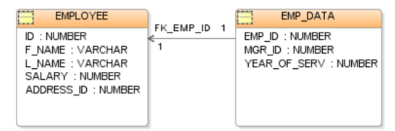
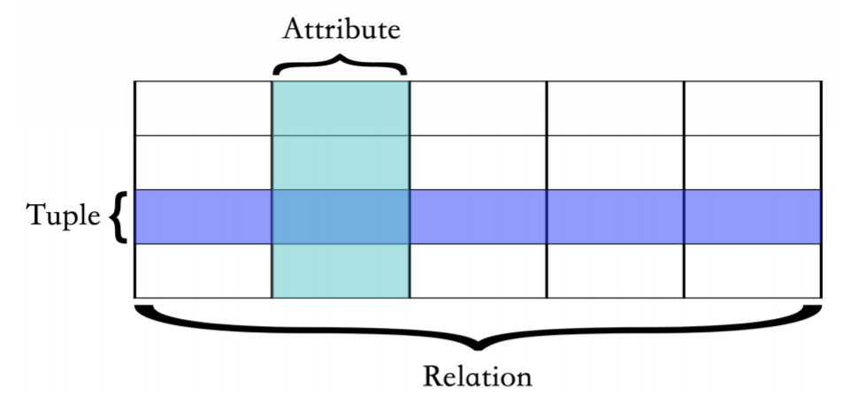
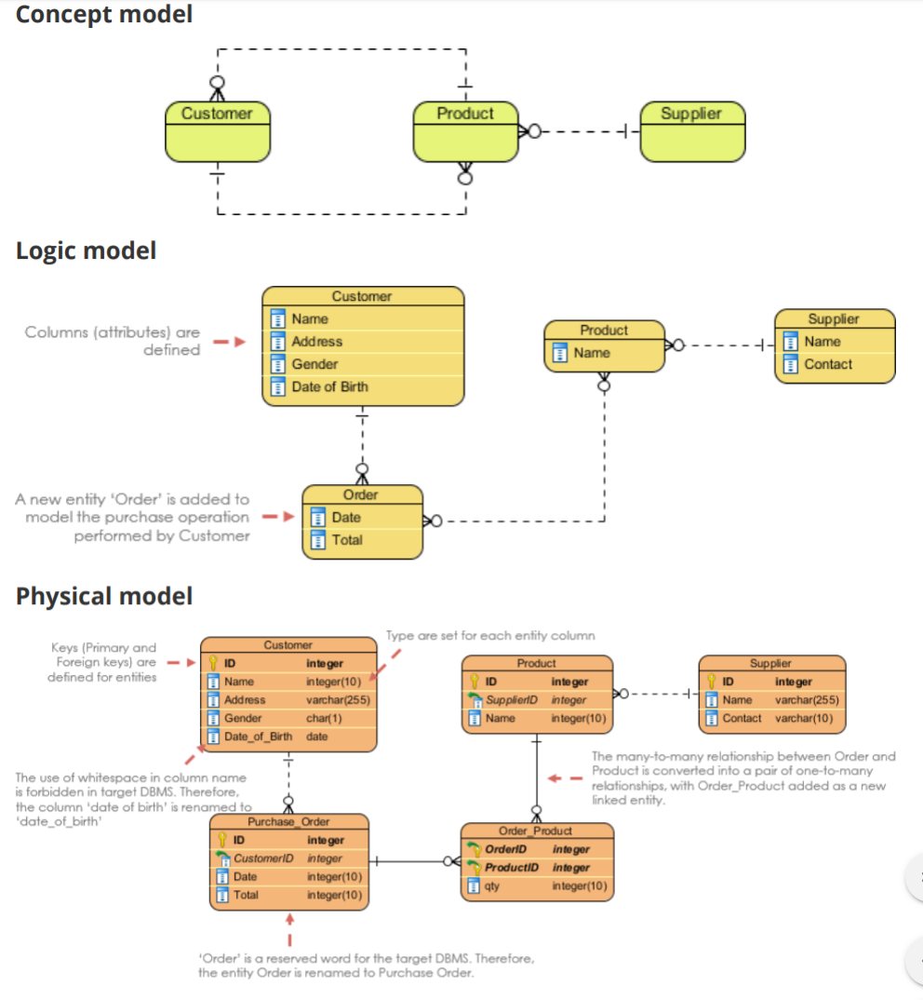
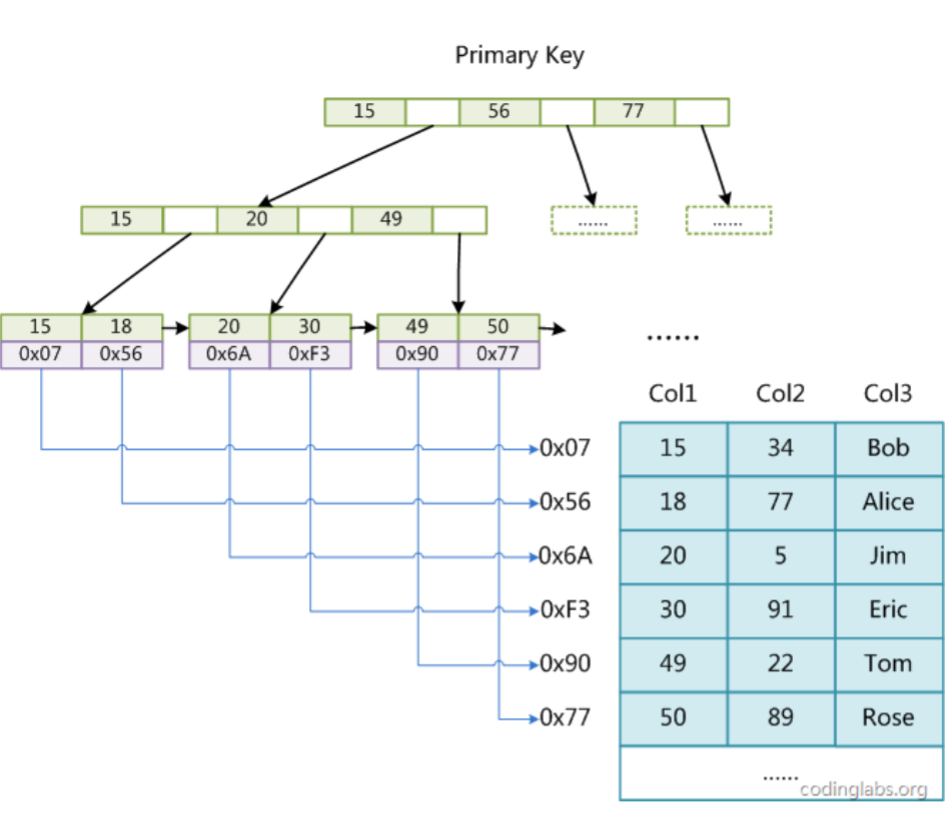
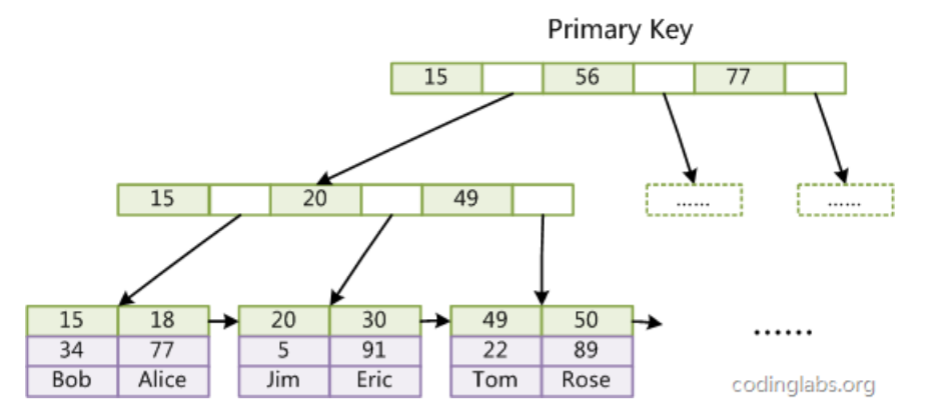
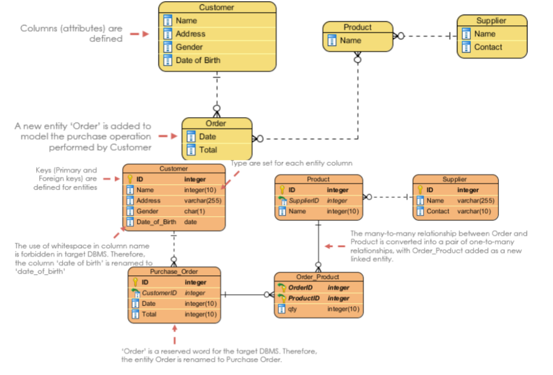

04-数据库基础
---
# 1. 数据设计

## 1.1. 数据持久化
1. 为什么持久化:
   1. 知识：数据被记录（record）、存储（storage）、回忆（recall）。
2. 持久化历史
   1. 实物记录（绳结、泥板、⽵⽚、绢布、纸张）
   2. 电子文件
   3. 数据库系统

## 1.2. 关系型数据库

### 1.2.1. Relation in Concept Model 概念模型上的关系

### 1.2.2. Relation in database 数据库中的关系

1. 列:属性
2. 行:元组

### 1.2.3. Concept model->Logic model ->Physical model 概念模型 -> 逻辑模型 -> 物理模型

## 1.3. 索引

### 1.3.1. 为什么使用索引
1. 在数据库系统的使用过程当中，数据的**查询**是使用最频繁的⼀种数据操作。
2. 最基本的查询算法当然是**顺序查找**（linear search），遍历表然后逐⾏匹配⾏值是否等于待查找的关键字，其时间复杂度为O（n）。
   1. 对于算法规模较小的表，负载轻的数据库，也能有好的性能。
   2. 对于数据量比较大的表，这时候的算法显然是糟糕的，性能就很快下降了。
3. 好在计算机科学的发展提供了很多更优秀的查找算法，例如**二分查找（binary search）、⼆叉树查找（binary tree search）**等。如果稍微分析⼀下会发现，每种查找算法都只能应⽤于特定的数据结构之上，
   1. 二分查找要求被检索数据有序
   2. 二叉树查找只能应⽤于二叉查找树上
4. 数据本身的组织结构不可能完全满⾜各种数据结构（例如，理论上不可能同时将两列都按顺序进⾏组织），所以，在数据之外，数据库系统还维护着满⾜特定查找算法的数据结构，这些数据结构以某种⽅式引⽤（指向）数据，这样就可以在这些数据结构上实现高级查找算法。这种数据结构，就是**索引**。
5. 索引是对数据库表中⼀个或多个列的值进⾏排序的结构。与在表中搜索所有的⾏相⽐，索引⽤**指针**指向存储在表中指定列的数据值，然后根据指定的次序排列这些指针，有助于更快地获取信息。通常情况下，只有当经常查询索引列中的数据时，才需要在表上创建索引。索引将占⽤磁盘空间，并且影响数据更新的速度。但是在多数情况下，索引所带来的数据检索速度优势⼤⼤超过它的不⾜之处。

### 1.3.2. 为什么是B+树
1. ⽂件很⼤，不可能全部存储在内存中，故要存储到磁盘上
2. 索引的结构组织要尽量减少查找过程中磁盘I/O的存取次数（为什么使⽤B-/+Tree，还跟磁盘存取原理有关。）
3. **局部性原理与磁盘预读**，预读的⻓度⼀般为⻚（page）的整倍数，（在许多操作系统中，页的大小通常为4k）
4. 数据库系统巧妙利⽤了磁盘预读原理，将⼀个节点的⼤⼩设为等于⼀个⻚，这样每个节点只需要⼀次I/O就可以完全载⼊，(由于节点中有两个数组，所以地址连续)。⽽红⿊树这种结构，h明显要深的多。由于逻辑上很近的节点（⽗⼦）物理上可能很远，⽆法利⽤局部性

## 1.4. 索引实现
1. InnoDB索引和MyISAM索引的区别：
   1. ⼀是主索引的区别：InnoDB的数据⽂件本身就是索引⽂件。⽽MyISAM的索引和数据是分开的。
   2. ⼆是辅助索引的区别：InnoDB的辅助索引data域存储相应记录主键的值⽽不是地址。⽽MyISAM的辅助索引和主索引没有多⼤区别。

### 1.4.1. MyISAM(早期默认)

1. 不支持复杂的事务操作
2. 每一个横行都是非叶节点
3. 存储的是地址，索引和数据是分开的

### 1.4.2. innoDB

1. 索引结构和值是在一起的

## 1.5. 将类图映射为关系表

### 1.5.1. ORM(Object-Relation Mapping)
1. 通常⼀个类/对象映射为⼀张表
2. 类的属性映射为表的列名
3. 类的实例对象就是表的⾏
4. 要为每个转换后的表建⽴主键
   1. 类/对象通过引⽤来唯⼀标识⾃⼰
   2. 关系/表通过主键类唯⼀标识⾃⼰
5. 处理关联
   1. 类/对象通过链接实现关联
   2. 关系/表通过主键/外键对实现关联
      1. 1:1关联：其中⼀个表的主键，作为另⼀个表的外键；两端等价
      2. 1:N关联：将1端表的主键，作为N端表的外键
      3. M:N关联：建⽴中间表，将M的主键和N的主键都作为**中间表**的外键
   3. 在包含/聚合关联中，将整体的主键放在部分中作为外键
   4. 关联的最⼩基数为0，意味着相应外键可以为NULL

