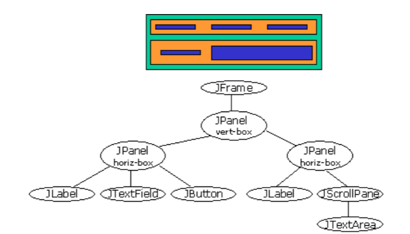
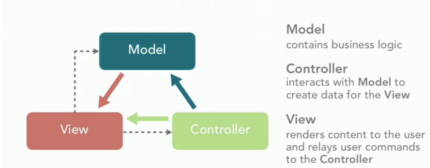
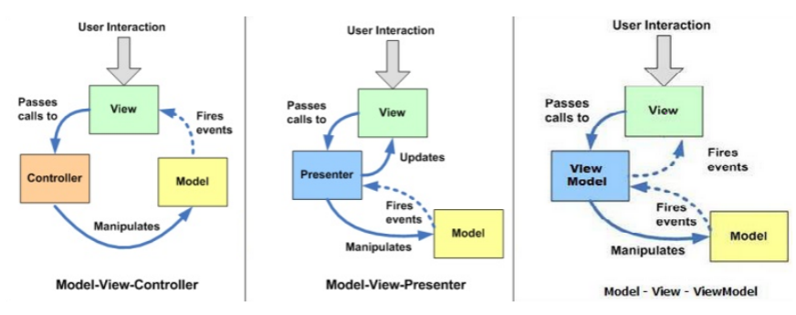
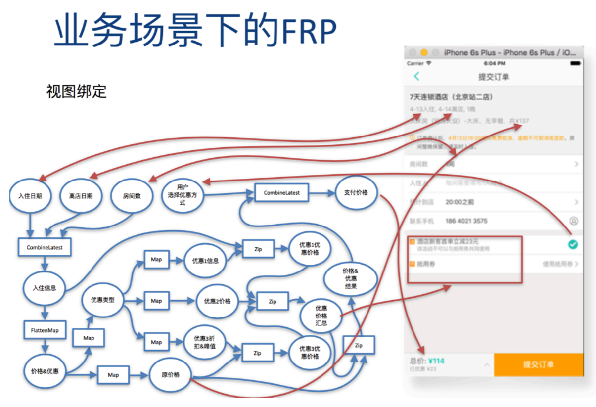
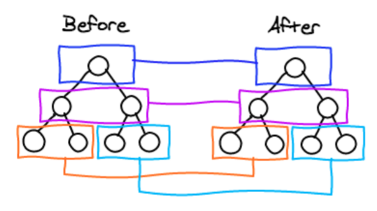
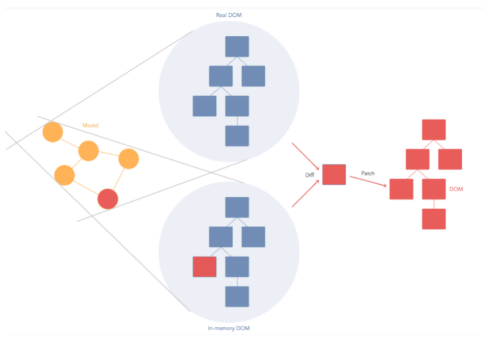

05-GUI入门
---

# 1. GUI入门

## 1.1. GUI Key elements
1. 任何GUI（Graphical User Interface）都有三个关键元素：组件、布局和事件。

### 1.1.1. Component
1. 组件是整个GUI的基础。常⻅组件有Label、TextField、Button等。

### 1.1.2. Layout
1. 有了组件之后，下⾯要考虑的就是组件的布局。组件之间是Composite模式，可以转化为⼀个树状结构。



### 1.1.3. Event
1. 最后，每个组件都要有事件响应的处理。⽐如，按按钮，获得焦点，被选择等。

Act that Results in an Event|Listener Type
--|--
User clicks a button, presses Return while typing in a text field, or chooses a menu item|ActionListener
User closes a frame (main window)|WindowListener
User presses a mouse button while the cursor is over a component|MouseListener
User moves the mouse over a component|MouseMotionListener
Component becomes visible|ComponentListener
Comoponent gets the keyboard focus |FocusListener
Table or list selection changes |ListSelectionListener

# 2. MVC Style



1. View和Model之间是Observer模式。
   1. View要先向感兴趣的Model进⾏注册、Model改变之后通知View
   2. View来Model取数据。View和Controller之间是事件机制。
   3. ⼀次View的交互，对应⼀个响应Controller。Controller负责修改Model和选择View的显示。

## 2.1. MVC in Swing

### 2.1.1. Model
1. ButtonModel接⼝的属性
   + ActionCommand
   + Mnemonic
   + Armed
   + Enabled
   + Pressed
   + Rollover
   + Selected
2. 同样的模型DefaultButtonModel可以⽤于不同视图
   + 下压按钮
   + 单选按钮
   + 复选框
   + 菜单项

### 2.1.2. View
1. JButton
   + 继承JComponent
   + 包含DefaultButtonModel、⼀些视图数据（标签和图标）、⼀个负责按钮视图的BasicButtonUI对象

### 2.1.3. Controller
```java
public class ButtonUIListener implements MouseListener, MouseMotionListener, ChangeListener{
    public void mouseMoved(MouseEvent mouseevent)
    public void mouseDragged(MouseEvent mouseevent)
    public void mouseClicked(MouseEvent mouseevent)
    public void mouseEntered(MouseEvent mouseevent)
    public void mouseExited(MouseEvent mouseevent)
    public void mousePressed(MouseEvent mouseevent)
    public void mouseReleased(MouseEvent mouseevent)
    public void stateChanged(ChangeEvent changeevent)
}
//Controller修改Model状态
public void mousePressed(MouseEvent mouseevent){
    Button button = (Button)mouseevent.getSource();
    ButtonModel buttonmodel = button.getModel();
    buttonmodel.setPressed(true);
    buttonmodel.setArmed(true);
}
//状态改变后，异步事件响应，View拿Model数据，重画。
public void stateChanged(ChangeEvent changeevent){
    Button button = (Button)changeevent.getSource();
    button.repaint();
}
```

## 2.2. MVC in Web GUI
1. HTML表达了基础组件，⽣成DOM树，CSS表达样式生成CSS树。从⽽可以通过layout⽣成出渲染树。
2. Javascipt代表触发事件机制之后的处理。Javascipt脚本去操作Dom、更改CSS样式时，浏览器⼜要重新构建DOM、CSSOM树，重新render，重新layout、paint；(这是很费时间的操作)
```html
<!DOCTYPE html>
<html>
<head>
<meta charset="utf-8">
</head>
MVC vs MVP vs MVVM
<body>
    <h1>JavaScript 验证输⼊</h1>
    <p>请输⼊ 1 到 10 之间的数字：</p>
    <input id="numb">
    <button type="button" onclick="myFunction()">提交</button>
    <p id="demo"></p>
    <script>
    function myFunction() {
    var x, text;
    // 获取 id="numb" 的值
    x = document.getElementById("numb").value;
    // 如果输⼊的值 x 不是数字或者⼩于 1 或者⼤于 10，则提示错误 Not a Number or less
    than one or greater than 10
    if (isNaN(x) || x < 1 || x > 10) {
    text = "输⼊错误";
    } else {
    text = "输⼊正确";
    }
    document.getElementById("demo").innerHTML = text;
    }
    </script>
</body>
</html>
```

### 2.2.1. MVC vs MVP vs MVVM


1. MVC的等待过程会出现卡顿
2. 所以我们选择MVP:Presenter来完成
3. 例子:手机横竖屏切换，很多次的切换有很多的Controller拉爆内存
4. MVP：测试Presenter是很困难
5. MVVM:View Model和View双向绑定，是一个数据集

### 2.2.2. MVVM in Vue
1. counter数据和View中的点击次数进⾏双向绑定。事件响应每次按按钮，counter数据+1。View中的点击次数也随之改变。
    + 点击后会直接修改的

```js
<!DOCTYPE html>
<html>
<head>
    <meta charset="utf-8">
    <title>Vue 测试实例 - 菜⻦教程(runoob.com)</title>
    <script src="https://cdn.staticfile.org/vue/2.2.2/vue.min.js"></script>
</head>
<body>
    <div id="app">
    <button v-on:click="counter += 1">增加 1</button>
    <p>这个按钮被点击了 {{ counter }} 次。</p>
    </div>
    <script>
    new Vue({
    el: '#app',
    data: {
    counter: 0
    }
    })
    </script>
</body>
</html>
```

2. ViewModel有时候会异步请求Model的数据。当服务器回答后，再根据response数据设置ViewModel，从而达到View的改变。
    + 下面是循环调用的，info是双向绑定，有MVVM处理好之后的过程

```html
<div id="app">
    <h1>⽹站列表</h1>
    <div
    v-for="site in info"
    >
    {{ site.name }}
    </div>
</div>
<script type = "text/javascript">
    new Vue({
    el: '#app',
    data () {
    return {
    info: null
    }
    },
    mounted () {
    axios
    .get('https://www.runoob.com/try/ajax/json_demo.json')
    .then(response => (this.info = response.data.sites))
    .catch(function (error) { // 请求失败处理
    console.log(error);
    });
    }
    })
</script>
```

3. MVVM可以和函数式编程范式下的流式编程相结合，⽣成复杂的数据处理。



# 3. Virtual Dom 虚拟Dom树

## 3.1. From Template to Dom in Vue
1. Virtual DOM 其实就是⼀棵以 JavaScript 对象( VNode 节点)作为基础的树，⽤对象属性来描述节点，实际上它只是⼀层对真实 DOM 的抽象。最终可以通过⼀系列操作使这棵树映射到真实环境上。
2. 简单来说，可以把Virtual DOM 理解为⼀个简单的JS对象，并且最少包含标签名(tag)、属性(attrs)和⼦元素对象(children)三个属性。不同的框架对这三个属性的命名会有点差别。
3. 对于虚拟DOM，咱们来看⼀个简单的实例，就是下图所示的这个，详细的阐述了 `模板 → 渲染函数 → 虚拟DOM树 → 真实DOM` 的⼀个过程。


4. 先生成一个假的Dom Tree，作为一个中间状态，不触发repaint，此时Dom在内存中
5. 虚拟DOM树增大了调试的负担

## 3.2. 为什么要虚拟Dom？
1. 虚拟DOM的最终**目的**是将虚拟节点渲染到视图上。但是如果直接使⽤虚拟节点覆盖旧节点的话，会有很多不必要的DOM操作。例如，⼀个ul标签下很多个li标签，其中只有⼀个li有变化，这种情况下如果使⽤新的ul去替代旧的ul,因为这些不必要的DOM操作⽽造成了性能上的浪费。
2. 为了避免不必要的DOM操作，虚拟DOM在虚拟节点映射到视图的过程中，将虚拟节点与上⼀次渲染视图所使⽤的旧虚拟节点（oldVnode）做**对⽐**，找出真正需要更新的节点来进⾏DOM操作，从⽽避免操作其他⽆需改动的DOM。
3. 其实虚拟DOM在Vue.js主要做了两件事：
   1. 提供与真实DOM节点所对应的虚拟节点vnode
   2. 将虚拟节点vnode和旧虚拟节点oldVnode进⾏对⽐，然后更新视图

## 3.3. diff 差异
1. Vue的diff算法是基于snabbdom改造过来的，仅在同级的vnode间做diff，递归地进⾏同级vnode的
diff，最终实现整个DOM树的更新。因为跨层级的操作是⾮常少的，忽略不计，这样时间复杂度就从
O(n3)变成O(n)。
2. diff 算法包括⼏个步骤：
   1. ⽤ JavaScript 对象结构表示 DOM 树的结构；然后⽤这个树构建⼀个真正的 DOM 树，插到⽂档当中
   2. 当状态变更的时候，重新构造⼀棵新的对象树。然后⽤新的树和旧的树进⾏⽐较，记录两棵树差异
   3. 把所记录的差异应⽤到所构建的真正的DOM树上，视图就更新了



## 3.4. patch
1. 核⼼函数实现流程：
   1. patch(container,vnode) :初次渲染的时候，将Virtual Dom渲染成真正的DOM然后插⼊到容器⾥⾯。
   2. patch(vnode,newVnode):再次渲染的时候，将新的vnode和旧的vnode相对⽐，然后之间差异应⽤到所构建的真正的DOM树上。




# 4. 参考
1. https://www.cs.utexas.edu/users/dsb/SwingTutorial/1_Basics/lecture.html
2. https://www.runoob.com/vue2/vuejs-ajax-axios.html
3. https://www.runoob.com/try/try.php?filename=tryjs_validation_number
4. https://segmentfault.com/a/1190000014070240